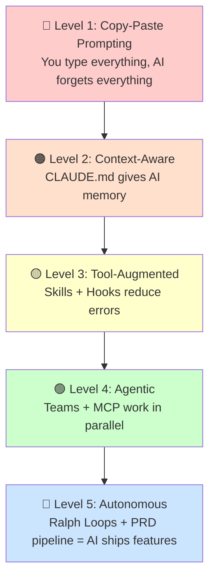

# 🗺️ Course Map — Your Learning Journey

> Follow the path from left to right. Each step builds on the previous one.

---

## 📍 The Journey

```mermaid
graph LR
    subgraph P1["💥 Part 1 — Foundations"]
        A1[01 Why AI Fails] --> A1b[01b Catching Mistakes]
        A1b --> A2[02 CLAUDE.md]
        A2 --> A3[03 AGENTS.md]
        A3 --> A4[04 Smart Prompting]
        A4 --> A4b[04b Model Selection]
    end

    subgraph P2["⚡ Part 2 — Power Tools"]
        B1[05 Skills] --> B1b[05b Context Mgmt]
        B1b --> B1c[05c /memory]
        B1c --> B2[06 Commands]
        B2 --> B3[07 Hooks]
        B3 --> B3b[07b Permissions]
        B3b --> B4[08 Subagents]
    end

    subgraph P3["🐝 Part 3 — Agentic"]
        C1[09 Agent Teams] --> C2[10 MCP Servers]
        C2 --> C3[11 Custom MCP]
        C3 --> C4[12 Ralph Loops]
        C4 --> C5[28 Agent SDK]
    end

    subgraph P4["📋 Part 4 — Workflows"]
        D1[13 PRD Pipeline] --> D2[14 Plan Mode]
        D2 --> D3[15 Jira Integration]
        D3 --> D4[26 CI/CD Automation]
        D4 --> D4b[26b Security]
        D4b --> D5[27 Code Review]
        D5 --> D5b[27b Cost Mgmt]
        D5b --> D5c[27c Team Onboarding]
    end

    A4b --> B1
    B4 --> C1
    C5 --> D1

    style P1 fill:#d4edda,stroke:#28a745
    style P2 fill:#cce5ff,stroke:#007bff
    style P3 fill:#e2d5f1,stroke:#6f42c1
    style P4 fill:#fff3cd,stroke:#ffc107
```

---

## 🕐 Time Map

| Part | Duration | Focus | You'll Build |
|------|----------|-------|-------------|
| 💥 **1. Foundations** | ~18 min | Memory + Prompting + Validation | CLAUDE.md, catching mistakes, model selection |
| ⚡ **2. Power Tools** | ~18 min | Automation + Context | Skills, Commands, Hooks, Context, Permissions |
| 🐝 **3. Agentic** | ~12 min | Parallelism | Agent Teams, MCP, Loops |
| 📋 **4. Workflows** | ~20 min | Process + Security + Scale | PRD → Code → CI/CD → Security → Team |
| 🎯 **5. Scenarios** | ~25 min | Daily Work | 15 Playbooks + Testing + Refactoring |

---

## 📖 Story Arc: Your First Month with AI

### 🗓️ Day 1 — "This AI keeps making mistakes"
→ [01 Why AI Fails](Part%201%20—%20Foundations/01-why-ai-fails.md) — Understand the root cause
→ [01b Catching Mistakes](Part%201%20—%20Foundations/01b-catching-ai-mistakes.md) — Learn to catch them

### 🗓️ Day 2 — "Let me give it some context"
→ [02 CLAUDE.md](Part%201%20—%20Foundations/02-claude-md-basics.md) — Create project memory
→ [03 AGENTS.md](Part%201%20—%20Foundations/03-agents-md.md) — Universal config

### 🗓️ Day 3 — "My prompts are getting better"
→ [04 Smart Prompting](Part%201%20—%20Foundations/04-smart-prompting.md) — CRAC framework
→ [04b Model Selection](Part%201%20—%20Foundations/04b-model-selection.md) — Pick the right model

### 🗓️ Week 1 — "I keep repeating myself"
→ [05 Skills](Part%202%20—%20Power%20Tools/05-skills.md) — Auto-triggering patterns
→ [05b Context Management](Part%202%20—%20Power%20Tools/05b-context-management.md) — Keep sessions efficient
→ [05c /memory](Part%202%20—%20Power%20Tools/05c-memory-preferences.md) — Personal preferences
→ [06 Commands](Part%202%20—%20Power%20Tools/06-commands.md) — Custom workflows

### 🗓️ Week 2 — "I need guardrails"
→ [07 Hooks](Part%202%20—%20Power%20Tools/07-hooks.md) — Automated checks
→ [07b Permissions](Part%202%20—%20Power%20Tools/07b-permissions-model.md) — Trust levels and scoping
→ [08 Subagents](Part%202%20—%20Power%20Tools/08-subagents.md) — Parallel workers

### 🗓️ Week 3 — "I want AI to do more independently"
→ [09 Agent Teams](Part%203%20—%20Agentic%20Patterns/09-agent-teams.md) — Multi-agent swarms
→ [10 MCP Servers](Part%203%20—%20Agentic%20Patterns/10-mcp-servers.md) — External tools
→ [11 Custom MCP](Part%203%20—%20Agentic%20Patterns/11-custom-mcp.md) — Your own servers

### 🗓️ Week 4 — "AI is shipping features while I review"
→ [12 Ralph Loops](Part%203%20—%20Agentic%20Patterns/12-ralph-loops.md) — Autonomous loops
→ [28 Agent SDK](Part%203%20—%20Agentic%20Patterns/28-agent-sdk.md) — Build custom agents
→ [13 PRD Pipeline](Part%204%20—%20Workflow%20Methodologies/13-prd-driven-dev.md) — Spec to code
→ [14 Plan Mode](Part%204%20—%20Workflow%20Methodologies/14-plan-mode-mastery.md) — Think first
→ [15 Jira Integration](Part%204%20—%20Workflow%20Methodologies/15-jira-integration.md) — Full loop
→ [26 CI/CD Automation](Part%204%20—%20Workflow%20Methodologies/26-ci-cd-automation.md) — Pipeline integration
→ [26b Security Hardening](Part%204%20—%20Workflow%20Methodologies/26b-security-hardening.md) — Secure AI workflows
→ [27 Code Review](Part%204%20—%20Workflow%20Methodologies/27-code-review.md) — Automated PR review
→ [27b Cost Management](Part%204%20—%20Workflow%20Methodologies/27b-cost-management.md) — Token budgeting
→ [27c Team Onboarding](Part%204%20—%20Workflow%20Methodologies/27c-team-onboarding.md) — Scale across your team

### 🗓️ Month 2+ — "I pick the right approach for each task"
→ [Part 5 Scenarios](Part%205%20—%20Daily%20Scenarios/) — Your daily playbook
→ [29 Cloud Sessions](Part%205%20—%20Daily%20Scenarios/29-cloud-sessions.md) — Run Claude in the cloud
→ [30 Testing AI Code](Part%205%20—%20Daily%20Scenarios/30-testing-ai-code.md) — Test-first AI workflows
→ [31 Refactoring](Part%205%20—%20Daily%20Scenarios/31-refactoring.md) — Systematic refactoring
→ [32 Performance](Part%205%20—%20Daily%20Scenarios/32-performance.md) — AI-assisted profiling
→ [33 Evaluation](Part%205%20—%20Daily%20Scenarios/33-evaluation.md) — Measuring AI quality

---

## 🎯 Independence Scale

> **Most teams are at Level 1-2.** This course takes you to **Level 5.**

---

## 🔀 Non-Linear Paths

Not everyone needs to follow the exact order. Here are shortcut paths:

### 🐛 "I mainly fix bugs"
01 → 02 → 04 → 07 (Hooks) → 19 (Bug Investigation) → 20 (Bug Fix)

### ✨ "I mainly build features"
01 → 02 → 04 → 05 (Skills) → 09 (Agent Teams) → 12 (Ralph Loops) → 21 (New Feature)

### 📋 "I mainly plan & spec"
01 → 02 → 04 → 13 (PRD Pipeline) → 14 (Plan Mode) → 15 (Jira) → 25 (Create PRD)

### 🔍 "I'm new to this codebase"
01 → 02 → 04 → 08 (Subagents) → 16 (Unknown Codebase) → 17 (RFC/SPIKE)

---

## 📎 Quick Links

| Need | Go To |
|------|-------|
| Copy-paste prompts | [B: Prompt Library](appendix/B-prompt-library.md) |
| Quick reference | [A: Cheat Sheet](appendix/A-cheat-sheet.md) |
| Links & docs | [C: Resources](appendix/C-resources.md) |

---

[🏠 README](README.md) | **You are here: 🗺️ Course Map** | [Start → 01 Why AI Fails](Part%201%20—%20Foundations/01-why-ai-fails.md)
