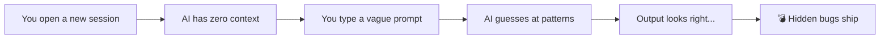
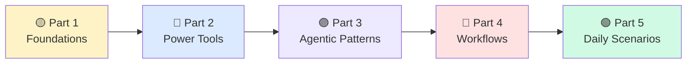

# 💥 Why AI Makes Mistakes (And How We'll Fix It)

> **You've been using AI wrong. Here's proof.**

You're a senior dev. You ship features, review PRs, mentor juniors. You started using AI coding assistants and thought: *"This will 10× me."* Instead, you got hallucinated APIs, broken builds, and security holes you caught at 11 PM.

**This chapter explains why — and what to do about it.**

---

## 📊 The Numbers

AI-assisted code introduces **more bugs, not fewer** — unless you know how to guide it.

```mermaid
bar chart
    title "AI-Assisted vs Human-Only Code (per 1,000 lines)"
    x-axis ["Total Bugs", "Security Bugs", "Logic Errors"]
    y-axis "Bug Count" 0 --> 25
    bar [12, 4, 8] "Human-Only"
    bar [20, 8, 14] "AI-Assisted (no guardrails)"
    bar [9, 3, 6] "AI-Assisted (with guardrails)"
```

| Metric | Source |
|--------|--------|
| AI creates **1.7× more total bugs** than humans | CodeRabbit 2025 Study |
| AI introduces **1.5–2× more security vulnerabilities** | GitClear Analysis |
| **71% of devs** won't merge AI code without manual review | Stack Overflow Survey |
| **41% of AI-generated code** contains at least one defect | Microsoft Research |

The third bar is the key: **AI with guardrails outperforms both.** That's what this course teaches.

---

## 🧠 Why It Happens

AI assistants aren't dumb. They're **amnesiac.**

Every single session, your AI assistant:

- 🚫 Has **zero memory** of previous conversations
- 🚫 Knows **nothing** about your architecture decisions
- 🚫 Can't see your **module graph** or dependency tree
- 🚫 Has **no guardrails** to catch platform-specific mistakes
- 🚫 Treats every interaction like **Day 1 at the company**



The fix isn't "stop using AI." The fix is **giving it the context it needs.**

---

## 📱 Mobile Pain Points

Here's what actually goes wrong — with real code.

### 🍎 Swift / iOS Mistakes

**Mistake 1: Forgetting `@MainActor` on ViewModel**

```swift
// ❌ AI generates this — crashes on background thread UI update
class TaskListViewModel: ObservableObject {
    @Published var tasks: [Task] = []

    func loadTasks() async {
        let fetched = try await taskService.fetchAll()
        tasks = fetched // 💥 Publishing changes from background thread
    }
}

// ✅ What it should generate
@MainActor
class TaskListViewModel: ObservableObject {
    @Published var tasks: [Task] = []

    func loadTasks() async {
        let fetched = try await taskService.fetchAll()
        tasks = fetched // ✅ Safe — guaranteed main thread
    }
}
```

**Mistake 2: Retain cycle with `self` in closure**

```swift
// ❌ AI loves strong self references
taskService.onUpdate { result in
    self.tasks = result // 💥 Retain cycle — ViewModel never deallocates
}

// ✅ Weak capture list
taskService.onUpdate { [weak self] result in
    self?.tasks = result
}
```

**Mistake 3: Wrong Combine operator**

```swift
// ❌ AI picks .map when you need .flatMap
searchText
    .map { query in
        taskService.search(query) // Returns AnyPublisher — nested publishers!
    }

// ✅ flatMap unwraps the inner publisher
searchText
    .debounce(for: .milliseconds(300), scheduler: RunLoop.main)
    .flatMap { query in
        taskService.search(query)
    }
```

### 🤖 Kotlin / Android Mistakes

**Mistake 1: Wrong CoroutineScope**

```kotlin
// ❌ AI defaults to GlobalScope — survives Activity destruction
class TaskListViewModel : ViewModel() {
    fun loadTasks() {
        GlobalScope.launch { // 💥 Leak! Outlives ViewModel
            val tasks = taskRepository.fetchAll()
            _uiState.value = UiState.Success(tasks)
        }
    }
}

// ✅ viewModelScope cancels automatically
class TaskListViewModel : ViewModel() {
    fun loadTasks() {
        viewModelScope.launch {
            val tasks = taskRepository.fetchAll()
            _uiState.value = UiState.Success(tasks)
        }
    }
}
```

**Mistake 2: Missing `@Composable` annotation**

```kotlin
// ❌ AI extracts a helper function, forgets annotation
fun TaskCard(task: Task) { // 💥 Won't compile — no @Composable
    Card(modifier = Modifier.padding(8.dp)) {
        Text(task.title)
    }
}

// ✅ Annotated correctly
@Composable
fun TaskCard(task: Task) {
    Card(modifier = Modifier.padding(8.dp)) {
        Text(task.title)
    }
}
```

**Mistake 3: Not handling configuration changes**

```kotlin
// ❌ AI stores state in the composable — lost on rotation
@Composable
fun TaskListScreen() {
    var tasks by remember { mutableStateOf(emptyList<Task>()) } // 💥 Gone on rotation

// ✅ State lives in ViewModel, survives config changes
@Composable
fun TaskListScreen(viewModel: TaskListViewModel = hiltViewModel()) {
    val uiState by viewModel.uiState.collectAsStateWithLifecycle()
```

---

## 🏗️ The New Dev Analogy

Imagine a **brilliant senior developer** joins your team on Monday.

They have 15 years of experience. They know Swift, Kotlin, every design pattern. But:

- 📭 No onboarding doc
- 📭 No architecture overview
- 📭 No code conventions guide
- 📭 No module map
- 📭 No access to previous decisions

What happens? They write **technically correct code** that **doesn't fit your project.**

That's exactly what AI does every session without a `GEMINI.md`.

> **This course turns your AI from an unboarded contractor into a team member with perfect institutional memory.**

---

## 🎯 What We'll Build

This course has 5 parts. Here's the progression:



| Part | You'll Learn | AI Gets |
|------|-------------|---------|
| 1 — Foundations | GEMINI.md, AGENTS.md, prompting | Memory + context |
| 2 — Power Tools | Custom commands, MCP servers, hooks | Specialized skills |
| 3 — Agentic Patterns | Multi-agent, parallel work, planning | Independence |
| 4 — Workflows | Headless mode, CI/CD, PR reviews | Autonomy |
| 5 — Scenarios | Real daily tasks, debugging, refactoring | Mastery |

By Part 5, your AI will handle **entire feature branches** with guardrails you trust.

---

## 📊 Before / After

**The same task. Two approaches. Wildly different results.**

### ❌ Naive Prompt
```
Add a task detail screen
```

**What AI produces:** A standalone screen with hardcoded data, no navigation, wrong architecture, inline styles, no error handling.

### ✅ Informed Prompt (after this course)
```
Following our MVVM pattern in Sources/Features/, create TaskDetailView.

Requirements:
- Match TaskListView's structure and styling patterns
- Use TaskDetailViewModel with @MainActor and @Published state
- Load via TaskService.fetchTask(id:) with proper error handling
- Support .loading, .loaded(Task), .error(AppError) states
- Include edit/delete actions using our ConfirmationDialog pattern
- Add snapshot test matching our Testing/ conventions

Reference: Sources/Features/TaskList/ for architecture example.
```

**What AI produces:** Production-ready code that fits your project like it was written by a teammate.

The difference? **Context.** Let's build yours.

---

## 🧪 Try It Now

1. **Audit your last 5 AI interactions.** How many included:
   - [ ] Architecture context?
   - [ ] File path references?
   - [ ] Error handling requirements?
   - [ ] Testing expectations?

2. **Find a bug.** Open your most recent AI-generated PR. Look for:
   - Missing `@MainActor` or wrong coroutine scope
   - Retain cycles or memory leaks
   - Hardcoded values that should be constants
   - Missing error states

3. **Write it down.** Start a list of "mistakes AI keeps making in MY project." You'll turn this into GEMINI.md rules in the next chapter.

---

← Previous | [🗺️ Course Map](../00-course-map.md) | [Next: Your First GEMINI.md →](02-gemini-md-basics.md)
