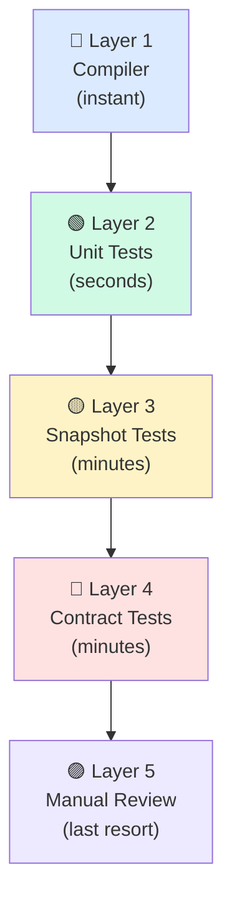
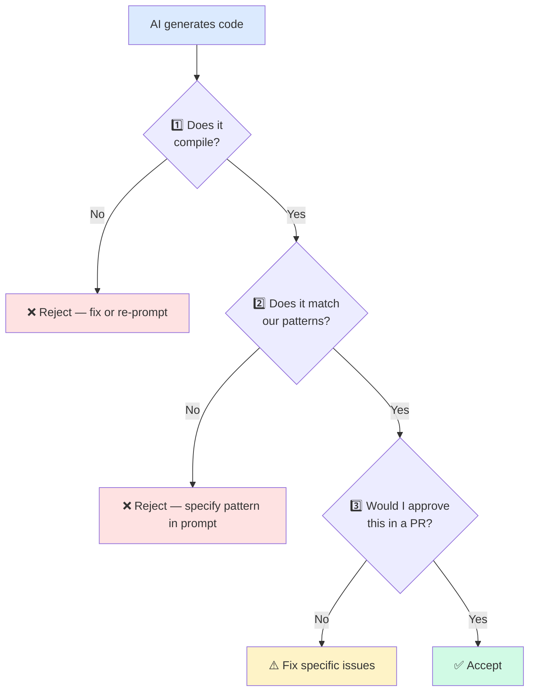

# 🛡️ Catching AI Mistakes

> **Time to read:** ~5 min | **Skill level:** Intermediate | **Platform:** iOS & Android

Chapter 01 showed that AI-assisted code produces **1.7x more bugs** than human-only code. This chapter teaches you how to **catch those bugs before they ship.** The goal isn't to stop using AI — it's to build a verification reflex that takes seconds and saves hours.

---

## 🎚️ The Trust Spectrum

Not all AI output deserves the same level of scrutiny. The key is knowing **when to trust, when to verify, and when to never trust.**


| Trust Level | Code Type | Examples | Your Action |
|-------------|-----------|----------|-------------|
| 🟢 **Trust** | Boilerplate, scaffolding | File templates, protocol conformance stubs, basic CRUD views, model structs | Glance, accept |
| 🟡 **Verify** | Business logic, data flow | ViewModel state machines, Combine/Flow pipelines, navigation logic, caching | Read every line, test edge cases |
| 🔴 **Never Trust** | Security, auth, crypto | Token storage, encryption, biometric checks, API key handling, certificate pinning | Rewrite or audit line-by-line |

**Rule of thumb:** The more a mistake could cost you (money, data, user trust), the less you should trust AI to get it right.

---

## 👻 Common Hallucination Patterns in Mobile

AI doesn't just write bugs — it **invents things that don't exist.** Here are the patterns senior mobile devs encounter most.

### 🍎 iOS Hallucinations

```swift
// ❌ Invented SwiftUI modifier — looks plausible, doesn't exist
Text("Task Title")
    .fontWeight(.semibold)
    .lineLimit(2)
    .truncationStyle(.byClipping)  // 💥 Does not exist

// ❌ Deprecated API — AI trained on old docs
let center = UNUserNotificationCenter.current()
center.requestAuthorization(options: [.alert, .sound]) { granted, error in
    // AI sometimes uses the old UILocalNotification API instead
}

// ❌ Wrong method signature — close but wrong parameter name
URLSession.shared.dataTask(with: url, completionHandler: { data, response, error in
    // AI sometimes invents: .dataTask(for: url) or .dataTask(url:)
})

// ❌ Imaginary SwiftUI container — AI invents layout views
LazyZStack {  // 💥 Not a real SwiftUI view
    ForEach(tasks) { task in
        TaskRowView(task: task)
    }
}
```

### 🤖 Android Hallucinations

```kotlin
// ❌ Non-existent Compose function
@Composable
fun TaskCard(task: Task) {
    SwipeableCard(  // 💥 Not a real Compose component
        onSwipeLeft = { /* ... */ },
        onSwipeRight = { /* ... */ }
    ) {
        Text(task.title)
    }
}

// ❌ Wrong remember signature
val animState = remember { AnimationState(initialValue = 0f) }  // 💥 Wrong constructor

// ❌ Mixing Material 2 and Material 3 APIs
import androidx.compose.material3.Text
import androidx.compose.material.Card  // 💥 Material 2 — should be material3

// ❌ Invented Modifier extension
Modifier
    .swipeToDismiss(onDismiss = { })  // 💥 Not a built-in Modifier
    .padding(16.dp)
```

### Pattern Recognition Checklist

| Hallucination Type | How to Spot It | Frequency |
|-------------------|----------------|-----------|
| Invented modifier/function | Compiler error, no autocomplete match | Very common |
| Deprecated API | Warning in IDE, strikethrough in docs | Common |
| Wrong method signature | Compiler error on parameter names | Common |
| Mixed library versions | Import from wrong package | Moderate |
| Imaginary parameter | Named argument doesn't exist on the type | Very common |
| Non-existent container view | No such type in framework | Moderate |

---

## 🔍 Verification Strategies

You need **layers** of defense. No single strategy catches everything.



### Layer 1: Compiler as First Defense

Your compiler catches **most** hallucinations for free. Before you even read AI output:

```bash
# iOS — build immediately after accepting AI code
xcodebuild -scheme TaskPulse -destination 'platform=iOS Simulator,name=iPhone 16,OS=18.0' build

# Android — same idea
./gradlew :app:assembleDebug
```

If it doesn't compile, it doesn't matter how clever the code looks.

### Layer 2: Unit Tests for Logic

AI loves producing code that **compiles but doesn't work.** Especially in state machines and data transformations.

```swift
// AI generated this Combine pipeline for TaskPulse search
func setupSearch() {
    searchText
        .debounce(for: .milliseconds(300), scheduler: RunLoop.main)
        .map { query in
            self.taskService.search(query) // ❌ Returns AnyPublisher, not [Task]
        }
        .assign(to: &$searchResults) // 💥 Type mismatch — nested publisher
}
```

A unit test catches this immediately:

```swift
func testSearchReturnsFilteredTasks() async {
    let vm = TaskListViewModel(service: MockTaskService())
    vm.searchText.send("urgent")

    // Wait for debounce
    try await Task.sleep(for: .milliseconds(400))

    XCTAssertEqual(vm.searchResults.count, 2) // 💥 Fails — searchResults is a Publisher, not [Task]
}
```

### Layer 3: Snapshot Tests for UI

AI generates views that look structurally correct but render wrong. Snapshot tests catch visual regressions.

```swift
// After AI modifies TaskRowView, run snapshot test
func testTaskRowView_defaultState() {
    let view = TaskRowView(task: .sample)
    assertSnapshot(matching: view, as: .image(layout: .device(config: .iPhone13)))
}
```

```kotlin
// Android equivalent with Paparazzi
@Test
fun taskRowDefault() {
    paparazzi.snapshot {
        TaskPulseTheme {
            TaskRow(task = SampleData.task)
        }
    }
}
```

### Layer 4: Contract Tests for APIs

When AI generates API integration code, verify it against the actual contract:

```kotlin
@Test
fun `task endpoint matches API contract`() {
    val response = mockWebServer.enqueue(MockResponse().setBody(TASK_JSON))
    val result = taskApi.getTask("task-123").execute()

    // Verify AI's Retrofit interface matches real API
    assertThat(result.body()?.id).isEqualTo("task-123")
    assertThat(result.body()?.assignee?.name).isNotNull() // AI often forgets nested objects
}
```

---

## ⚡ The 3-Second Check

Before you accept **any** AI-generated code, run this mental checklist. It takes 3 seconds and catches 80% of issues.



### The 3 Questions

| # | Question | What You're Checking | Time |
|---|----------|---------------------|------|
| 1 | **Does it compile?** | Invented APIs, wrong signatures, missing imports | 0.5s (build it) |
| 2 | **Does it match our patterns?** | `@MainActor`, `viewModelScope`, error handling, naming | 1.5s (scan structure) |
| 3 | **Would I approve this in a PR?** | Edge cases, thread safety, retain cycles, nullability | 1s (gut check) |

If you answer "no" to any question, don't accept the code. **Re-prompt with specific feedback.**

---

## 🛡️ Defensive Prompting

The best way to catch mistakes is to **prevent them.** These prompting techniques force AI to show its work.

### Ask for Reasoning

```
Create a Combine pipeline for debounced search in TaskListViewModel.
EXPLAIN each operator you use and WHY you chose it over alternatives.
```

When AI explains its choices, you can spot flawed reasoning before the code even runs.

### Request References

```
Add pull-to-refresh to TaskListView using SwiftUI's built-in modifier.
List the exact SwiftUI API name, the iOS version it was introduced in,
and link to the Apple documentation.
```

If AI can't cite the API correctly, it's probably hallucinating.

### Demand Edge Cases

```
Implement task deletion in TaskDetailViewModel.

Handle these cases explicitly:
- Network timeout during delete
- Task already deleted by another user (409 conflict)
- User cancels confirmation dialog
- Offline mode — queue for sync
```

AI defaults to the happy path. Listing edge cases forces it to write defensive code.

### Challenge the Output

```
Review the code you just wrote. Find at least 3 potential issues with:
- Thread safety
- Memory management
- Error handling
```

AI is surprisingly good at finding its **own** mistakes when asked directly.

---

## 📱 TaskPulse Case Study: The Wrong Combine Operator

Here's a real scenario. You ask Claude to build debounced search for TaskPulse.

### What AI Generates (Wrong)

```swift
@MainActor
class TaskListViewModel: ObservableObject {
    @Published var searchText = ""
    @Published var searchResults: [TaskItem] = []

    private var cancellables = Set<AnyCancellable>()

    func setupSearch() {
        $searchText
            .debounce(for: .milliseconds(300), scheduler: RunLoop.main)
            .map { [weak self] query -> AnyPublisher<[TaskItem], Never> in
                guard let self, !query.isEmpty else {
                    return Just([]).eraseToAnyPublisher()
                }
                return self.taskService.search(query)
                    .replaceError(with: [])
                    .eraseToAnyPublisher()
            }
            // ❌ .map returns Publisher<Publisher<[TaskItem]>> — nested!
            .sink { results in
                self.searchResults = results // 💥 Type error: results is AnyPublisher, not [TaskItem]
            }
            .store(in: &cancellables)
    }
}
```

### How to Catch It

1. **Compiler** (Layer 1): Type mismatch error on `.sink` — `results` is `AnyPublisher`, not `[TaskItem]`
2. **Pattern check** (3-Second Check, Q2): We use `.flatMap` for publisher-returning closures, not `.map`
3. **Defensive prompt**: Asking AI to explain each operator would reveal it doesn't understand the `.map` vs `.flatMap` distinction here

### The Fix

```swift
func setupSearch() {
    $searchText
        .debounce(for: .milliseconds(300), scheduler: RunLoop.main)
        .removeDuplicates()
        .flatMap { [weak self] query -> AnyPublisher<[TaskItem], Never> in
            guard let self, !query.isEmpty else {
                return Just([]).eraseToAnyPublisher()
            }
            return self.taskService.search(query)
                .replaceError(with: [])
                .eraseToAnyPublisher()
        }
        // ✅ .flatMap unwraps the inner publisher — results is [TaskItem]
        .receive(on: DispatchQueue.main)
        .assign(to: &$searchResults)
}
```

### Android Equivalent: The Wrong Flow Operator

The same class of mistake happens on Android with Kotlin Flows:

```kotlin
// ❌ AI uses map instead of flatMapLatest
class TaskListViewModel @Inject constructor(
    private val taskRepository: TaskRepository
) : ViewModel() {

    private val searchQuery = MutableStateFlow("")

    val searchResults = searchQuery
        .debounce(300)
        .map { query ->
            taskRepository.search(query) // ❌ Returns Flow<List<Task>>, not List<Task>
        }
        .stateIn(viewModelScope, SharingStarted.WhileSubscribed(5000), emptyList())
}

// ✅ flatMapLatest cancels previous search and unwraps the inner Flow
val searchResults = searchQuery
    .debounce(300)
    .distinctUntilChanged()
    .flatMapLatest { query ->
        if (query.isBlank()) flowOf(emptyList())
        else taskRepository.search(query) // ✅ Returns Flow<List<Task>>, flatMapLatest unwraps it
    }
    .catch { emit(emptyList()) }
    .stateIn(viewModelScope, SharingStarted.WhileSubscribed(5000), emptyList())
```

**Key pattern:** Whenever a lambda returns a publisher/flow instead of a plain value, AI picks `map` when it should pick `flatMap`/`flatMapLatest`. This is the **single most common reactive programming mistake** AI makes.

---

## 📊 Mistake Type Reference

| Mistake Category | Example | Detection Layer | Prevention Strategy |
|-----------------|---------|----------------|-------------------|
| **Invented API** | `.truncationStyle(.byClipping)` | Compiler | Ask AI to cite documentation |
| **Wrong operator** | `.map` instead of `.flatMap` | Compiler / Unit test | Ask AI to explain operator choice |
| **Deprecated API** | `UILocalNotification` | Compiler warning | Specify minimum OS version in prompt |
| **Missing annotation** | No `@MainActor`, no `@Composable` | Compiler | Include in CLAUDE.md rules |
| **Wrong scope** | `GlobalScope.launch` | Code review | Explicit constraint in prompt |
| **Retain cycle** | Missing `[weak self]` | Memory profiler | Add to 3-Second Check |
| **Happy path only** | No error handling | Unit test | List edge cases in prompt |
| **Mixed versions** | Material 2 + Material 3 | Compiler / runtime | Specify library versions |
| **Wrong architecture** | View calls Repository directly | Code review | Reference implementation in prompt |
| **Incorrect nullability** | Force unwrap / `!!` on nullable | Crash at runtime | Ban `!` and `!!` in CLAUDE.md |

---

## 🧪 Try It Now

1. **Build the reflex.** Take AI-generated code from your last session and run the 3-Second Check:
   - [ ] Does it compile? (Build it right now)
   - [ ] Does it match your patterns? (Check `@MainActor` / `viewModelScope`, error handling, naming)
   - [ ] Would you approve it in a PR? (Look for edge cases, thread safety, retain cycles)

2. **Hunt hallucinations.** Ask Claude to generate a SwiftUI view or Compose screen for TaskPulse. Before running it, read every modifier/function call and mark any you don't recognize. Then try to compile it.
   ```
   Create a TaskDetailView with animated transitions, swipe actions,
   and a custom toolbar. Use SwiftUI's latest APIs.
   ```
   Count how many modifiers are real vs. invented.

3. **Try defensive prompting.** Take a prompt you'd normally write and add these requirements:
   - [ ] "Explain each API you use and which OS version introduced it"
   - [ ] "List 3 potential issues with your implementation"
   - [ ] "Show me the unit test that proves this works"

   Compare the output quality to a prompt without these requirements.

4. **Catch the wrong operator.** Give Claude this prompt and check if it uses `.map` or `.flatMap` correctly:
   ```
   Create a Combine pipeline that takes a search string, debounces it,
   calls TaskService.search(query:) which returns AnyPublisher<[Task], Error>,
   and assigns the results to a @Published property.
   ```

5. **Build a mistake catalog.** Start a document listing every AI mistake you catch this week. Categorize each one using the Mistake Type Reference table above. After 5 entries, add the top patterns as rules in your CLAUDE.md.

---

← Previous: [Why AI Fails](01-why-ai-fails.md) | [🗺️ Course Map](../00-course-map.md) | [Next: Your First CLAUDE.md →](02-claude-md-basics.md)
