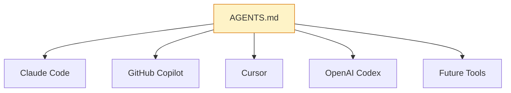
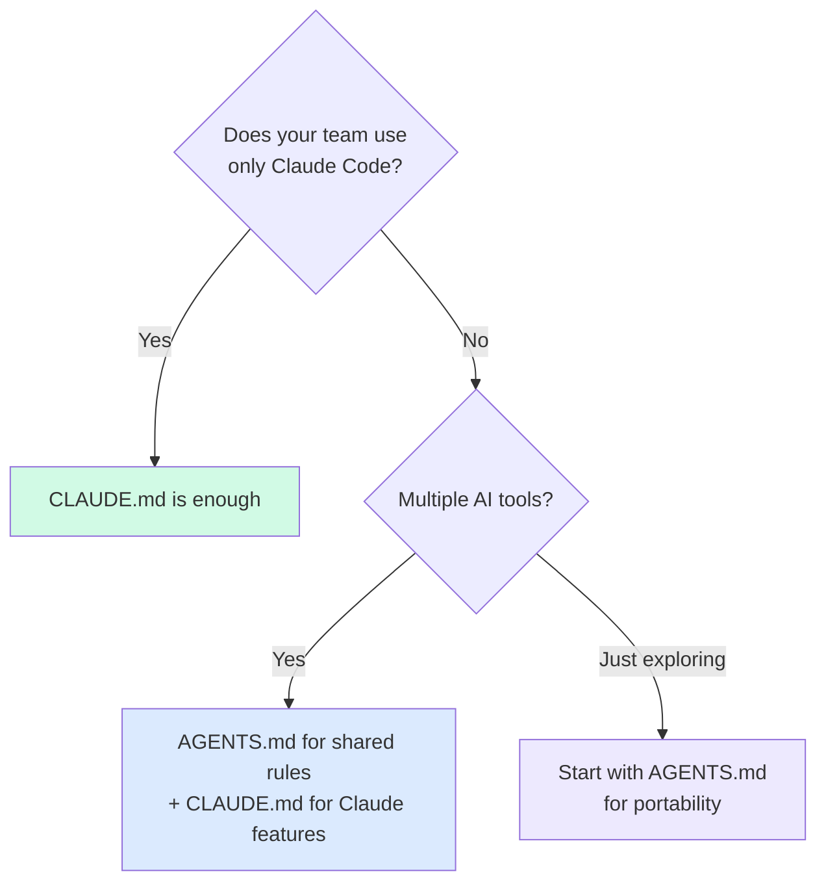

# 🤖 AGENTS.md — The Universal Config

> **One config file. Every AI tool. Zero vendor lock-in.**

What if your team uses Claude Code, but your contractor uses Cursor, and your CI runs GitHub Copilot? You'd need three config files — unless you use AGENTS.md.

---

## 🌐 What is AGENTS.md?

AGENTS.md is an **open standard** from the Linux Foundation that any AI coding tool can read.



**The numbers:**
- 📊 Adopted by **60,000+ repositories** since launch
- 🏢 Backed by the **Linux Foundation**
- 🔧 Supported by Claude, Copilot, Cursor, Codex, and growing

**The idea is simple:** put your project rules in a format every tool understands. No more duplicating instructions across `.cursorrules`, `CLAUDE.md`, `.github/copilot-instructions.md`, and `codex.md`.

---

## 🆚 CLAUDE.md vs AGENTS.md

They're **complementary, not competing.**

| Feature | CLAUDE.md | AGENTS.md |
|---------|-----------|-----------|
| **Scope** | Claude Code only | Any AI tool |
| **@imports** | ✅ Split into files | ❌ Single file |
| **Custom slash commands** | ✅ `/commands/` dir | ❌ Not supported |
| **Hooks (pre/post)** | ✅ Full hook system | ❌ Not supported |
| **MCP server config** | ✅ Via settings | ❌ Not supported |
| **Nested overrides** | ✅ Per-directory | ✅ Per-directory |
| **Tool adoption** | Claude Code | 60K+ repos, multi-tool |
| **Spec governance** | Anthropic | Linux Foundation |

### When to use which?



---

## 🤝 Using Both Together

The power move: **AGENTS.md for universal rules, CLAUDE.md for Claude-specific features.**

```
TaskPulse/
├── AGENTS.md         # Rules every AI tool reads
├── CLAUDE.md         # Claude-specific: hooks, imports, slash commands
├── .claude/
│   ├── commands/     # Claude slash commands (Part 2)
│   └── settings.json # MCP servers, permissions
```

**AGENTS.md** handles:
- Architecture rules
- Code style conventions
- Build commands
- Testing patterns
- File structure expectations

**CLAUDE.md** adds:
- `@imports` for modular config
- Hook triggers (lint on save, test on commit)
- Slash command definitions
- MCP server connections
- Claude-specific behavioral tuning

### How they merge

When Claude Code sees both files, it reads **AGENTS.md first, then CLAUDE.md.** CLAUDE.md rules take priority on conflicts. Think of it as:

```
Final context = AGENTS.md (base) + CLAUDE.md (override)
```

---

## 📱 Mobile Example — Cross-Platform Team

Here's a real scenario: your team has iOS devs using Claude, Android devs using Cursor, and a shared KMM module.

**AGENTS.md covers the shared ground:**

```markdown
# AGENTS.md — TaskPulse Cross-Platform Rules

## Architecture
- MVVM with Repository pattern across all platforms
- Unidirectional data flow: View → ViewModel → Repository → DataSource
- Shared business logic lives in :shared KMM module

## Shared Module (Kotlin Multiplatform)
- Location: shared/src/commonMain/
- All DTOs defined here, platform modules must not redefine them
- Use kotlinx.serialization for all JSON parsing
- Use kotlinx.coroutines Flow for reactive streams

## API Contract
- Base URL configured per environment in BuildConfig / Info.plist
- All endpoints return ApiResponse<T> wrapper
- Error codes: see shared/src/commonMain/model/ErrorCode.kt
- Auth: Bearer token in Authorization header, refresh via /auth/refresh

## Code Review Standards
- No platform-specific code in :shared module
- All public APIs require KDoc/DocC comments
- Max file length: 200 lines (split if larger)
- All ViewModels must handle: loading, success, error, empty states
```

Then each platform adds its own tool-specific config:

**iOS team's CLAUDE.md:**
```markdown
# TaskPulse iOS — Claude Config
@.claude/swift-style.md
@.claude/testing-ios.md

## Hooks
- Pre-commit: swiftlint --strict
- Post-generate: swift build --package-path Packages/Core
```

**Android team's `.cursorrules`:**
```
Follow AGENTS.md for architecture.
Use ktlint for formatting.
Run ./gradlew :app:testDebugUnitTest after changes.
```

**Same rules, different tools, zero drift.**

---

## 📝 TaskPulse AGENTS.md — Complete Example

```markdown
# AGENTS.md — TaskPulse

## Project
TaskPulse is a collaborative task manager with real-time sync and offline support.
Two native clients: iOS (SwiftUI) and Android (Jetpack Compose).

## Architecture
- Pattern: MVVM with Repository pattern
- Data flow: View → ViewModel → Repository → LocalDataSource + RemoteDataSource
- Navigation: Coordinator pattern (iOS), Navigation Component (Android)
- DI: Protocol-based (iOS), Interface-based with Hilt (Android)

## Module Structure
```
iOS:  Core → Networking → Features/{FeatureName} → App
Android: :core → :networking → :features:{feature-name} → :app
```
UI components are shared. Never duplicate across feature modules.

## Code Conventions
- ViewModels manage UI state as a single sealed type/enum
- All async work scoped to ViewModel lifecycle
- No business logic in Views/Composables
- Error handling: map all errors through ErrorMapper before UI
- File limit: 200 lines max. Split into extensions/partials if needed.

## State Management
- iOS: @Published properties, @MainActor ViewModels
- Android: StateFlow, viewModelScope coroutines
- Both: UiState pattern with Loading / Success / Error / Empty variants

## Testing Requirements
- Every ViewModel: test loading, success, error, empty states
- Use fakes/mocks from shared test utilities (TestHelpers/ or :core:testing)
- No live network calls in unit tests
- Snapshot tests for all shared UI components

## Build Commands
iOS:
  xcodebuild -scheme TaskPulse -destination 'platform=iOS Simulator,name=iPhone 16,OS=18.0' test

Android:
  ./gradlew :app:assembleDebug
  ./gradlew :app:testDebugUnitTest --continue

## Don't
- Don't use GlobalScope (Android) or detached Tasks without cancellation (iOS)
- Don't force-unwrap optionals or use lateinit for UI state
- Don't put UI framework imports in ViewModel layer
- Don't add third-party dependencies without documenting the reason
- Don't store secrets in source code — use environment config
```

---

## ⚡ Quick Decision Guide

Starting fresh? Use this:

| Situation | Use |
|-----------|-----|
| Solo dev, Claude Code only | `CLAUDE.md` |
| Team, all Claude Code | `CLAUDE.md` |
| Team, mixed AI tools | `AGENTS.md` + `CLAUDE.md` |
| Open-source project | `AGENTS.md` (widest compatibility) |
| Enterprise, multi-team | `AGENTS.md` (base) + tool-specific overrides |

---

## 🧪 Try It Now

1. **Create an AGENTS.md** for your project with these sections:
   - [ ] Project description (2–3 sentences)
   - [ ] Architecture pattern
   - [ ] Module structure
   - [ ] 5 code conventions
   - [ ] Build/test commands

2. **Compare coverage.** If you already have a CLAUDE.md, identify which rules are universal (move to AGENTS.md) vs Claude-specific (keep in CLAUDE.md).

3. **Test portability.** Copy your AGENTS.md into a Cursor project or Copilot workspace. Does the AI follow your rules? Note any gaps.

4. **Check the ecosystem.** Browse [github.com/topics/agents-md](https://github.com/topics/agents-md) to see how other projects structure theirs.

---

← [Previous: CLAUDE.md Basics](02-claude-md-basics.md) | [🗺️ Course Map](../00-course-map.md) | [Next: Smart Prompting →](04-smart-prompting.md)
