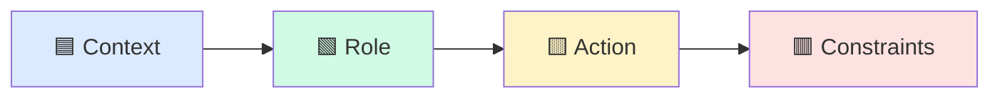
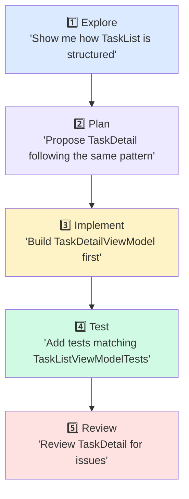
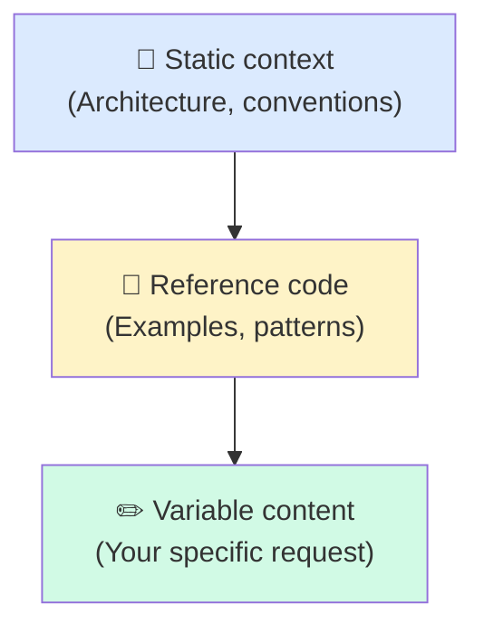

# 🎯 Prompting That Actually Works

> **Your prompt is the blueprint. Vague blueprint = vague building.**

The difference between "AI generated garbage" and "AI generated a production-ready feature" is almost always the prompt. This chapter gives you frameworks and templates you'll use daily.

---

## ❌ Bad Prompts Hall of Shame

These prompts feel natural. They're also why AI disappoints you.

### "Add authentication"

**What you meant:** OAuth2 PKCE flow with biometric fallback, Keychain/EncryptedSharedPreferences storage, token refresh, session timeout.

**What AI heard:** Add a login screen with a username/password field and a `Bool` flag.

**What you got:**

```swift
// AI's "authentication" 😬
struct LoginView: View {
    @State var username = ""
    @State var password = ""
    @State var isLoggedIn = false // Auth state in a @State var...
}
```

### "Fix the bug"

**What you meant:** The task list crashes when the API returns an empty array because we're force-unwrapping the first element.

**What AI heard:** Something is broken somewhere. Let me guess.

**Result:** AI "fixes" a completely different issue or refactors working code.

### "Make it better"

**What you meant:** Improve performance of the task list by adding pagination and caching.

**What AI heard:** ¯\\\_(ツ)\_/¯

**Result:** AI renames variables, adds comments, and calls it "improved."

### "Add tests"

**What you meant:** Unit tests for TaskListViewModel covering loading, success, error, and empty states using our mock infrastructure.

**What AI heard:** Add some tests.

**Result:** A single test that checks `true == true` or tests that import real network services.

---

## ✅ The CRAC Framework

Every effective prompt has four parts:



### 🟦 C — Context

*What does the AI need to know about the current situation?*

```
Our TaskPulse app uses MVVM with a Coordinator pattern.
The TaskListViewModel at Sources/Features/TaskList/TaskListViewModel.swift
fetches tasks via TaskService and exposes @Published state.
```

### 🟩 R — Role

*What expertise should the AI bring?*

```
Acting as a senior iOS developer experienced with SwiftUI and async/await...
```

### 🟨 A — Action

*What specific thing should it do?*

```
Create a TaskDetailView and TaskDetailViewModel that displays a single task
with edit and delete capabilities.
```

### 🟥 C — Constraints

*What are the boundaries and requirements?*

```
- Must follow @MainActor ViewModel pattern from TaskListViewModel
- Use our existing AppError enum for error states
- Include loading, loaded, and error UiState variants
- No force unwraps
- Max 150 lines per file
```

### Full CRAC Example

```
Context: TaskPulse uses MVVM + Coordinator. See Sources/Features/TaskList/
for the reference implementation. TaskService protocol is in
Sources/Networking/Services/TaskService.swift.

Role: Senior iOS developer with SwiftUI and async/await expertise.

Action: Create TaskDetailView + TaskDetailViewModel in
Sources/Features/TaskDetail/.

Constraints:
- @MainActor on ViewModel, @Published for state
- UiState enum: .loading, .loaded(Task), .error(AppError)
- Load task via TaskService.fetchTask(id:)
- Edit button triggers sheet with TaskEditView (already exists)
- Delete with ConfirmationDialog, then pop via Coordinator
- Add unit tests in Tests/Features/TaskDetailViewModelTests.swift
- Match test structure of TaskListViewModelTests.swift
```

---

## 🔗 Prompt Chaining

Complex features need **sequential prompts**, not one mega-prompt.



### Why chaining works

| Approach | Tokens used | Accuracy |
|----------|-------------|----------|
| One mega-prompt | High | Low — AI loses focus |
| 5 chained prompts | Same total | High — each step is clear |

**Rule of thumb:** If your prompt has more than 3 actions, split it.

### Chain example for TaskPulse

**Prompt 1 — Explore:**
```
Look at Sources/Features/TaskList/ and explain the MVVM pattern used.
List all files, their responsibilities, and how they connect.
```

**Prompt 2 — Plan:**
```
Based on the TaskList pattern, propose the file structure for a TaskDetail
feature. Include ViewModel, View, and Coordinator files. Don't write code yet.
```

**Prompt 3 — Implement:**
```
Create TaskDetailViewModel.swift following your proposed plan.
Match TaskListViewModel's patterns exactly: @MainActor, @Published state,
UiState enum, async loading via TaskService.
```

**Prompt 4 — Test:**
```
Write TaskDetailViewModelTests.swift. Match the structure of
TaskListViewModelTests.swift. Test loading, success, error, and
the delete confirmation flow.
```

**Prompt 5 — Review:**
```
Review all TaskDetail files for: retain cycles, missing error handling,
thread safety issues, and deviation from our MVVM conventions.
```

---

## 📱 10 Mobile Prompt Templates

Copy-paste these. Fill in the blanks. Ship features.

### 1️⃣ New SwiftUI Screen

```
Following our MVVM pattern in Sources/Features/TaskList/, create a
TaskDetailView and TaskDetailViewModel in Sources/Features/TaskDetail/.

Requirements:
- @MainActor ViewModel with @Published UiState enum (loading/loaded/error)
- Load task via TaskService.fetchTask(id:) — protocol in Sources/Networking/
- Navigation back via CoordinatorProtocol.pop()
- Accessibility: all interactive elements need accessibilityLabel
- Match visual style of TaskListView (spacing, typography, colors from Theme/)
```

### 2️⃣ New Compose Screen

```
Using our design system in ui/components/ and the MVVM pattern from
features/task-list/, create TaskDetailScreen and TaskDetailViewModel
in features/task-detail/.

Requirements:
- StateFlow<TaskDetailUiState> with sealed interface (Loading/Success/Error)
- Collect state with collectAsStateWithLifecycle()
- Load via TaskRepository.getTask(id) in viewModelScope
- Hilt @Inject constructor for ViewModel
- Preview function with sample data from ui/preview/SampleData.kt
```

### 3️⃣ API Integration

```
Using our existing NetworkService protocol in Sources/Networking/NetworkService.swift,
implement the /tasks/{id}/comments endpoint.

- Request: GET with taskId path parameter
- Response: decode into [Comment] (model in Sources/Core/Models/Comment.swift)
- Error handling: map network errors through our ErrorMapper
- Add to TaskService protocol and DefaultTaskService implementation
- Include unit test with MockNetworkService from TestHelpers/
```

### 4️⃣ Unit Test Suite

```
Write tests for TaskDetailViewModel matching the style of
Tests/Features/TaskListViewModelTests.swift.

Test these scenarios:
- Initial load → loading state → success with task data
- Initial load → loading state → error with AppError.networkError
- Delete task → confirmation → success → coordinator.pop() called
- Delete task → confirmation → failure → error state shown
- Use MockTaskService and MockCoordinator from TestHelpers/
```

### 5️⃣ Navigation Flow

```
Following our Coordinator pattern in Sources/Navigation/AppCoordinator.swift,
add navigation from TaskListView to TaskDetailView.

- Add showTaskDetail(id: String) to TaskListCoordinator
- Wire the NavigationPath push in CoordinatorView
- Pass TaskService dependency through the coordinator
- Add back navigation via pop()
- Handle deep link: taskpulse://task/{id}
```

### 6️⃣ Dependency Injection

```
Register TaskDetailViewModel in our DI container following the pattern
in Sources/DI/FeatureAssembly.swift.

- Register TaskDetailViewModel.Factory protocol
- Implement DefaultTaskDetailViewModel.Factory
- Add to FeatureAssembly.assemble()
- Inject TaskService and TaskRepository as dependencies
- Add test in Tests/DI/FeatureAssemblyTests.swift verifying resolution
```

### 7️⃣ Error Handling

```
Using our ErrorHandler protocol in Sources/Core/ErrorHandler.swift,
implement error handling for the task sync feature.

- Map URLError cases to our AppError enum (.networkError, .timeout, .unauthorized)
- Map DecodingError to AppError.dataCorrupted
- Show user-facing message via ErrorPresenter (already in UI module)
- Log technical details via AnalyticsService.logError()
- Implement retry logic: 3 attempts with exponential backoff for .networkError
```

### 8️⃣ Accessibility

```
Add VoiceOver support to TaskListView following our a11y guidelines
in Sources/UI/Accessibility/A11yGuide.swift.

- Every task row: accessibilityLabel with title, assignee, due date
- Priority indicator: accessibilityValue ("High priority", "Low priority")
- Swipe actions: accessibilityCustomAction for edit/delete/complete
- Section headers: accessibilityAddTraits(.isHeader)
- Test: add a11y audit test matching Tests/UI/A11yAuditTests.swift pattern
```

### 9️⃣ Offline Sync

```
Using our CoreData stack in Sources/Core/Persistence/CoreDataStack.swift,
implement offline storage for tasks.

- Create TaskEntity matching Sources/Core/Models/Task.swift fields
- Implement TaskLocalDataSource with CRUD operations
- Sync strategy: fetch remote first, fall back to local on network error
- Conflict resolution: server wins, log conflicts via AnalyticsService
- Add migration from schema V2 to V3 in Migrations/
- Test with in-memory NSPersistentContainer from TestHelpers/
```

### 🔟 New Feature Module

```
Create a new Comments feature module following the structure of
Sources/Features/TaskList/.

Files needed:
- CommentListView.swift — SwiftUI view with list of comments
- CommentListViewModel.swift — @MainActor, @Published UiState
- CommentRowView.swift — Single comment display
- CommentService.swift — Protocol + default implementation
- CommentListCoordinator.swift — Navigation handling

Follow all conventions from GEMINI.md. Reference TaskList for patterns.
Each file max 150 lines. Include tests for ViewModel.
```

---

## 🎯 Few-Shot Learning

Sometimes rules aren't enough. **Show the AI what you want.**

```
Here's an example of our ViewModel pattern:

"""swift
@MainActor
final class TaskListViewModel: ObservableObject {
    enum UiState {
        case loading
        case loaded([Task])
        case error(AppError)
    }

    @Published private(set) var state: UiState = .loading
    private let service: TaskServiceProtocol

    init(service: TaskServiceProtocol) {
        self.service = service
    }

    func loadTasks() async {
        state = .loading
        do {
            let tasks = try await service.fetchAll()
            state = .loaded(tasks)
        } catch {
            state = .error(ErrorMapper.map(error))
        }
    }
}
"""

Now create CommentListViewModel following this exact same structure.
Use CommentServiceProtocol and [Comment] as the data type.
```

Few-shot works because AI matches patterns better than it follows abstract rules.

**When to use few-shot:**
- 🎯 Complex patterns with multiple conventions
- 🎯 When GEMINI.md rules aren't producing the right output
- 🎯 New team members need consistent code from day one

---

## ⚡ Context Ordering

Prompt structure affects **performance and cost.**



**Why this order?** Gemini caches static content at the start of the conversation. If your architecture rules and reference code come first, they get cached and you pay for them only once across multiple prompts.

| Position | Content Type | Caching |
|----------|-------------|---------|
| First | Static rules, architecture | ✅ Cached across turns |
| Middle | Reference code, examples | ✅ Partially cached |
| Last | Your specific request | ❌ Changes every time |

**Practical tip:** Put your GEMINI.md (static) and code references (semi-static) before your specific ask (variable). This is already how GEMINI.md works — it loads before your prompt.

---

## 🧪 Try It Now

1. **Rewrite a bad prompt.** Take your most recent AI prompt and rewrite it using CRAC:
   - [ ] Add Context (architecture, file paths)
   - [ ] Add Role (what expertise is needed)
   - [ ] Specify Action (exact deliverable)
   - [ ] List Constraints (patterns, limits, requirements)

2. **Chain a feature.** Pick a feature you need to build. Write 5 chained prompts:
   - Explore → Plan → Implement → Test → Review

3. **Use a template.** Pick one of the 10 templates above, fill in the blanks for your project, and run it. Compare the output to what you'd get from a vague prompt.

4. **Try few-shot.** Find a pattern AI keeps getting wrong. Paste a correct example into your prompt and ask AI to follow it for a new feature.

---

← [Previous: AGENTS.md](03-agents-md.md) | [🗺️ Course Map](../00-course-map.md) | Next →
