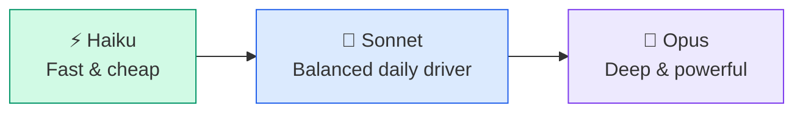
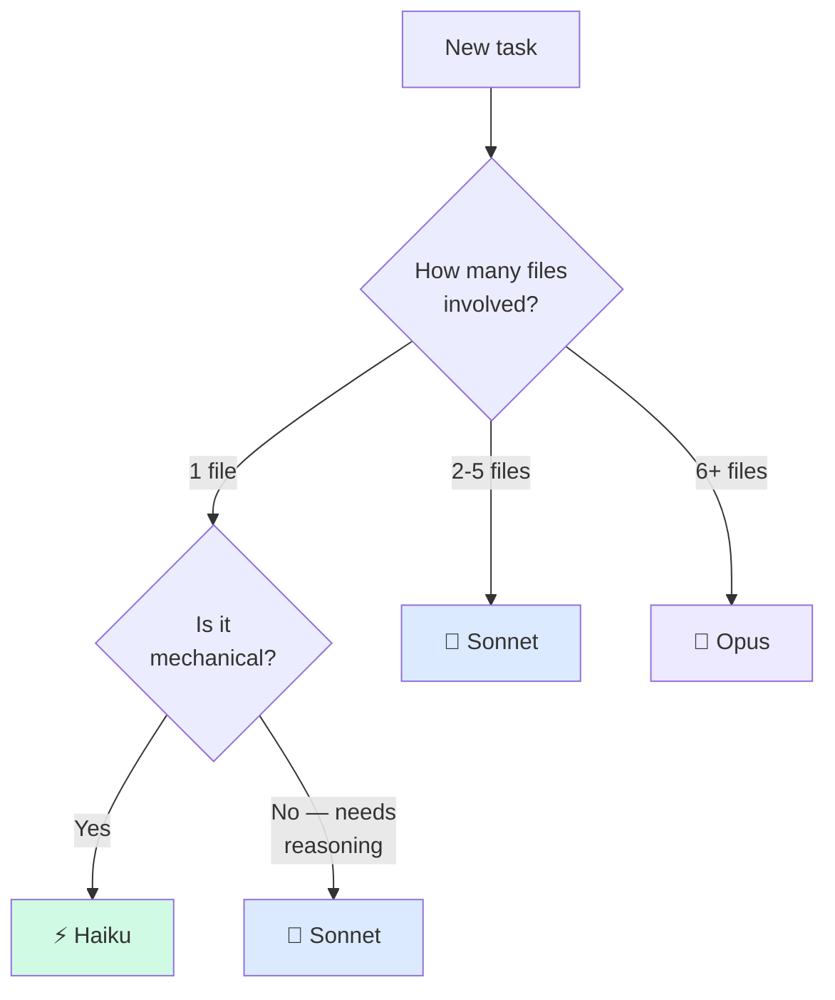
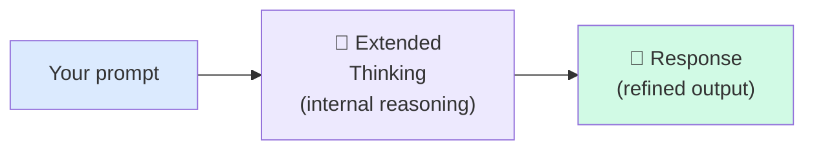
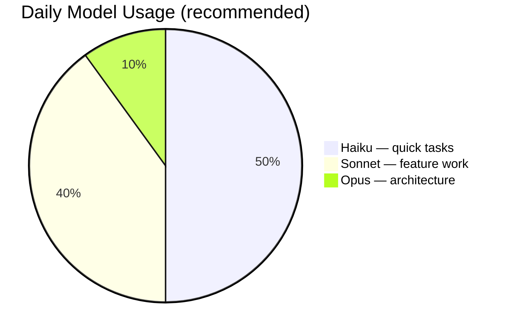

# 🧠 Model Selection & Extended Thinking

> **Time to read:** ~4 min | **Skill level:** Intermediate | **Platform:** iOS & Android

Using Opus for a variable rename is like driving a Ferrari to the mailbox. Using Haiku for a multi-module architecture refactor is like bringing a skateboard to a Formula 1 race. **Match the model to the task.**

Claude Code gives you access to multiple models. Picking the right one saves money, saves time, and often produces **better** results — because a focused model on a clear task beats an overpowered model on a vague one.

---

## 🏎️ The Model Lineup

Three models, three jobs. Here's what each one is built for.



| | ⚡ Haiku | 🎯 Sonnet | 🧠 Opus |
|---|---|---|---|
| **Speed** | Fastest (~2s) | Moderate (~5s) | Slowest (~15s+) |
| **Relative Cost** | 1x (baseline) | ~3x Haiku | ~15x Haiku |
| **Context Window** | 200K tokens | 200K tokens | 200K tokens |
| **Sweet Spot** | Quick answers, single-file edits | Feature implementation, bug fixes | Architecture decisions, complex refactors |
| **Accuracy on complex tasks** | Good for simple | Very good | Excellent |
| **When to avoid** | Multi-file reasoning | Trivial boilerplate (overkill) | Simple renames (massive overkill) |

---

## 🎯 Task-to-Model Decision Matrix

Stop guessing. Use this matrix.

| Task Type | Recommended Model | Why |
|-----------|------------------|-----|
| "What does this function do?" | ⚡ Haiku | Quick comprehension, no generation needed |
| Rename a variable across a file | ⚡ Haiku | Mechanical, pattern-based |
| Generate a model struct/data class | ⚡ Haiku | Boilerplate with clear structure |
| Write a new ViewModel | 🎯 Sonnet | Needs pattern awareness, state management |
| Implement a feature screen | 🎯 Sonnet | Multiple files, needs architectural consistency |
| Debug a race condition | 🎯 Sonnet | Requires reasoning about concurrency |
| Fix a failing test | 🎯 Sonnet | Needs to understand test + implementation |
| Design a multi-module architecture | 🧠 Opus | Complex interdependencies, long-term impact |
| Migrate from UIKit to SwiftUI | 🧠 Opus | Multi-file, needs to preserve behavior |
| Plan a database schema migration | 🧠 Opus | Data integrity, backward compatibility |
| Refactor 15 files to new pattern | 🧠 Opus | Cross-file reasoning, consistency |
| Design a complex state machine | 🧠 Opus | Many states, transitions, edge cases |



---

## 💰 Cost Awareness

Model choice has real budget impact. Here's what a typical day looks like.

| Scenario | Model | Interactions/Day | Relative Daily Cost |
|----------|-------|-----------------|-------------------|
| Quick questions, boilerplate | ⚡ Haiku | 30 | $1 (baseline) |
| Feature work, bug fixes | 🎯 Sonnet | 20 | ~$4 |
| Architecture sessions | 🧠 Opus | 5 | ~$5 |
| **Smart mix** | **All three** | **30 + 10 + 2** | **~$3.50** |
| Everything on Opus | 🧠 Opus | 30 | **~$30** |

**The smart mix saves ~88% compared to using Opus for everything** — and you get answers faster for simple tasks because Haiku responds in seconds.

---

## 🔧 How to Switch Models

### CLI Flag

```bash
# Use a specific model for one session
claude --model opus
claude --model sonnet
claude --model haiku

# Mid-conversation model switch
/model opus
/model sonnet
/model haiku
```

### In Your Workflow

```bash
# Quick question — use Haiku
claude --model haiku -p "What parameters does URLSession.data(for:) accept?"

# Feature work — default to Sonnet (usually the default)
claude
> Create TaskDetailViewModel following our MVVM pattern in Sources/Features/TaskList/

# Architecture planning — switch to Opus
claude --model opus
> Design the offline sync system for TaskPulse. Consider conflict resolution,
> queue management, and retry strategies across both iOS and Android.
```

---

## 🧠 Extended Thinking

Extended thinking lets Claude **reason through complex problems step by step** before generating a response. It's like giving the model a whiteboard to work through the problem before writing code.

### What Happens Under the Hood



Without extended thinking, Claude generates tokens left to right — each word follows the previous one. With extended thinking, Claude first works through the problem internally, considering alternatives and catching its own errors, **then** writes the final answer.

### When to Enable It

Extended thinking shines on problems where **getting it wrong is expensive** and **the problem has multiple interacting constraints.**

| Use Case | Without Thinking | With Thinking |
|----------|-----------------|---------------|
| Complex state machine (5+ states) | Misses edge transitions | Maps all states and transitions systematically |
| Migration plan (CoreData v3 to v4) | Forgets data transformation steps | Considers rollback, data integrity, ordering |
| Architecture decision | Picks first reasonable option | Weighs tradeoffs, considers future changes |
| Multi-step refactor | Breaks something in file 7 of 15 | Plans dependency order, maintains consistency |
| Concurrency bug investigation | Guesses at the race condition | Traces thread interleaving scenarios |

### How to Enable It

```bash
# Enable extended thinking in Claude Code
/think

# Or use the flag
claude --model sonnet --thinking
```

You can also set a thinking budget to control how much reasoning happens:

```bash
# Ultrathink — maximum reasoning depth
/think ultrathink
```

### Mobile Use Cases for Extended Thinking

**1. Designing a complex state machine:**

```
/think

Design the state machine for TaskPulse's offline sync system.

States: idle, syncing, conflict, error, retrying
Events: networkAvailable, syncRequested, conflictDetected, resolved, failed, retryTimeout

For each state+event combination, define:
- The next state
- Side effects (network calls, UI updates, queue operations)
- Error recovery path
```

**2. Planning a Core Data migration:**

```swift
// AI with extended thinking produces a migration plan like this:

// Step 1: Add new `collaborators` relationship (non-destructive)
// Step 2: Lightweight migration adds column — no custom mapping needed
// Step 3: Post-migration script copies `assignee` into `collaborators` array
// Step 4: Mark `assignee` as deprecated (keep for rollback window)
// Step 5: Remove `assignee` in NEXT version's migration (v5 → v6)

// Without thinking, AI often tries to do steps 1-5 in a single migration,
// which breaks rollback capability.
```

**3. Architecture decision for TaskPulse:**

```
/think

We need to add real-time collaboration to TaskPulse.
Compare these approaches for both iOS and Android:

1. WebSocket with manual reconnection
2. Server-Sent Events (SSE)
3. Firebase Realtime Database
4. gRPC streaming

Consider: battery impact, offline behavior, conflict resolution,
implementation complexity, and our existing Repository pattern.
```

---

## 📱 TaskPulse Example: Same Prompt, Different Models

Here's what happens when you send the same prompt to each model.

**Prompt:**
```
Add a "sort by" feature to TaskListView. Users should be able to sort
tasks by due date, priority, or creation date.
```

### ⚡ Haiku's Response

```swift
// Quick and functional — gets the job done for a simple case
enum SortOption: String, CaseIterable {
    case dueDate, priority, createdAt
}

// Adds a @State var and a .sorted() call
@State var sortOption: SortOption = .dueDate

var sortedTasks: [Task] {
    switch sortOption {
    case .dueDate: tasks.sorted { $0.dueDate < $1.dueDate }
    case .priority: tasks.sorted { $0.priority.rawValue > $1.priority.rawValue }
    case .createdAt: tasks.sorted { $0.createdAt < $1.createdAt }
    }
}
```

**Verdict:** Works for a prototype. Misses persistence, doesn't follow the ViewModel pattern, no animation on sort change.

### 🎯 Sonnet's Response

```swift
// Well-structured, follows patterns, production-ready
// In TaskListViewModel:
@MainActor
final class TaskListViewModel: ObservableObject {
    enum SortOption: String, CaseIterable, Identifiable {
        case dueDate = "Due Date"
        case priority = "Priority"
        case createdAt = "Created"

        var id: String { rawValue }
    }

    @Published var sortOption: SortOption = .dueDate {
        didSet { UserDefaults.standard.set(sortOption.rawValue, forKey: "taskSortOption") }
    }

    var sortedTasks: [TaskItem] {
        switch sortOption {
        case .dueDate: tasks.sorted { ($0.dueDate ?? .distantFuture) < ($1.dueDate ?? .distantFuture) }
        case .priority: tasks.sorted { $0.priority.sortOrder > $1.priority.sortOrder }
        case .createdAt: tasks.sorted { $0.createdAt < $1.createdAt }
        }
    }

    init() {
        if let saved = UserDefaults.standard.string(forKey: "taskSortOption"),
           let option = SortOption(rawValue: saved) {
            sortOption = option
        }
    }
}

// In TaskListView — menu in toolbar
.toolbar {
    ToolbarItem(placement: .topBarTrailing) {
        Menu {
            Picker("Sort by", selection: $viewModel.sortOption) {
                ForEach(SortOption.allCases) { option in
                    Text(option.rawValue).tag(option)
                }
            }
        } label: {
            Image(systemName: "arrow.up.arrow.down")
        }
    }
}
```

**Verdict:** Production-ready. Persists preference, handles nil dates, follows ViewModel pattern, proper UI placement.

### 🧠 Opus's Response

Everything Sonnet produces, **plus:**

- Suggests using `SortDescriptor` for type-safe sorting
- Proposes a `SortPreferenceStore` protocol for testability instead of raw `UserDefaults`
- Considers accessibility: VoiceOver announcement when sort changes
- Notes that sorting should work with the existing filter system (doesn't override filters)
- Recommends animation: `.animation(.default, value: viewModel.sortOption)`
- Adds the Kotlin/Compose equivalent for Android parity

**Verdict:** Architecturally thorough. Worth the cost for features that touch multiple systems. Overkill for a quick sort menu.

---

## ⚖️ The 80/20 Rule of Model Selection

For most mobile developers, the optimal mix is:



- **50% Haiku**: Questions, boilerplate, single-file edits, explanations
- **40% Sonnet**: Feature development, bug fixes, test writing, code review
- **10% Opus**: Architecture decisions, complex refactors, migration planning

**Start every task with Sonnet.** Downshift to Haiku when the task is simple. Upshift to Opus when you're stuck or the decision has long-term consequences.

---

## 🧪 Try It Now

1. **Run the same prompt on all three models.** Pick a feature you need to add to your project. Run the exact same prompt with `--model haiku`, `--model sonnet`, and `--model opus`. Compare:
   - [ ] How fast each responds
   - [ ] How many files each touches
   - [ ] Whether each follows your project's patterns
   - [ ] Which one you'd actually merge

2. **Try extended thinking on an architecture problem.** Pick a design decision you've been mulling over and use `/think`:
   ```
   /think
   Should TaskPulse use a single shared database or per-feature
   local storage? Consider offline sync, data isolation, migration
   complexity, and testing. Recommend one approach with tradeoffs.
   ```
   Compare the depth of reasoning to the same prompt without `/think`.

3. **Optimize your model mix for a day.** Track every Claude interaction for one full day. For each one, note which model you used and which model you **should** have used based on the decision matrix. Calculate how much you could save.

4. **Find your Opus-worthy problems.** Look at your team's backlog and tag the 3 tasks that genuinely need Opus-level reasoning. These should be tasks where getting the design wrong would cost days to fix. Everything else? Sonnet or Haiku.

---

← Previous: [Smart Prompting](04-smart-prompting.md) | [🗺️ Course Map](../00-course-map.md) | [Next: Creating Skills →](../Part%202%20—%20Power%20Tools/05-skills.md)
