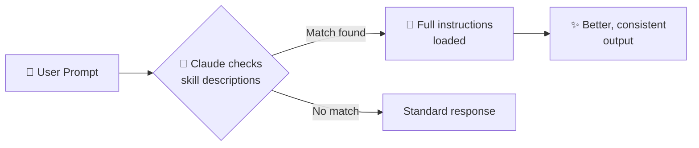

# ⚡ Creating Reusable Skills

> **Time to read:** ~5 min | **Skill level:** Intermediate | **Platform:** iOS & Android

You've been explaining the same patterns to Claude over and over. Your team's SwiftUI component structure. Your Compose screen conventions. Your API layer patterns. **Stop repeating yourself.**

Skills are reusable instruction sets that Claude loads *automatically* when they're relevant. Write once, benefit forever.

---

## 🎯 What's a Skill?

A **Skill** is a markdown file with structured instructions that Claude auto-loads based on context.

| | Skills | Manual Instructions |
|---|---|---|
| **Trigger** | 🤖 Automatic | 👤 You type it every time |
| **Location** | `.claude/skills/` | Your brain / clipboard |
| **Consistency** | Always the same | Varies by your mood & memory |
| **Team sharing** | Git-committed, everyone gets it | "Check the wiki maybe?" |

**Think of skills as muscle memory for your AI pair programmer.**

---

## 📁 File Structure

```
.claude/
  skills/
    swift-ui-component/
      SKILL.md
    compose-screen/
      SKILL.md
    api-integration/
      SKILL.md
    unit-test-writer/
      SKILL.md
```

Each skill lives in its own folder. The file **must** be named `SKILL.md`.

---

## 📝 YAML Frontmatter

Every skill starts with a YAML frontmatter block between `---` delimiters:

```yaml
---
description: "Short description of what this skill does"
triggers:
  - "keyword or phrase that activates this skill"
  - "another trigger phrase"
---
```

- **`description`** — Claude reads this to decide if the skill is relevant
- **`triggers`** — Context clues that cause Claude to load the full instructions

**Keep descriptions specific.** "Helps with code" = useless. "Generates SwiftUI views following TaskPulse design system with previews" = chef's kiss.

---

## 🔄 How Activation Works



1. You type a prompt like *"Create a new task detail screen"*
2. Claude scans all skill descriptions and triggers
3. `compose-screen` skill matches — instructions load automatically
4. Claude follows your team's exact patterns. No reminding needed.

---

## 📱 Mobile Skill Examples

### 1️⃣ `swift-ui-component` Skill

**`.claude/skills/swift-ui-component/SKILL.md`**

```markdown
---
description: "Generates SwiftUI view components following TaskPulse iOS design system with previews"
triggers:
  - "create a SwiftUI view"
  - "new component"
  - "build a screen in SwiftUI"
  - "TaskPulse iOS UI"
---

# SwiftUI Component Generator — TaskPulse

When creating any SwiftUI view for TaskPulse:

## Structure
- Place in `Sources/UI/Components/` (reusable) or `Sources/UI/Screens/` (full screens)
- Use MVVM: View observes a `@Observable` ViewModel
- Never put business logic in the View

## Naming
- Views: `{Feature}View.swift` (e.g., `TaskDetailView.swift`)
- ViewModels: `{Feature}ViewModel.swift`

## Required patterns
- Add `#Preview` macro with at least 2 states (loaded, empty)
- Use `TaskPulseTheme` tokens for colors/spacing — NEVER hardcode
- Support Dynamic Type via `.font(.tpBody)` etc.
- Include accessibility labels on all interactive elements
- Use `@MainActor` on ViewModels

## Template
```swift
import SwiftUI

struct {Name}View: View {
    @State private var viewModel: {Name}ViewModel

    var body: some View {
        // Content here
    }
}

#Preview("Loaded") {
    {Name}View(viewModel: .preview)
}

#Preview("Empty") {
    {Name}View(viewModel: .emptyPreview)
}
```
```

---

### 2️⃣ `compose-screen` Skill

**`.claude/skills/compose-screen/SKILL.md`**

```markdown
---
description: "Generates Jetpack Compose screens with ViewModel following TaskPulse Android patterns"
triggers:
  - "create a Compose screen"
  - "new Android screen"
  - "build a screen in Compose"
  - "TaskPulse Android UI"
---

# Compose Screen Generator — TaskPulse

When creating any Compose screen for TaskPulse:

## Structure
- Place in `feature/{name}/ui/` for screens
- Place in `core/ui/components/` for shared components
- ViewModel in `feature/{name}/viewmodel/`

## Naming
- Screens: `{Feature}Screen.kt`
- ViewModels: `{Feature}ViewModel.kt`
- State: `{Feature}UiState.kt` (sealed interface)

## Required patterns
- Stateless composable: Screen receives state + callbacks
- ViewModel exposes `StateFlow<UiState>`
- Use `collectAsStateWithLifecycle()` — NOT `collectAsState()`
- Use `TaskPulseTheme` tokens — never hardcode colors/dimens
- Include `@Preview` with `@PreviewLightDark`

## Template
```kotlin
@Composable
fun {Name}Screen(
    viewModel: {Name}ViewModel = hiltViewModel()
) {
    val uiState by viewModel.uiState.collectAsStateWithLifecycle()
    {Name}Content(
        state = uiState,
        onAction = viewModel::onAction
    )
}

@Composable
private fun {Name}Content(
    state: {Name}UiState,
    onAction: ({Name}Action) -> Unit
) {
    // UI here
}

@PreviewLightDark
@Composable
private fun {Name}Preview() {
    TaskPulseTheme {
        {Name}Content(
            state = {Name}UiState.Loaded(/* preview data */),
            onAction = {}
        )
    }
}
```
```

---

### 3️⃣ `api-integration` Skill

**`.claude/skills/api-integration/SKILL.md`**

```markdown
---
description: "Creates network layer API calls following TaskPulse patterns for both iOS and Android"
triggers:
  - "add an API call"
  - "create endpoint"
  - "network request"
  - "API integration"
---

# API Integration — TaskPulse

## iOS (Swift)
- Use `TaskPulseAPIClient` (wraps URLSession)
- Define endpoints in `Sources/Networking/Endpoints/`
- Use `async throws` — never completion handlers
- Models in `Sources/Models/API/` with Codable
- Always use `TaskPulseError` for error mapping

```swift
// Endpoint definition
enum TaskEndpoint: APIEndpoint {
    case getTask(id: String)
    case updateTask(id: String, body: UpdateTaskRequest)

    var path: String { /* ... */ }
    var method: HTTPMethod { /* ... */ }
}
```

## Android (Kotlin)
- Use Retrofit interfaces in `core/network/api/`
- DTOs in `core/network/dto/` with `@Serializable`
- Map DTOs → domain models in repository layer
- Use `suspend` functions, handle with `Result<T>`

```kotlin
interface TaskApi {
    @GET("tasks/{id}")
    suspend fun getTask(@Path("id") id: String): TaskDto

    @PUT("tasks/{id}")
    suspend fun updateTask(
        @Path("id") id: String,
        @Body body: UpdateTaskRequest
    ): TaskDto
}
```
```

---

### 4️⃣ `unit-test-writer` Skill

**`.claude/skills/unit-test-writer/SKILL.md`**

```markdown
---
description: "Generates unit tests matching TaskPulse conventions for XCTest (iOS) and JUnit (Android)"
triggers:
  - "write tests"
  - "add unit tests"
  - "test this"
  - "create test cases"
---

# Unit Test Writer — TaskPulse

## iOS (XCTest)
- Place in `Tests/{Module}Tests/`
- Name: `{Class}Tests.swift`
- Use `// MARK: -` to group by method
- Pattern: Given / When / Then in comments
- Use `TaskPulseMocks` for dependencies

```swift
@MainActor
final class TaskViewModelTests: XCTestCase {
    private var sut: TaskViewModel!
    private var mockRepo: MockTaskRepository!

    override func setUp() {
        mockRepo = MockTaskRepository()
        sut = TaskViewModel(repository: mockRepo)
    }

    // MARK: - loadTask
    func test_loadTask_success_updatesState() async {
        // Given
        mockRepo.stubbedTask = .preview

        // When
        await sut.loadTask(id: "123")

        // Then
        XCTAssertEqual(sut.state, .loaded(.preview))
    }
}
```

## Android (JUnit + Turbine)
- Place in `feature/{name}/src/test/`
- Use Turbine for Flow testing
- Use MockK for mocking
- Pattern: Given / When / Then

```kotlin
class TaskViewModelTest {
    @get:Rule
    val mainDispatcherRule = MainDispatcherRule()

    private val mockRepo = mockk<TaskRepository>()
    private lateinit var viewModel: TaskViewModel

    @Test
    fun `loadTask success updates state`() = runTest {
        // Given
        coEvery { mockRepo.getTask("123") } returns Result.success(testTask)
        viewModel = TaskViewModel(mockRepo)

        // When / Then
        viewModel.uiState.test {
            viewModel.loadTask("123")
            assertThat(awaitItem()).isEqualTo(UiState.Loaded(testTask))
        }
    }
}
```
```

---

## 💡 The Rule of Three

> **If you've explained something to your AI 3 times, make it a skill.**

Signs you need a skill:

- 🔁 You keep pasting the same "remember to..." instructions
- 😤 Claude forgets your team's patterns between sessions
- 📋 You have a "prompt template" saved somewhere
- 👥 New team members ask "how does Claude know our conventions?"

**Turn tribal knowledge into committed skills.**

---

## 🆚 Skills vs Manual Instructions

### Without skill:
```
Create a new SwiftUI view for the task detail screen.
Remember to use MVVM pattern.
Use our TaskPulseTheme tokens, not hardcoded colors.
Add preview macros with loaded and empty states.
Put it in Sources/UI/Screens/.
Make sure the ViewModel uses @MainActor.
Oh and add accessibility labels.
```

### With `swift-ui-component` skill:
```
Create a new SwiftUI view for the task detail screen.
```

**Same output. 80% less typing.** Claude auto-loads everything it needs.

---

## 🧪 Try It Now

1. **Create your first skill:** Pick your most-repeated instruction pattern. Create a `SKILL.md` with proper frontmatter.

2. **Port a real pattern:** Take a component you recently built in TaskPulse. Write a skill that would generate it correctly from a one-line prompt.

3. **Test the trigger:** Write 3 different prompts that *should* activate your skill. Do the triggers in your frontmatter cover them all?

4. **Team challenge:** Ask a teammate to create a component using your skill. Did the output match team standards without any extra prompting?

---

← Previous: [04-context-management.md](../Part%201%20—%20Foundations/04-context-management.md) | [🗺️ Course Map](../00-course-map.md) | Next →: [06-commands.md](06-commands.md)
