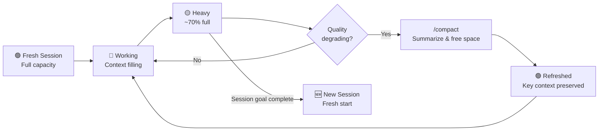

# 🧹 Context Window Management

> **Time to read:** ~5 min | **Skill level:** Intermediate | **Platform:** iOS & Android

Your Claude session is like RAM — finite, precious, and silently degrades when full. You wouldn't ignore memory leaks in TaskPulse. Don't ignore context leaks in your AI sessions.

Understanding how context works is the difference between a productive 2-hour pairing session and a frustrating loop of "didn't I already tell you that?"

---

## 🧠 How Context Windows Work

Every Claude session has a **token limit** — a fixed amount of information Claude can "see" at once. Think of it as a sliding window over your conversation.

| What Fills Context | Token Cost | Example |
|---|---|---|
| **Your prompts** | Low-Medium | "Add a due date picker to TaskDetailView" |
| **Claude's responses** | Medium-High | Generated code, explanations |
| **File reads** | High | Reading a 500-line ViewModel |
| **Tool outputs** | High | Build logs, test results, grep output |
| **Conversation history** | Cumulative | Every previous turn stays in context |

**The critical insight:** Context doesn't just fill — it fills *cumulatively*. Every message, every file read, every build output stays in the window until it's full.

```
Turn 1:   [████░░░░░░░░░░░░░░░░] 20% — Fresh, fast, accurate
Turn 15:  [████████████░░░░░░░░] 60% — Still good, but watch it
Turn 30:  [██████████████████░░] 90% — Quality starts dropping
Turn 40:  [████████████████████] 100% — Forgetting, repeating, degrading
```

---

## 🚨 Signs Your Context Is Full

Watch for these red flags — they mean Claude's context window is saturated:

| Symptom | What It Looks Like | What's Happening |
|---|---|---|
| **Forgetting instructions** | "Wait, you said use MVVM earlier?" | Earlier turns pushed out of effective attention |
| **Repeating itself** | Same explanation or code pattern given twice | Lost track of what was already said |
| **Quality degradation** | Simpler code, missing edge cases | Less "thinking space" available |
| **Ignoring CLAUDE.md rules** | Hardcoded colors instead of theme tokens | Project rules losing priority in crowded context |
| **Contradicting itself** | "Use async/await" then later "Use completion handlers" | Conflicting signals from long conversation |

> 💬 "If Claude suddenly 'forgets' your architecture, it hasn't gotten dumber — it's gotten full."

---

## 🔄 Context Window Lifecycle



---

## 📦 The `/compact` Command

`/compact` is your context pressure valve. It tells Claude to **summarize the conversation so far**, discarding the raw history but keeping the essential decisions and state.

### What `/compact` Preserves

- Key decisions made ("we chose MVVM, not MVI")
- Current task and progress ("implementing TaskDetailView, ViewModel done")
- File paths being worked on
- Important constraints mentioned

### What `/compact` Discards

- Full text of file reads (can be re-read if needed)
- Build/test output details
- Exploratory conversation ("what if we tried...")
- Verbose explanations already delivered

### When to Use `/compact`

```
✅ DO compact when:
  - You feel responses getting worse
  - You've read many large files
  - You're pivoting to a new sub-task within the same feature
  - Build/test output has eaten your context

❌ DON'T compact when:
  - You're in the middle of a multi-file refactor (might lose file state)
  - Claude is actively generating code (wait until it finishes)
  - You're about to end the session anyway (just start fresh)
```

---

## 🆚 Session Strategies Compared

| Strategy | When to Use | Pros | Cons |
|---|---|---|---|
| **Fresh session** | New feature, new task, new day | Full context, clean slate | Loses all prior conversation |
| **`/compact`** | Mid-session, context getting heavy | Preserves key decisions, frees space | Lossy — some nuance lost |
| **Continue (no action)** | Short session, context still light | Full conversation history | Risk of degradation |
| **Multiple short sessions** | Complex feature, plan upfront | Each session is sharp | Requires good handoff notes |

**The sweet spot for mobile dev:** Plan in session 1, implement in session 2, test/fix in session 3.

---

## 🗑️ Context Pollution — Common Mistakes

These habits burn through your context window fast:

### 1️⃣ Reading Too Many Files

```
❌ Bad: "Read every file in Sources/UI/Screens/"
   → 15 files × ~200 lines = massive context burn

✅ Good: "Read TaskDetailView.swift and its ViewModel"
   → Only what you need, right now
```

### 2️⃣ Verbose Prompts

```
❌ Bad: "I want you to create a SwiftUI view that shows task details.
   The view should have a title, description, due date, priority, and
   assignee. It should use MVVM pattern. The ViewModel should be
   @Observable. Use our theme tokens. Add previews. Support accessibility.
   Use async/await for data loading. Handle errors gracefully..."

✅ Good: "Create TaskDetailView following our SwiftUI component skill.
   Fields: title, description, due date, priority, assignee."
   → Skills carry the rest. Save your tokens.
```

### 3️⃣ Dumping Build Logs

```
❌ Bad: Running a full Xcode build with 500 lines of output in context

✅ Good: Use xcpretty to filter output, or ask Claude to only
   show errors: "Build TaskPulse and show only errors"
```

### 4️⃣ Exploratory Conversations Before Implementation

```
❌ Bad: "Explain 5 different architectures for real-time sync,
   then let's pick one and implement it"
   → The exploration phase eats context needed for implementation

✅ Good: Do exploration in Session 1. Start Session 2 with:
   "We're using WebSocket + local-first sync for TaskPulse.
   Implement the sync layer."
```

---

## 📱 Optimal Session Patterns for Mobile Dev

### Pattern 1: One Feature Per Session

The simplest and most reliable approach.

```
Session: "Add due date picker to TaskPulse"
├── Read relevant files (2-3 files)
├── Implement the feature
├── /compact if needed
├── Write tests
└── Done. Start a new session for the next feature.
```

### Pattern 2: Explore → Implement (Two Sessions)

For features requiring design decisions.

```
Session 1 — Explore:
├── "How should we architect offline sync?"
├── Discuss trade-offs
├── Agree on approach
└── Document decision in a comment or ADR

Session 2 — Implement:
├── "Implement offline sync using local-first with WebSocket push.
│    See decision notes in docs/adr/005-offline-sync.md"
├── Implement
├── Test
└── Done
```

### Pattern 3: The Compact Checkpoint

For medium-length sessions with multiple sub-tasks.

```
Session: "Refactor TaskList to support filters"
├── Step 1: Update data layer → complete
├── /compact ← checkpoint
├── Step 2: Update ViewModel → complete
├── /compact ← checkpoint
├── Step 3: Update UI → complete
└── Done
```

---

## 📱 TaskPulse Example: Building a Feature Across 2 Sessions

### Session 1 — Planning & Data Layer

```
You: I need to add task comments to TaskPulse. Users can add threaded
     comments to any task. Both iOS and Android.

     Let's start with the data layer. Here's our current Task model.
     [Claude reads TaskModel.swift and TaskDto.kt]

You: Design the Comment model and repository interface for both platforms.

     [Claude generates models, interfaces — context is ~40% full]

You: Now implement the iOS repository with CoreData persistence.

     [Claude implements — context is ~65% full]

You: /compact

     [Context freed, key decisions preserved: Comment model shape,
      repository interface, CoreData choice for iOS]

You: Now implement the Android repository with Room.

     [Claude implements — working with refreshed context]
```

### Session 2 — UI Layer (Fresh Start)

```
You: Continuing TaskPulse comments feature. The data layer is done:
     - iOS: Sources/Data/Repositories/CommentRepository.swift
     - Android: feature/comments/data/CommentRepositoryImpl.kt
     - Both use the same API contract from CommentApi

     Build the comment UI for iOS first — a comment thread view
     embedded in TaskDetailView. Follow our SwiftUI component skill.

     [Claude has full context for UI work — no wasted tokens
      on the data layer conversation from yesterday]
```

**Why this works:** Each session starts with only the context it needs. No leftover build logs, no exploratory discussion, no token debt.

---

## 🧪 Try It Now

1. **Context awareness drill:** Start a Claude session. After 15-20 turns, notice the quality. Run `/compact` and ask the same question. Compare the responses.

2. **Lean prompting:** Take a recent prompt you gave Claude that was 5+ lines. Rewrite it in 2 lines using a skill reference. Measure the token savings.

3. **Two-session feature:** Pick a small TaskPulse feature. Plan it in session 1 (architecture, file structure, models). Implement it in session 2 with a crisp opening prompt that references session 1's decisions. Notice how much sharper session 2 feels.

4. **Pollution audit:** Review your last 3 Claude sessions. Identify the biggest context polluters — unnecessary file reads, verbose logs, exploratory tangents. Write a personal checklist to avoid them.

---

← Previous: [05-skills.md](05-skills.md) | [🗺️ Course Map](../00-course-map.md) | Next →: [05c-memory-preferences.md](05c-memory-preferences.md)
