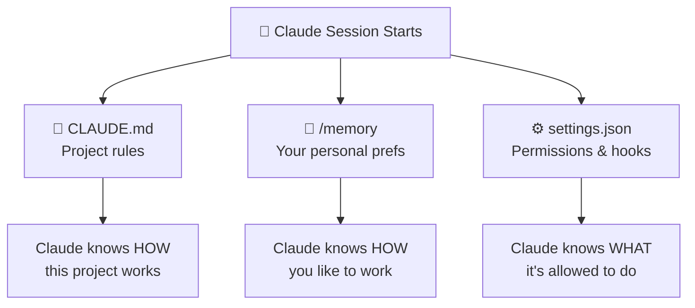

# 💾 /memory & Persistent Preferences

> **Time to read:** ~3 min | **Skill level:** Beginner | **Platform:** iOS & Android

CLAUDE.md is project memory. `/memory` is YOUR memory — personal preferences that follow you everywhere. Different projects, different machines, same you.

Think of it this way: CLAUDE.md is the team handbook everyone reads. `/memory` is the sticky note on *your* monitor that says "I like tabs, dark mode, and terse code reviews."

---

## 🧠 What /memory Does

`/memory` stores **user-level preferences** that persist across all sessions and all projects. When you set a preference with `/memory`, Claude remembers it every time you start a new session — anywhere.

```
You: /memory I prefer concise responses. Skip explaining what code does
     unless I ask. Just show the code.

Claude: ✅ Saved to memory. I'll keep responses code-focused from now on.

--- Next session, different project ---

You: Add a loading state to TaskListViewModel

Claude: [Just shows the code. No essay. Because it remembers.]
```

Your memory preferences are stored in `~/.claude/memory.md` — a simple markdown file in your home directory.

---

## 🆚 Memory Systems Compared

Claude Code has three layers of persistent configuration. They serve different purposes:

| | **CLAUDE.md** | **/memory** | **.claude/settings.json** |
|---|---|---|---|
| **Scope** | This project | You, everywhere | This project (or global) |
| **Who writes it** | You (or `/init`) | You via `/memory` | You, manually |
| **Shared with team** | Yes (committed) | No (personal) | Yes (committed) |
| **What it stores** | Architecture, code style, build commands | Personal preferences, communication style | Permissions, hooks, MCP servers |
| **Format** | Markdown instructions | Markdown notes | JSON configuration |
| **Where it lives** | `./CLAUDE.md` | `~/.claude/memory.md` | `./.claude/settings.json` |
| **Loaded when** | Every session in this project | Every session, any project | Every session in this project |



**The key insight:** CLAUDE.md shapes the *output*. `/memory` shapes the *interaction*. Settings shape the *guardrails*.

---

## ✅ What to Store in /memory

Great `/memory` entries are **personal, cross-project, and behavioral**. They describe how *you* work, not how a *project* works.

### Communication Preferences

```
/memory I prefer concise responses. Show code first, explain only if I ask.
/memory When showing diffs, use unified format.
/memory Don't ask for confirmation before editing files — just do it.
/memory When I say "fix it", run the fix and the tests in one go.
```

### Coding Style Preferences

```
/memory I prefer early returns over nested if-else.
/memory I use trailing closures in Swift whenever possible.
/memory For Kotlin, I prefer expression bodies for single-line functions.
/memory I prefer named parameters for functions with 3+ arguments.
```

### Platform Preferences

```
/memory I'm primarily an iOS developer. Default to Swift/SwiftUI examples
        unless I specify Android.
/memory When showing both platforms, show iOS first.
/memory I use Xcode 16 and target iOS 17+.
/memory For Android, I use Kotlin 2.0 and target API 28+.
```

### Review Preferences

```
/memory When reviewing code, be strict. Flag any missing error handling.
/memory In code reviews, focus on architecture issues over style nits.
/memory Always check for memory leaks in closures and Combine subscriptions.
```

### Workflow Preferences

```
/memory After implementing a feature, always run the relevant test suite.
/memory When creating new files, add them to the Xcode project if needed.
/memory I prefer feature branches named feature/JIRA-123-short-description.
```

---

## 📱 Good /memory Entries for Mobile Devs

Here are battle-tested memory entries from experienced mobile developers:

### iOS-First Developer

```
/memory I'm a senior iOS developer. Default to Swift and SwiftUI.
/memory Use Swift Testing over XCTest for new test files.
/memory I prefer @Observable over ObservableObject for new ViewModels.
/memory Run swift build before committing to catch compiler errors.
/memory When generating views, always include #Preview with 2+ states.
```

### Android-First Developer

```
/memory I'm a senior Android developer. Default to Kotlin and Compose.
/memory Use collectAsStateWithLifecycle, never collectAsState.
/memory I prefer sealed interfaces over sealed classes for UI state.
/memory Run ./gradlew testDebugUnitTest before committing.
/memory Use Material3 components, not Material2.
```

### Cross-Platform Developer

```
/memory I work on both iOS and Android. Show both platform implementations
        side by side when relevant.
/memory Match feature parity across platforms — if I implement something
        for iOS, remind me to do Android too.
/memory Keep data models aligned: same field names, same types where possible.
```

---

## 🚫 What NOT to Store in /memory

These belong in **CLAUDE.md**, not `/memory`:

```
❌ /memory This project uses MVVM architecture
   → Put in CLAUDE.md — it's a PROJECT rule, not a personal preference

❌ /memory The API base URL is https://api.taskpulse.io
   → Put in CLAUDE.md — it's project-specific configuration

❌ /memory Run ./gradlew :app:assembleDebug to build
   → Put in CLAUDE.md — build commands are project-specific

❌ /memory Never use force unwraps in Swift
   → Put in CLAUDE.md — it's a team coding standard, not personal

❌ /memory The Chat module uses WebSocket for real-time updates
   → Put in CLAUDE.md (or nested CLAUDE.md) — project architecture detail
```

**The test:** Would this preference apply if you switched to a completely different project tomorrow? If yes, it belongs in `/memory`. If no, it belongs in `CLAUDE.md`.

---

## 📱 TaskPulse Example: Setting Up Personal Preferences

Meet Sam, an iOS-first developer joining the TaskPulse team. Here's how Sam sets up their personal preferences:

### Day 1 — Basic Setup

```
Sam: /memory I'm a senior iOS developer, 8 years experience. I know
     SwiftUI deeply but I'm newer to Compose. When showing Android
     code, add brief comments explaining non-obvious Compose concepts.

Sam: /memory Concise responses. Code over explanation. I'll ask if I
     need more context.

Sam: /memory I prefer early returns and guard statements in Swift.
     For Kotlin, prefer when expressions over if-else chains.
```

### Day 3 — Refinement After a Few Sessions

```
Sam: /memory When I say "test it", run only the tests for the module
     I'm working in, not the full suite. Full suite is too slow.

Sam: /memory I use vim keybindings. When describing file navigation,
     skip GUI instructions.
```

### Day 7 — Workflow Patterns

```
Sam: /memory My workflow: implement → lint → test → commit. Prompt me
     if I forget to test before committing.

Sam: /memory For PR descriptions, use this format:
     ## What: one-liner
     ## Why: motivation
     ## Testing: what was tested
```

**Sam's `~/.claude/memory.md` now contains preferences that work across TaskPulse, side projects, and any future team.**

---

## 🔧 Managing Your Memory

### View Current Memory

```bash
# Your memory file is just markdown
cat ~/.claude/memory.md
```

### Edit Directly

```bash
# Open in your editor for bulk changes
vim ~/.claude/memory.md
```

### Clear and Start Fresh

```bash
# Nuclear option — clear everything
echo "" > ~/.claude/memory.md
```

### Updating via /memory

Each `/memory` command **appends** to your memory file. To change an existing preference, either edit the file directly or add a new `/memory` entry that overrides the old one:

```
/memory UPDATE: I now prefer Swift Testing over XCTest for ALL tests,
        not just new files.
```

---

## 🧪 Try It Now

1. **Set up your platform preference:** Run `/memory` to tell Claude your primary platform (iOS or Android), your experience level with the other platform, and how you want code examples presented. Start a new session and notice the difference.

2. **Calibrate verbosity:** Run `/memory I prefer [concise/detailed] responses. [Show code first/Explain first].` Then ask Claude to implement a small feature. Does the response style match your preference? Adjust until it feels right.

3. **Audit your CLAUDE.md for personal preferences:** Look at your current CLAUDE.md. Are any of the rules actually *personal preferences* rather than project rules? Move them to `/memory` where they belong. Your teammates will thank you.

---

← Previous: [05b-context-management.md](05b-context-management.md) | [🗺️ Course Map](../00-course-map.md) | Next →: [06-commands.md](06-commands.md)
