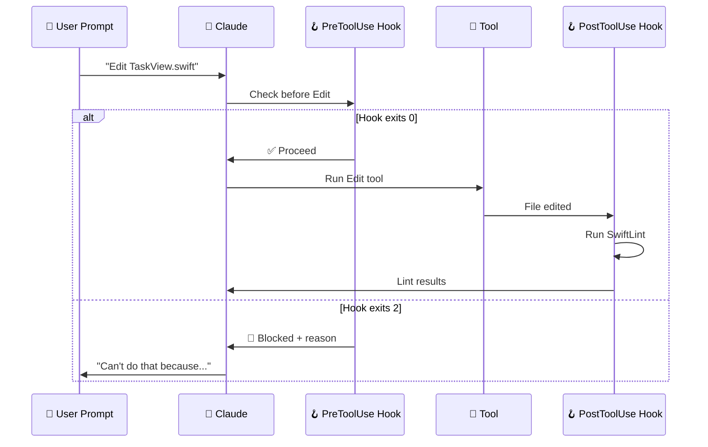

# 🪝 Hooks — Your AI's Guardrails

> **Time to read:** ~5 min | **Skill level:** Intermediate-Advanced | **Platform:** iOS & Android

CLAUDE.md says "please do X." Skills teach patterns. But **hooks enforce rules.** They're deterministic shell scripts that run automatically on Claude events.

> 💬 "Hooks catch what prompts miss."

Claude forgot to lint? The hook runs it anyway. Claude tried to commit to `main`? The hook blocks it. No exceptions.

---

## 🎯 What Are Hooks?

Hooks are **shell scripts that fire on specific Claude events.** They're not AI-powered — they're plain old bash. That's the point.

| Layer | Type | Reliability |
|-------|------|-------------|
| CLAUDE.md | Instructions | 🟡 Usually followed |
| Skills | Patterns | 🟡 Usually followed |
| **Hooks** | **Enforcement** | **🟢 Always runs** |

Hooks are your safety net. They don't *ask* Claude to do something — they *make it happen*.

---

## ⚙️ Configuration

Hooks live in `.claude/settings.json`:

```json
{
  "hooks": {
    "PreToolUse": [
      {
        "matcher": "Bash",
        "command": "/path/to/your/script.sh"
      }
    ],
    "PostToolUse": [
      {
        "matcher": "Edit",
        "command": "/path/to/another-script.sh"
      }
    ]
  }
}
```

Each hook has:
- **Event type** — When it fires
- **Matcher** — Which tool triggers it (optional, filters by tool name)
- **Command** — The shell script to run

---

## 📋 Key Event Types

| Event | When It Fires | Best Use Case |
|-------|--------------|---------------|
| `PreToolUse` | ⏮️ Before a tool runs | Block dangerous commands |
| `PostToolUse` | ⏭️ After a tool runs | Auto-lint, auto-format |
| `Notification` | 🔔 Claude sends notification | Custom alerts (Slack, sound) |
| `Stop` | 🛑 Session ends | Auto-restart loops! |
| `SubagentStop` | 🐣 Subagent finishes | Chain tasks together |
| `SessionStart` | 🌐 Cloud session begins | Install deps, configure env |

---

## 🎯 Matchers

Matchers filter hooks to specific tools:

| Matcher | Fires When |
|---------|-----------|
| `Bash` | Any bash command runs |
| `Edit` | A file is edited |
| `Write` | A new file is written |
| `Read` | A file is read |
| *(empty)* | Every tool invocation |

You can also use regex patterns: `"matcher": "Bash|Edit|Write"` to match multiple tools.

---

## 🔢 Exit Codes — The Control System

Your hook script's exit code tells Claude what to do:

| Exit Code | Meaning | Claude's Reaction |
|-----------|---------|-------------------|
| `0` | ✅ Proceed | Tool runs / continues normally |
| `2` | 🚫 Block + message | Tool is blocked; stdout shown to Claude as feedback |
| Other | ❌ Error | Hook is ignored, tool proceeds |

**Exit code `2` is your superpower.** It blocks the action AND tells Claude *why*, so it can self-correct.

---

## 🔄 Hook Lifecycle



---

## 📱 Mobile Hook Examples

Here's a full `.claude/settings.json` for a TaskPulse mobile project:

```json
{
  "hooks": {
    "PreToolUse": [
      {
        "matcher": "Bash",
        "command": ".claude/hooks/block-main-commit.sh"
      }
    ],
    "PostToolUse": [
      {
        "matcher": "Edit",
        "command": ".claude/hooks/auto-lint.sh"
      },
      {
        "matcher": "Write",
        "command": ".claude/hooks/auto-lint.sh"
      }
    ]
  }
}
```

---

### 🚫 Block Commits to `main`

**`.claude/hooks/block-main-commit.sh`**

```bash
#!/bin/bash

# Read the tool input from stdin
INPUT=$(cat)

# Check if this is a git commit command
if echo "$INPUT" | grep -q "git commit\|git push"; then
  BRANCH=$(git branch --show-current)
  if [ "$BRANCH" = "main" ] || [ "$BRANCH" = "master" ]; then
    echo "🚫 BLOCKED: Cannot commit/push directly to $BRANCH."
    echo "Create a feature branch first: git checkout -b feature/your-change"
    exit 2
  fi
fi

exit 0
```

---

### 🧹 Auto-Lint After Every Edit

**`.claude/hooks/auto-lint.sh`**

```bash
#!/bin/bash

# Read tool output from stdin
INPUT=$(cat)

# Extract the file path from the tool input
FILE=$(echo "$INPUT" | grep -oP '"file_path":\s*"\K[^"]+')

if [[ -z "$FILE" ]]; then
  exit 0
fi

# Swift files → SwiftLint
if [[ "$FILE" == *.swift ]]; then
  if command -v swiftlint &> /dev/null; then
    RESULT=$(swiftlint lint --path "$FILE" --quiet 2>&1)
    if [[ -n "$RESULT" ]]; then
      echo "⚠️ SwiftLint issues in $FILE:"
      echo "$RESULT"
    fi
  fi
fi

# Kotlin files → detekt / ktlint
if [[ "$FILE" == *.kt ]]; then
  if command -v ktlint &> /dev/null; then
    RESULT=$(ktlint "$FILE" 2>&1)
    if [[ -n "$RESULT" ]]; then
      echo "⚠️ ktlint issues in $FILE:"
      echo "$RESULT"
    fi
  fi
fi

exit 0
```

---

### 🎨 Auto-Format on Save

**`.claude/hooks/auto-format.sh`**

```bash
#!/bin/bash

INPUT=$(cat)
FILE=$(echo "$INPUT" | grep -oP '"file_path":\s*"\K[^"]+')

if [[ -z "$FILE" ]]; then
  exit 0
fi

# Swift → swift-format
if [[ "$FILE" == *.swift ]]; then
  if command -v swift-format &> /dev/null; then
    swift-format format --in-place "$FILE" 2>&1
    echo "✅ Formatted $FILE with swift-format"
  fi
fi

# Kotlin → ktlint
if [[ "$FILE" == *.kt ]]; then
  if command -v ktlint &> /dev/null; then
    ktlint --format "$FILE" 2>&1
    echo "✅ Formatted $FILE with ktlint"
  fi
fi

exit 0
```

---

### 🧪 Run Tests Before Git Commit

**`.claude/hooks/pre-commit-tests.sh`**

```bash
#!/bin/bash

INPUT=$(cat)

# Only trigger on git commit commands
if ! echo "$INPUT" | grep -q "git commit"; then
  exit 0
fi

echo "🧪 Running quick test suite before commit..."

# Check which files are staged
SWIFT_CHANGED=$(git diff --cached --name-only -- '*.swift' | wc -l)
KT_CHANGED=$(git diff --cached --name-only -- '*.kt' | wc -l)

if [ "$SWIFT_CHANGED" -gt 0 ]; then
  echo "Running iOS unit tests..."
  xcodebuild test \
    -workspace TaskPulse.xcworkspace \
    -scheme TaskPulse \
    -destination 'platform=iOS Simulator,name=iPhone 16,OS=latest' \
    -quiet 2>&1
  if [ $? -ne 0 ]; then
    echo "🚫 iOS tests failed. Fix tests before committing."
    exit 2
  fi
fi

if [ "$KT_CHANGED" -gt 0 ]; then
  echo "Running Android unit tests..."
  ./gradlew testDebugUnitTest --quiet 2>&1
  if [ $? -ne 0 ]; then
    echo "🚫 Android tests failed. Fix tests before committing."
    exit 2
  fi
fi

echo "✅ All tests passed."
exit 0
```

---

## 🔒 Sandboxing — OS-Level Protection

Hooks are your custom guardrails. But Claude Code also has **built-in sandboxing** using OS-level primitives:

| Platform | Technology | What It Does |
|----------|-----------|--------------|
| Linux | bubblewrap | Filesystem and network isolation |
| macOS | seatbelt | App sandbox profiles |

Sandboxing results:
- **84% fewer permission prompts** — Claude can read safely without asking
- **95% reduction** in prompt injection attack surface

By default, Claude Code runs in a read-only sandbox. It asks before writing files or running commands. You can fine-tune this with permission settings.

---

## 🛡️ Permission Modes

Claude Code has **four permission modes** that control what Claude can do without asking:

| Mode | Behavior |
|------|----------|
| **Default** | Read-only. Asks before writes and bash commands |
| **Approved list** | Auto-approve specific tools/commands you've allowed |
| **Trust project** | Follow `.claude/settings.json` permissions for this project |
| **YOLO** | `--dangerously-skip-permissions` — auto-approve everything (CI only!) |

Fine-grained control via settings:

```json
{
  "permissions": {
    "allow": [
      "Bash(npm test)",
      "Bash(swift build)",
      "Read",
      "Glob",
      "Grep"
    ],
    "deny": [
      "Bash(rm -rf *)",
      "Bash(git push --force)"
    ]
  }
}
```

### `settings.local.json` — Personal Overrides

Your personal settings that **don't get committed** to the repo:

```json
// .claude/settings.local.json (auto-gitignored)
{
  "permissions": {
    "allow": ["Bash(./my-custom-script.sh)"]
  },
  "env": {
    "MY_API_KEY": "sk-..."
  }
}
```

Use `settings.local.json` for: API keys, personal tool paths, local MCP server configs, and any settings you don't want in version control.

### Settings Hierarchy

Settings are merged in order of specificity (later overrides earlier):

```
~/.claude/settings.json        ← User-global (all projects)
.claude/settings.json           ← Project-shared (committed to repo)
.claude/settings.local.json     ← Project-personal (auto-gitignored)
```

| File | Scope | Committed? | Use For |
|------|-------|-----------|---------|
| `~/.claude/settings.json` | All projects | N/A (home dir) | Global hooks, default permissions |
| `.claude/settings.json` | This project | Yes | Team-shared hooks, MCP servers |
| `.claude/settings.local.json` | This project, you only | No (gitignored) | API keys, personal MCP configs |

**Note:** `~/.claude.json` (without the directory) stores theme, OAuth tokens, notification preferences, and MCP caches. It's not a settings file — don't edit it manually.

---

## ⚠️ The Guardrail Stack

The three layers work together:

```
┌─────────────────────────────────────┐
│  🪝 Hooks (Enforcement)            │  ← "You WILL lint"
│  Always runs. Deterministic. Bash.  │
├─────────────────────────────────────┤
│  ⚡ Skills (Patterns)               │  ← "Here's HOW to write it"
│  Auto-loaded. AI-interpreted.       │
├─────────────────────────────────────┤
│  📝 CLAUDE.md (Instructions)        │  ← "Here's WHAT we do"
│  Always present. Sets the tone.     │
└─────────────────────────────────────┘
```

| Layer | Strength | Weakness |
|-------|----------|----------|
| CLAUDE.md | Broad guidance | Can be ignored by AI |
| Skills | Detailed patterns | Only loads when matched |
| **Hooks** | **Always executes** | **Only reacts, can't generate** |

**Use all three together.** CLAUDE.md teaches. Skills demonstrate. Hooks enforce.

---

## 🧪 Try It Now

1. **Create a lint hook:** Set up `auto-lint.sh` to run SwiftLint or ktlint after every file edit. Watch Claude get instant feedback.

2. **Block `main` commits:** Add the branch protection hook. Try to commit to `main` and see it blocked.

3. **Test exit code 2:** Write a hook that blocks any file write to `Sources/Generated/` (auto-generated files shouldn't be hand-edited). Verify Claude gets the message and adjusts.

4. **Build the full stack:** For one feature in TaskPulse, set up:
   - CLAUDE.md rule: "All views must have previews"
   - Skill: SwiftUI component generator with preview template
   - Hook: Script that checks `#Preview` exists after `.swift` file creation

   See how all three layers reinforce each other.

---

← Previous: [06-commands.md](06-commands.md) | [🗺️ Course Map](../00-course-map.md) | Next →: [08-subagents.md](08-subagents.md)
