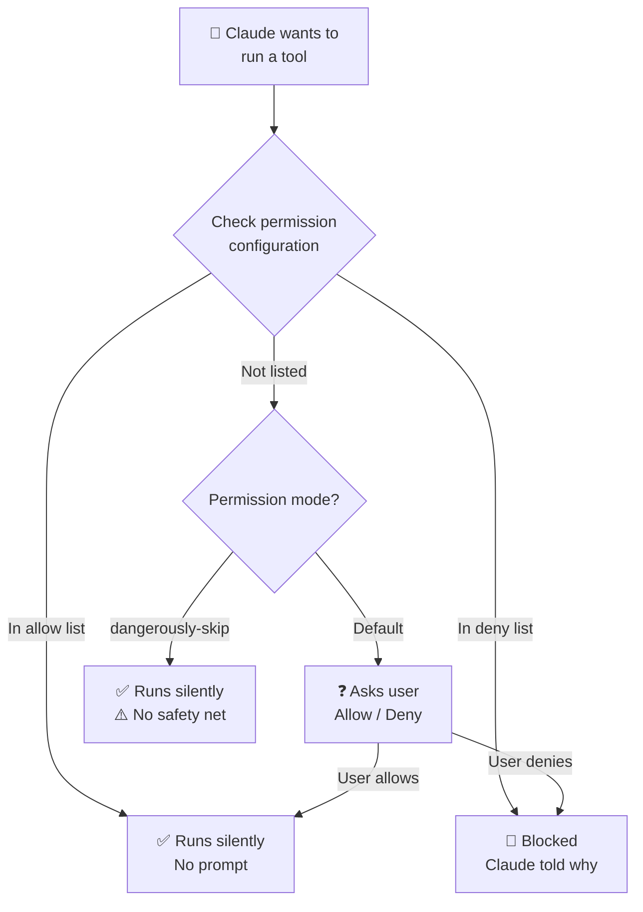
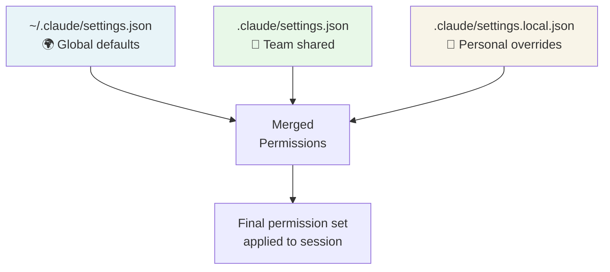

# 🔐 Permissions Deep Dive

> **Time to read:** ~5 min | **Skill level:** Intermediate | **Platform:** iOS & Android

Permissions are the seatbelt of AI coding — annoying until you need them, then they save your project. That one time Claude ran `rm -rf` on your `Sources/` directory? Permissions would have stopped it cold.

Understanding the permission model isn't just about safety. It's about *speed*. The right permission setup eliminates constant "Allow this?" prompts while keeping genuinely dangerous operations gated.

---

## 🎯 What Permissions Control

Claude Code's permission model gates three categories of actions:

| Category | What It Covers | Example |
|---|---|---|
| **File Operations** | Read, Edit, Write files | Writing to `TaskDetailView.swift` |
| **Bash Execution** | Shell commands | Running `xcodebuild`, `./gradlew`, `git commit` |
| **MCP Tool Calls** | External tool invocations | Calling a Jira MCP server, fetching a URL |

Every time Claude wants to perform one of these actions, the permission system decides: **allow silently, ask the user, or block entirely**.



---

## 🔧 Permission Modes

Claude Code offers a spectrum of permission strictness. Choose based on your context:

### 1️⃣ Default Mode — Ask for Everything

The out-of-the-box experience. Claude asks before any write or command execution.

```
You: Add a due date field to TaskModel.swift

Claude: I'd like to edit Sources/Models/TaskModel.swift
        [Allow] [Deny] [Allow Always]
```

**Best for:** First-time users, unfamiliar codebases, security-critical projects.

### 2️⃣ Allowlisted Mode — Pre-Approve Specific Tools

Configure `.claude/settings.json` to auto-approve known-safe operations:

```json
{
  "permissions": {
    "allow": [
      "Read",
      "Glob",
      "Grep",
      "Bash(swift build)",
      "Bash(swift test)",
      "Bash(xcodebuild *)",
      "Bash(./gradlew *)",
      "Bash(swiftlint *)",
      "Bash(ktlint *)",
      "Bash(git status)",
      "Bash(git diff *)",
      "Bash(git log *)"
    ],
    "deny": [
      "Bash(rm -rf *)",
      "Bash(git push --force *)",
      "Bash(git reset --hard *)",
      "Bash(sudo *)"
    ]
  }
}
```

**Best for:** Daily development. The sweet spot for most mobile developers.

### 3️⃣ Dangerously Skip Permissions

```bash
claude --dangerously-skip-permissions
```

Every operation runs without asking. Claude has full autonomy.

**Best for:** CI/CD pipelines, automated batch operations, Ralph loops with guardrail hooks. **Never for interactive development on production code.**

---

## 🆚 Permission Modes Compared

| | **Default** | **Allowlisted** | **Dangerously Skip** |
|---|---|---|---|
| **Safety** | Maximum | High (you choose what's safe) | None |
| **Speed** | Slow (constant prompts) | Fast (known ops are instant) | Fastest (zero prompts) |
| **Setup effort** | None | Medium (configure once) | None |
| **Risk level** | Lowest | Low-Medium | High |
| **Best for** | Learning, auditing | Daily development | CI/CD, automation |
| **Team recommended** | New members' first week | Standard workflow | Pipeline scripts only |

---

## ⚙️ Configuring Allowlists

### Pattern Matching Syntax

Permissions use glob-style pattern matching for bash commands:

```json
{
  "permissions": {
    "allow": [
      "Bash(swift *)",
      "Bash(./gradlew *)",
      "Bash(git diff *)",
      "Bash(npm test)",
      "Bash(cd * && swift *)",
      "Edit",
      "Write",
      "Read"
    ]
  }
}
```

| Pattern | Matches | Does NOT Match |
|---|---|---|
| `Bash(swift build)` | `swift build` only | `swift test`, `swift build -v` |
| `Bash(swift *)` | `swift build`, `swift test` | `swiftlint`, `rm swift.txt` |
| `Bash(./gradlew *)` | `./gradlew assembleDebug` | `gradle assembleDebug` |
| `Bash(git diff *)` | `git diff HEAD`, `git diff --cached` | `git push`, `git reset` |
| `Edit` | Any file edit | File writes (new files) |

### Deny Takes Priority

If an operation matches both `allow` and `deny`, **deny wins**:

```json
{
  "permissions": {
    "allow": ["Bash(git *)"],
    "deny": ["Bash(git push --force *)"]
  }
}
```

This allows all git commands *except* force pushes. Defense in depth.

---

## 📁 Settings Hierarchy & Scoped Permissions

Permissions are configured at three levels, merged from broadest to most specific:

```
~/.claude/settings.json           ← Global: applies to ALL projects
.claude/settings.json              ← Project: shared with team (committed)
.claude/settings.local.json        ← Personal: your overrides (gitignored)
```



| File | Scope | Committed to Git? | Use For |
|---|---|---|---|
| `~/.claude/settings.json` | All your projects | N/A (home dir) | Your personal defaults across projects |
| `.claude/settings.json` | This project, all team members | Yes | Team-agreed permissions and hooks |
| `.claude/settings.local.json` | This project, only you | No (auto-gitignored) | Personal API keys, local MCP servers |

**Later files override earlier ones.** Your personal overrides beat project settings, which beat global settings.

---

## 👥 Team Permission Standards

For a team project like TaskPulse, establish a shared permission baseline that balances safety and productivity.

### Recommended Team `.claude/settings.json`

```json
{
  "permissions": {
    "allow": [
      "Read",
      "Glob",
      "Grep",
      "Bash(swift build *)",
      "Bash(swift test *)",
      "Bash(xcodebuild -scheme * -destination * test)",
      "Bash(./gradlew *)",
      "Bash(swiftlint *)",
      "Bash(ktlint *)",
      "Bash(git status)",
      "Bash(git diff *)",
      "Bash(git log *)",
      "Bash(git add *)",
      "Bash(git checkout -b *)",
      "Bash(git branch *)"
    ],
    "deny": [
      "Bash(rm -rf *)",
      "Bash(git push --force *)",
      "Bash(git reset --hard *)",
      "Bash(git checkout main)",
      "Bash(git checkout master)",
      "Bash(sudo *)",
      "Bash(curl * | bash)",
      "Bash(wget * | bash)"
    ]
  }
}
```

### What This Setup Achieves

- **Reads are always instant** — no prompts for grep, glob, or file reads
- **Builds and tests run freely** — Claude can verify its own work without asking
- **Linting is automatic** — SwiftLint and ktlint run without interruption
- **Git reads are open, writes are gated** — Claude can check status and diffs but asks before committing
- **Destructive operations are blocked** — force pushes, hard resets, and `rm -rf` are denied outright
- **Main branch is protected** — Claude cannot accidentally checkout and commit to main

### Personal Override Example

A senior developer who trusts Claude with more git operations:

```json
// .claude/settings.local.json — NOT committed
{
  "permissions": {
    "allow": [
      "Bash(git commit *)",
      "Bash(git push origin *)"
    ]
  }
}
```

A junior developer who wants extra safety:

```json
// .claude/settings.local.json
{
  "permissions": {
    "deny": [
      "Bash(git commit *)",
      "Write"
    ]
  }
}
```

---

## 🤖 When to Use --dangerously-skip-permissions

This flag has a scary name for a reason. Use it only in controlled, automated environments:

### Appropriate Uses

**CI/CD Pipelines**

```yaml
# GitHub Actions — Claude runs in an isolated container
- name: Claude Code Review
  run: |
    claude --dangerously-skip-permissions \
      -p "Review the changes in this PR and post comments"
```

The pipeline is ephemeral. No persistent files at risk. The container is destroyed after the run.

**Ralph Loops (with Hook Guardrails)**

```bash
# Automated fix loop — hooks provide the safety net
claude --dangerously-skip-permissions \
  -p "Fix all failing tests in feature/comments"
```

When combined with hooks (Chapter 07), permissions can be skipped because the hooks enforce rules deterministically. The hook blocks dangerous operations via exit code 2 — even when permissions are off.

**Batch File Operations**

```bash
# Rename a symbol across the entire codebase
claude --dangerously-skip-permissions \
  -p "Rename TaskItem to TaskEntry in all Swift and Kotlin files.
      Update imports. Run tests after."
```

For a well-defined, bounded operation where human review happens after.

### Never Appropriate

```
❌ Interactive development on production code
❌ Working in a repo with uncommitted changes you care about
❌ When you're unsure what Claude might do
❌ On shared machines or servers with sensitive data
❌ When onboarding new team members to Claude Code
```

---

## 🛡️ Security Implications

Understanding what can go wrong without permissions helps you configure them thoughtfully.

| Risk | Without Permissions | With Proper Config |
|---|---|---|
| **Accidental deletion** | Claude runs `rm -rf Sources/` | Denied by deny list |
| **Force push to main** | Overwrites team's work | Blocked and explained |
| **Secret exposure** | Claude reads `.env` and includes values in output | `.claudeignore` prevents reading |
| **Unintended installs** | `npm install sketchy-package` | Bash command requires approval |
| **Prompt injection** | Malicious file content triggers harmful commands | PreToolUse hooks validate commands |

### The Defense Stack

```
┌──────────────────────────────────────────┐
│  🚫 deny list — Hard blocks              │  ← "Never do this"
├──────────────────────────────────────────┤
│  🪝 Hooks — Programmable enforcement     │  ← "Check this first"
├──────────────────────────────────────────┤
│  ❓ Permission prompts — Human in loop   │  ← "Ask before doing"
├──────────────────────────────────────────┤
│  ✅ allow list — Pre-approved safe ops   │  ← "This is always OK"
├──────────────────────────────────────────┤
│  🏖️ Sandbox — OS-level isolation          │  ← "Can't escape this box"
└──────────────────────────────────────────┘
```

Permissions are one layer. Combined with hooks (Chapter 07), `.claudeignore`, and OS-level sandboxing, you get defense in depth.

---

## 📱 TaskPulse Example: Setting Up Team-Wide Permissions

Here's how the TaskPulse team rolls out a shared permission configuration:

### Step 1 — Tech Lead Creates the Baseline

```bash
mkdir -p .claude
```

```json
// .claude/settings.json — committed to repo
{
  "permissions": {
    "allow": [
      "Read",
      "Glob",
      "Grep",
      "Bash(swift build *)",
      "Bash(swift test *)",
      "Bash(xcodebuild *)",
      "Bash(./gradlew *)",
      "Bash(swiftlint *)",
      "Bash(ktlint *)",
      "Bash(git status)",
      "Bash(git diff *)",
      "Bash(git log *)",
      "Bash(git add *)",
      "Bash(git checkout -b *)"
    ],
    "deny": [
      "Bash(rm -rf *)",
      "Bash(git push --force *)",
      "Bash(git reset --hard *)",
      "Bash(sudo *)"
    ]
  },
  "hooks": {
    "PreToolUse": [
      {
        "matcher": "Bash",
        "command": ".claude/hooks/block-main-commit.sh"
      }
    ],
    "PostToolUse": [
      {
        "matcher": "Edit",
        "command": ".claude/hooks/auto-lint.sh"
      }
    ]
  }
}
```

### Step 2 — Commit and Communicate

```bash
git add .claude/settings.json
git commit -m "chore: add Claude Code team permissions and hooks"
```

Every developer who pulls this branch gets the same permission baseline automatically.

### Step 3 — Developers Add Personal Overrides

Each developer creates `.claude/settings.local.json` (auto-gitignored) for their own preferences:

```json
// iOS developer who also wants Xcode project management
{
  "permissions": {
    "allow": [
      "Bash(xed *)",
      "Bash(open *.xcworkspace)"
    ]
  }
}
```

```json
// Android developer who uses custom Gradle tasks
{
  "permissions": {
    "allow": [
      "Bash(./gradlew :features:*)",
      "Bash(adb *)"
    ]
  }
}
```

### Step 4 — CI/CD Pipeline Uses Skip Mode

```yaml
# .github/workflows/claude-review.yml
claude-review:
  runs-on: ubuntu-latest
  steps:
    - uses: actions/checkout@v4
    - name: AI Code Review
      run: |
        claude --dangerously-skip-permissions \
          -p "Review this PR for architecture violations.
              Check against CLAUDE.md rules."
```

Safe because the CI container is ephemeral and isolated.

---

## 🧪 Try It Now

1. **Audit your current permissions:** Run a Claude session and count how many permission prompts you get in 10 minutes. For each one, decide: should this be in your allow list (you always say yes), your deny list (you'd always say no), or kept as a prompt (you want to decide each time)?

2. **Create a team settings file:** Build a `.claude/settings.json` for your project with allow and deny lists. Start conservative — you can always loosen. Commit it so your team gets it on their next pull.

3. **Test the deny list:** Add `"Bash(git push --force *)"` to your deny list. Then ask Claude to force push. Verify it gets blocked with a clear explanation. Check that Claude adjusts its approach (e.g., suggests a regular push instead).

4. **Simulate CI mode:** In a throwaway branch, run `claude --dangerously-skip-permissions -p "List all TODO comments in the codebase"`. Notice how it runs without any prompts. Now imagine it running `rm -rf` just as silently — that's why you only use this flag in isolated environments.

---

← Previous: [07-hooks.md](07-hooks.md) | [🗺️ Course Map](../00-course-map.md) | Next →: [08-subagents.md](08-subagents.md)
