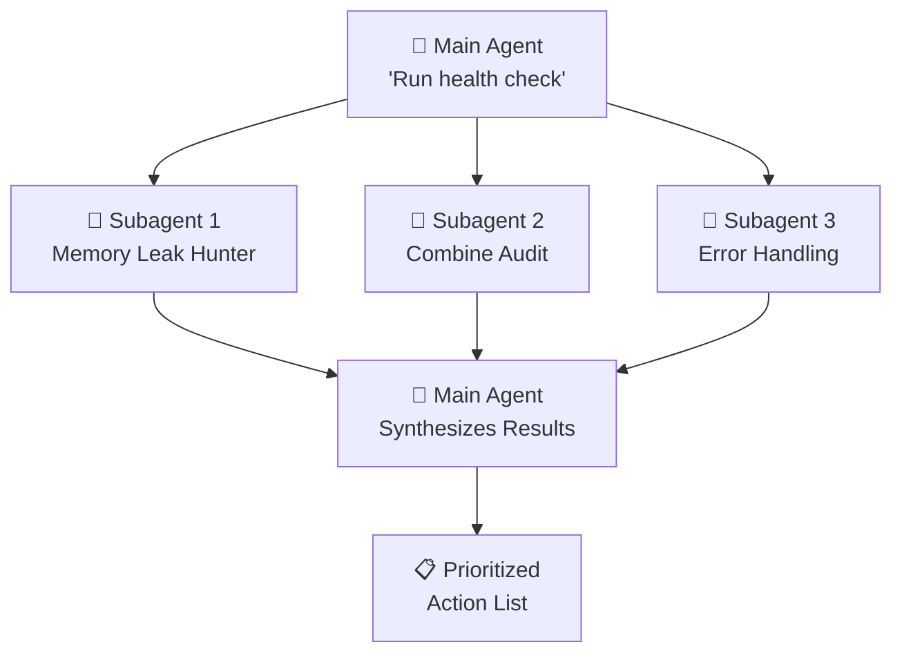
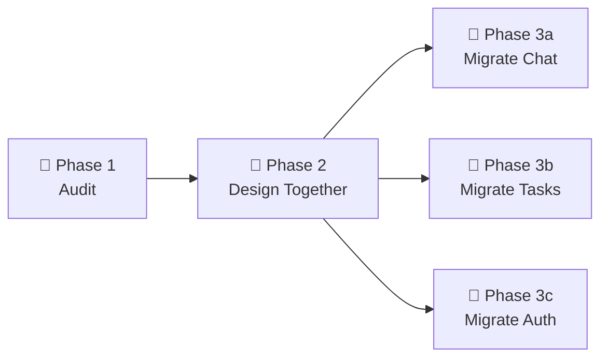

# 🐣 Subagents — Focused Workers

> **Time to read:** ~5 min | **Skill level:** Advanced | **Platform:** iOS & Android

You wouldn't ask a senior dev to simultaneously review memory leaks, audit error handling, AND check accessibility. You'd delegate. **Subagents are your delegation system.**

A subagent is a focused, scoped worker within your main Claude session. Think of it like dispatching a junior dev to research one specific thing and report back.

---

## 🎯 What's a Subagent?

A subagent is a separate Claude instance that:
- Gets a **focused task** with a narrow scope
- Has its **own context window** (doesn't pollute yours)
- **Returns findings** to the main agent
- Then **goes away**

```
You → Main Agent: "Review TaskPulse for issues"
Main Agent → Subagent 1: "Check ViewModels for memory leaks"
Main Agent → Subagent 2: "Audit Combine subscriptions"
Main Agent → Subagent 3: "Review error handling"
All 3 report back → Main Agent synthesizes → You get a clean summary
```

---

## 🆚 Main Session vs Subagent

| | 🤖 Main Session | 🐣 Subagent |
|---|---|---|
| **Scope** | Full project | Narrow, focused task |
| **Context window** | Large (full conversation) | Smaller (just its task) |
| **Capabilities** | All tools | All tools |
| **Persistence** | Entire session | Task duration only |
| **Can spawn others** | Yes | No (one level deep) |
| **Communication** | Directly with you | Through main agent only |

**Key insight:** Subagents keep your main context window clean. Heavy exploration happens "off-screen."

---

## 📱 Mobile Use Cases

### 1️⃣ Architecture Exploration

Your main session is building a feature, and you need to understand how navigation works — but you don't want 50 files cluttering your context.

```
Prompt to Claude:

"Launch a subagent to explore how TaskPulse handles navigation.
Check the Coordinator pattern in Sources/Navigation/.
Report back:
- How are routes defined?
- How do deep links work?
- What's the pattern for presenting modals?
Don't change any files."
```

The subagent dives in, reads 15 files, and returns a **summary**. Your main context stays clean.

---

### 2️⃣ Parallel Investigation

The real power: multiple subagents running **at the same time**.

```
Prompt to Claude:

"I need a health check on the TaskPulse iOS codebase.
Launch 3 subagents:

1. Memory Leak Hunter: Check all ViewModels in Sources/ViewModels/
   for retain cycles. Look for closures capturing self without
   [weak self], strong reference cycles between objects.

2. Combine Audit: Review all files using Combine. Check for
   missing .store(in: &cancellables), subscriptions that
   never cancel, publishers on wrong threads.

3. Error Handling Review: Audit Sources/ for swallowed errors
   (empty catch blocks), force try!, missing user-facing
   error messages.

Synthesize findings into a prioritized action list."
```



Each subagent works independently. Main agent collects results. You get one clean report.

---

### 3️⃣ Focused Code Review

Instead of one massive review, break it into focused passes:

```
Prompt to Claude:

"Review the Chat module for production readiness.
Use subagents for each concern:

Subagent 1 — Thread Safety:
  Check @MainActor usage on all ViewModels
  Verify async/await patterns are correct
  Look for data races in shared state
  Files: Sources/Features/Chat/

Subagent 2 — Performance:
  Check for expensive operations in SwiftUI body
  Look for unnecessary re-renders
  Audit image loading and caching
  Files: Sources/Features/Chat/UI/

Subagent 3 — Accessibility:
  Verify all interactive elements have labels
  Check VoiceOver navigation order
  Test Dynamic Type support
  Files: Sources/Features/Chat/UI/"
```

**Why this beats a single pass:** Each subagent is *laser-focused*. A single review session tends to get sloppy after the 20th file.

---

### 4️⃣ Dependency Audit

```
Prompt to Claude:

"Audit TaskPulse dependencies for issues.

Subagent 1 — iOS SPM:
  Read Package.swift and Package.resolved
  Check each dependency for: deprecated APIs we use,
  available updates, known security issues

Subagent 2 — Android Gradle:
  Read all build.gradle.kts files
  Check each dependency for: deprecated APIs,
  available updates, version conflicts

Report: table of dependencies with current version,
latest version, and any issues found."
```

---

## 📝 When Subagents vs When Not

### ✅ Use Subagents When:

- **Exploring unfamiliar code** — Don't clutter your main context
- **Parallel investigations** — Multiple independent questions
- **Deep dives** — Task needs reading 10+ files
- **Code review passes** — Each concern gets full attention
- **Research tasks** — "How does X work in this codebase?"

### ❌ Don't Use Subagents When:

- **Simple tasks** — One file, one change. Just do it.
- **Sequential edits** — Each change depends on the last
- **You need the context** — If YOU need to understand it deeply, don't offload
- **Shared state** — Subagents can't see each other's work

---

## 🔗 Chaining Subagents

Output of one subagent can feed into the next:

```
Prompt to Claude:

"Let's refactor TaskPulse error handling in 3 phases.

Phase 1 — Audit (Subagent):
  Find all error handling patterns currently used.
  Categorize: try/catch, Result, throws, optionals.
  Output: list of files + patterns used.

Phase 2 — Design (Main Agent):
  Based on Phase 1 findings, I'll decide on the
  unified error strategy with you.

Phase 3 — Migrate (Subagents, parallel):
  One subagent per module to apply the new pattern.
  Each gets the same instructions + their module scope."
```



**Phase 1** explores. **Phase 2** you and Claude decide together. **Phase 3** subagents execute in parallel.

---

## ⚠️ Limitations

Know the edges:

| Limitation | Why It Matters |
|-----------|---------------|
| 🚫 Subagents can't talk to each other | Main agent is the only intermediary |
| 📏 Shorter context window | Don't give them your life story — keep tasks tight |
| 🔄 No memory between subagents | Each starts fresh |
| 1️⃣ One level deep | Subagents can't spawn their own subagents |
| 🐌 Overhead | Spinning up a subagent isn't free — don't use for trivial tasks |

### 💡 Best Practices

- **Narrow the scope.** "Check `Sources/Features/Chat/` for memory leaks" beats "Check the codebase for memory leaks."
- **Specify the output format.** "Return a markdown table" or "Return a bullet list of file:line pairs."
- **Include file paths.** Don't make the subagent search. Tell it where to look.
- **Set boundaries.** "Read-only, don't change files" for investigation tasks.

---

## 🧪 Try It Now

1. **Single subagent exploration:** Ask Claude to launch a subagent to explore one module you're unfamiliar with. Notice how your main context stays clean.

2. **Parallel code review:** Set up 3 subagents to review the same module for different concerns (thread safety, accessibility, performance). Compare the focused results vs a single broad review.

3. **Chain experiment:** Use Phase 1 (subagent audits) → Phase 2 (you decide) → Phase 3 (subagents execute) on a real refactoring task in TaskPulse.

4. **Context comparison:** Try solving the same complex investigation both ways:
   - (A) Everything in main session
   - (B) Delegated to subagents

   Notice how (B) keeps your conversation cleaner and your main agent more responsive.

---

← Previous: [07-hooks.md](07-hooks.md) | [🗺️ Course Map](../00-course-map.md) | Next →: [09-agent-teams.md](../Part%203%20—%20Agentic%20Patterns/09-agent-teams.md)
