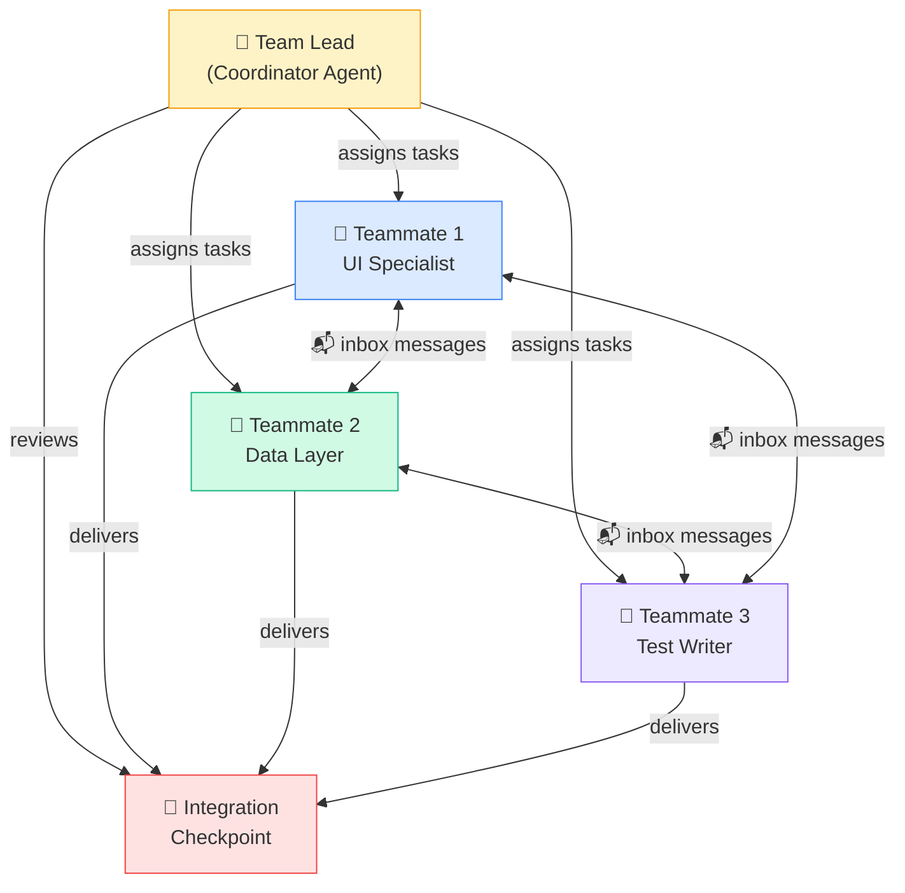

# 🐝 Agent Teams — Swarms That Ship

> **One Claude is powerful. A team of Claudes is unstoppable.**

You've used subagents for focused subtasks. Now imagine spinning up an entire **squad** — a team lead coordinating multiple independent Claude instances, each with their own context window, working in parallel on different parts of a feature.

That's Agent Teams. And it changes how you ship.

---

## 🎯 What Are Agent Teams?

Agent Teams = multiple independent Claude Code instances collaborating on one goal.

Think of your mobile squad:
- **Tech lead** reviews PRs and coordinates
- **iOS dev** builds the UI
- **Backend dev** writes the API layer
- **QA engineer** writes tests

Agent Teams work the same way — except every team member is Claude.

Each teammate:
- 🧠 Has their **own context window** (no shared memory pressure)
- 📋 Claims tasks from a **shared task list**
- 📬 Sends messages through an **inbox system**
- 🔄 Works **independently** until integration points

---

## 🏗️ Architecture



**Four key components:**

| Component | Role |
|-----------|------|
| 🎯 **Team Lead** | Coordinates work, assigns tasks, reviews integration |
| 👤 **Teammates** | Independent workers with their own context windows |
| 📋 **Shared Task List** | Central TODO with dependency tracking |
| 📬 **Inbox Messaging** | Agents notify each other of completions and blockers |

---

## 📬 How Communication Works

Agents don't share a brain. They share a **mailbox.**

1. **Team Lead** creates a task list with dependencies
2. **Teammates** self-claim available tasks (no dependency blockers)
3. On completion, a teammate **notifies** the lead and any dependent teammates
4. Teammates can **share findings** — "Hey, the API returns comments as nested objects, not flat arrays"
5. **Team Lead** reviews integration points and resolves conflicts

This is asynchronous by design. No teammate waits for another unless there's a real dependency.

---

## 🆚 Subagents vs Agent Teams

When do you reach for which?

| Factor | Subagents | Agent Teams |
|--------|-----------|-------------|
| **Independence** | Low — main agent controls everything | High — self-directed workers |
| **Communication** | Via main agent only | Direct messaging between teammates |
| **Context** | Shares main agent's context | Each gets their own full window |
| **Parallelism** | Sequential or lightly parallel | Fully parallel execution |
| **Best for** | Quick focused tasks (lint, test, search) | Parallel feature development |
| **Token cost** | Lower (shared context) | Higher (N separate contexts) |
| **Setup effort** | Minimal | Requires task planning |
| **Failure blast radius** | Contained by main | One teammate can diverge |

**Rule of thumb:**
- < 30 min of work? → **Subagent**
- Full feature with 3+ independent workstreams? → **Agent Team**

---

## 📱 TaskPulse Team Example

Let's implement "Task Comments" — users can comment on tasks.

### The Team Setup Prompt

```
I need to implement a "Task Comments" feature for TaskPulse using an agent team.

Team structure:
- Teammate 1 (UI): Build CommentListView and CommentInputView in SwiftUI
  - Follow existing patterns in Sources/Features/TaskList/
  - Use our DesignSystem tokens for spacing and colors
  - Handle empty state, loading, and error states

- Teammate 2 (Data): Build CommentRepository, API endpoints, CoreData models
  - Follow existing Repository pattern in Sources/Data/
  - Add Comment entity to CoreData model
  - Implement optimistic updates for new comments

- Teammate 3 (Tests): Write unit tests + UI tests
  - Follow patterns in Tests/Features/TaskListTests/
  - Cover: load comments, add comment, delete comment, error handling
  - Use our MockTaskService pattern for test doubles

Dependencies:
- Teammate 3 depends on Teammate 1 + 2 completing their interfaces
- Teammate 1 depends on Teammate 2's CommentRepository protocol definition
- Teammate 2 can start immediately (no dependencies)

Integration checkpoint: All three teammates complete → Team Lead reviews
the full feature branch, runs tests, resolves any conflicts.
```

### What Each Teammate Produces

**Teammate 1 (UI) — Swift output:**
```swift
// Sources/Features/Comments/CommentListView.swift
@MainActor
struct CommentListView: View {
    @StateObject private var viewModel: CommentListViewModel

    var body: some View {
        Group {
            switch viewModel.state {
            case .loading:
                ProgressView()
            case .loaded(let comments):
                LazyVStack(spacing: Spacing.sm) {
                    ForEach(comments) { comment in
                        CommentRow(comment: comment)
                    }
                }
            case .empty:
                EmptyStateView(message: "No comments yet")
            case .error(let error):
                ErrorBanner(error: error, retry: viewModel.loadComments)
            }
        }
    }
}
```

**Teammate 2 (Data) — Swift output:**
```swift
// Sources/Data/Repositories/CommentRepository.swift
protocol CommentRepositoryProtocol {
    func fetchComments(for taskId: String) async throws -> [Comment]
    func addComment(_ text: String, to taskId: String) async throws -> Comment
    func deleteComment(_ id: String) async throws
}

@MainActor
final class CommentRepository: CommentRepositoryProtocol {
    private let apiClient: APIClientProtocol
    private let coreDataStack: CoreDataStack

    func addComment(_ text: String, to taskId: String) async throws -> Comment {
        // Optimistic update — show immediately, sync in background
        let local = try coreDataStack.insertComment(text: text, taskId: taskId)
        Task { try await apiClient.post("/tasks/\(taskId)/comments", body: ["text": text]) }
        return local
    }
}
```

**Teammate 3 (Tests) — Swift output:**
```swift
// Tests/Features/CommentTests/CommentListViewModelTests.swift
@MainActor
final class CommentListViewModelTests: XCTestCase {
    private var sut: CommentListViewModel!
    private var mockRepo: MockCommentRepository!

    func test_loadComments_success_updatesState() async {
        mockRepo.stubbedComments = [.fixture(text: "Great work!")]
        await sut.loadComments()
        XCTAssertEqual(sut.state, .loaded(mockRepo.stubbedComments))
    }

    func test_addComment_optimisticUpdate_showsImmediately() async {
        await sut.addComment("Looking good!")
        XCTAssertTrue(sut.comments.contains { $0.text == "Looking good!" })
    }
}
```

---

## ⚙️ Requirements

| Requirement | Details |
|-------------|---------|
| Claude Code version | **v2.1.32+** |
| Plan | Max plan recommended for token headroom |
| Context | Each teammate gets full context window |

---

## 💰 Token Budgeting

Agent Teams are **token-hungry.** Every teammate has their own context window.

| Approach | Approximate Token Usage |
|----------|------------------------|
| Single Claude session | 1× (baseline) |
| Subagent delegation | 1.5–2× |
| 3-teammate Agent Team | 3–5× |

**When it's worth it:**
- ✅ Feature has 3+ truly independent workstreams
- ✅ Time savings outweigh token cost
- ✅ Complex feature that would overflow a single context window

**When it's overkill:**
- ❌ Small feature (< 5 files changed)
- ❌ Tightly coupled changes that need constant coordination
- ❌ Exploratory work where scope isn't clear yet

---

## ✅ Best Practices

1. **Define clear boundaries.** Each teammate should know exactly which files/modules they own. No overlap.

2. **Start data layer first.** Protocol definitions unblock everyone else. Same as real teams.

3. **Use integration checkpoints.** Don't let teammates work for 30 minutes then discover conflicts. Check in after each major milestone.

4. **Write dependency contracts.** Teammate 1 and Teammate 2 should agree on the `CommentRepositoryProtocol` interface before diverging.

5. **Keep the Team Lead focused.** The lead coordinates and reviews — it shouldn't also be writing code.

6. **Track progress visibly.** Use a shared `PROGRESS.md` or task list that all teammates update.

7. **Set token budgets per teammate.** Prevent one runaway agent from consuming the entire budget.

---

## 🧪 Try It Now

1. **Pick a feature** in your app that has 3 independent workstreams (UI, data, tests).

2. **Write the team prompt.** Define:
   - What each teammate owns
   - Dependencies between teammates
   - Integration checkpoint criteria

3. **Start small.** Try a 2-teammate team first:
   - Teammate 1: Implementation
   - Teammate 2: Tests

4. **Compare results** with doing it in a single Claude session. Note:
   - Time to completion
   - Quality of output
   - Token usage
   - Number of integration issues

5. **Iterate on boundaries.** The #1 mistake is overlapping ownership. If two teammates edit the same file, you'll get conflicts.

---

← [Previous: Headless Claude](08-headless-claude.md) | [🗺️ Course Map](../00-course-map.md) | [Next: MCP Servers →](10-mcp-servers.md)
