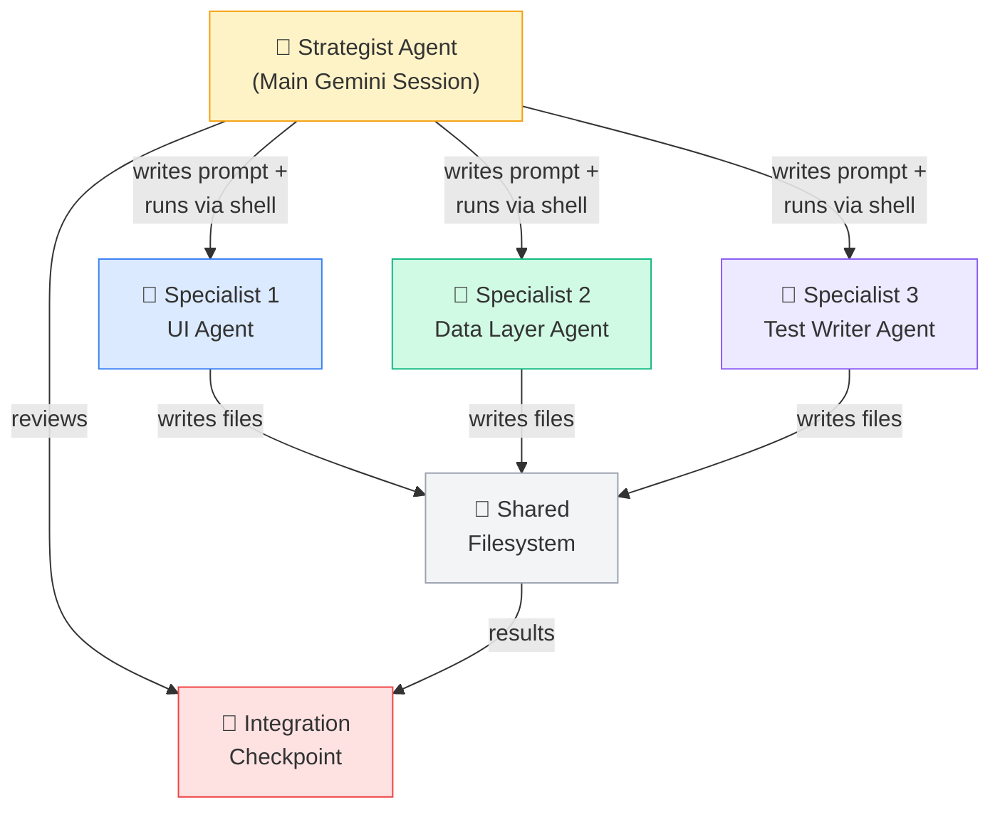

# 🐝 Multi-Agent Coordination — Swarms That Ship

> **One Gemini is powerful. A team of Geminis is unstoppable.**

You've used subagents for focused subtasks. Now imagine spinning up an entire **squad** — a strategist agent coordinating multiple specialist Gemini instances, each with their own context window, working in parallel on different parts of a feature.

That's multi-agent coordination via shell tool delegation. And it changes how you ship.

---

## 🎯 What Is Multi-Agent Coordination?

Multi-agent coordination = multiple independent Gemini CLI instances collaborating on one goal.

Think of your mobile squad:
- **Tech lead** reviews PRs and coordinates
- **iOS dev** builds the UI
- **Backend dev** writes the API layer
- **QA engineer** writes tests

Multi-agent coordination works the same way — except every team member is Gemini.

In Gemini CLI, this is achieved through three mechanisms:

1. **Shell tool delegation** — the main agent spawns new `gemini` sessions via the shell tool with specific prompts
2. **Custom agents** (`.gemini/agents/*.md`) — reusable specialist definitions that can be invoked as subagents
3. **Strategist + Specialist pattern** — the main agent writes prompt files and invokes specialists via shell

Each specialist:
- 🧠 Has their **own context window** (no shared memory pressure)
- 📋 Reads tasks from **prompt files** written by the strategist
- 📝 Writes results to **designated output areas**
- 🔄 Works **independently** until integration points

---

## 🏗️ Architecture



**Four key components:**

| Component | Role |
|-----------|------|
| 🎯 **Strategist** | Main Gemini session that coordinates work, writes prompts, reviews integration |
| 👤 **Specialists** | Independent Gemini instances spawned via shell with focused prompts |
| 📁 **Shared Filesystem** | Coordination through files — prompts, progress tracking, code output |
| 📋 **Custom Agents** | `.gemini/agents/*.md` files defining reusable specialist personas |

---

## 📬 How Communication Works

Agents don't share a brain. They share a **filesystem.**

1. **Strategist** writes task prompt files (e.g., `tasks/ui-task.md`, `tasks/data-task.md`)
2. **Strategist** spawns specialists via shell: `gemini --headless < tasks/ui-task.md`
3. On completion, each specialist **writes output** to designated directories
4. Specialists can **leave notes** in shared files — "The API returns comments as nested objects, not flat arrays"
5. **Strategist** reviews output, runs tests, and resolves any conflicts

This is asynchronous by design. No specialist waits for another unless there's a real dependency.

---

## 🛠️ Setting Up Custom Agents

Define reusable specialists in `.gemini/agents/`:

**`.gemini/agents/ui-specialist.md`**
```markdown
You are a SwiftUI specialist. You ONLY work on UI files.

Rules:
- Only modify files in Sources/Features/
- Follow existing patterns in the codebase
- Use DesignSystem tokens for spacing and colors
- Handle all states: loading, loaded, empty, error
- Do not modify data layer or test files
```

**`.gemini/agents/data-specialist.md`**
```markdown
You are a data layer specialist. You ONLY work on repositories and models.

Rules:
- Only modify files in Sources/Data/
- Follow existing Repository pattern
- Implement optimistic updates where appropriate
- Define clean protocol interfaces first
- Do not modify UI or test files
```

**`.gemini/agents/test-specialist.md`**
```markdown
You are a test specialist. You ONLY write and fix tests.

Rules:
- Only modify files in Tests/
- Follow patterns in Tests/Features/TaskListTests/
- Use MockTaskService pattern for test doubles
- Cover success, failure, and edge cases
- Do not modify source files
```

---

## 🔄 The Strategist + Specialist Pattern

Here's how the main Gemini session orchestrates the team:

```bash
# The strategist prompt — give this to your main Gemini session
I need to implement "Task Comments" for TaskPulse using multi-agent coordination.

Here's the plan:

1. First, define the CommentRepositoryProtocol interface in
   Sources/Data/Repositories/CommentRepository.swift
   (this unblocks other agents)

2. Then spawn three specialists in parallel via the shell tool:

   Specialist 1 (UI): Run in shell:
   gemini --headless -p "Read .gemini/agents/ui-specialist.md for your role.
   Build CommentListView and CommentInputView in Sources/Features/Comments/.
   Use the CommentRepositoryProtocol already defined."

   Specialist 2 (Data): Run in shell:
   gemini --headless -p "Read .gemini/agents/data-specialist.md for your role.
   Implement CommentRepository conforming to CommentRepositoryProtocol.
   Add Comment entity to CoreData model."

   Specialist 3 (Tests): Run in shell (after 1 & 2 complete):
   gemini --headless -p "Read .gemini/agents/test-specialist.md for your role.
   Write unit tests for CommentListViewModel and CommentRepository.
   Cover: load, add, delete, error handling."

3. After all specialists complete, review the full feature,
   run tests, and resolve any conflicts.
```

---

## 🆚 Subagents vs Multi-Agent Coordination

When do you reach for which?

| Factor | Subagents | Multi-Agent Coordination |
|--------|-----------|--------------------------|
| **Independence** | Low — main agent controls everything | High — self-directed workers |
| **Communication** | Via main agent only | Through shared filesystem |
| **Context** | Shares main agent's context | Each gets their own full window |
| **Parallelism** | Sequential or lightly parallel | Fully parallel execution |
| **Best for** | Quick focused tasks (lint, test, search) | Parallel feature development |
| **Token cost** | Lower (shared context) | Higher (N separate contexts) |
| **Setup effort** | Minimal | Requires task planning + agent definitions |
| **Failure blast radius** | Contained by main | One specialist can diverge |

**Rule of thumb:**
- < 30 min of work? → **Subagent**
- Full feature with 3+ independent workstreams? → **Multi-Agent Coordination**

---

## 📱 TaskPulse Team Example

Let's implement "Task Comments" — users can comment on tasks.

### The Strategist Setup Prompt

```
I need to implement a "Task Comments" feature for TaskPulse using
multi-agent coordination via shell tool delegation.

Plan:
1. First, I'll define the CommentRepositoryProtocol interface (unblocks everyone)
2. Then spawn specialists via shell:

- Specialist 1 (UI): Build CommentListView and CommentInputView in SwiftUI
  - Follow existing patterns in Sources/Features/TaskList/
  - Use our DesignSystem tokens for spacing and colors
  - Handle empty state, loading, and error states

- Specialist 2 (Data): Build CommentRepository, API endpoints, CoreData models
  - Follow existing Repository pattern in Sources/Data/
  - Add Comment entity to CoreData model
  - Implement optimistic updates for new comments

- Specialist 3 (Tests): Write unit tests + UI tests
  - Follow patterns in Tests/Features/TaskListTests/
  - Cover: load comments, add comment, delete comment, error handling
  - Use our MockTaskService pattern for test doubles

Dependencies:
- Specialist 3 depends on Specialist 1 + 2 completing their interfaces
- Specialist 1 depends on the CommentRepositoryProtocol definition
- Specialist 2 can start immediately after protocol is defined

Integration checkpoint: All three specialists complete → Strategist reviews
the full feature, runs tests, resolves any conflicts.
```

### What Each Specialist Produces

**Specialist 1 (UI) — Swift output:**
```swift
// Sources/Features/Comments/CommentListView.swift
@MainActor
struct CommentListView: View {
    @StateObject private var viewModel: CommentListViewModel

    var body: some View {
        Group {
            switch viewModel.state {
            case .loading:
                ProgressView()
            case .loaded(let comments):
                LazyVStack(spacing: Spacing.sm) {
                    ForEach(comments) { comment in
                        CommentRow(comment: comment)
                    }
                }
            case .empty:
                EmptyStateView(message: "No comments yet")
            case .error(let error):
                ErrorBanner(error: error, retry: viewModel.loadComments)
            }
        }
    }
}
```

**Specialist 2 (Data) — Swift output:**
```swift
// Sources/Data/Repositories/CommentRepository.swift
protocol CommentRepositoryProtocol {
    func fetchComments(for taskId: String) async throws -> [Comment]
    func addComment(_ text: String, to taskId: String) async throws -> Comment
    func deleteComment(_ id: String) async throws
}

@MainActor
final class CommentRepository: CommentRepositoryProtocol {
    private let apiClient: APIClientProtocol
    private let coreDataStack: CoreDataStack

    func addComment(_ text: String, to taskId: String) async throws -> Comment {
        // Optimistic update — show immediately, sync in background
        let local = try coreDataStack.insertComment(text: text, taskId: taskId)
        Task { try await apiClient.post("/tasks/\(taskId)/comments", body: ["text": text]) }
        return local
    }
}
```

**Specialist 3 (Tests) — Swift output:**
```swift
// Tests/Features/CommentTests/CommentListViewModelTests.swift
@MainActor
final class CommentListViewModelTests: XCTestCase {
    private var sut: CommentListViewModel!
    private var mockRepo: MockCommentRepository!

    func test_loadComments_success_updatesState() async {
        mockRepo.stubbedComments = [.fixture(text: "Great work!")]
        await sut.loadComments()
        XCTAssertEqual(sut.state, .loaded(mockRepo.stubbedComments))
    }

    func test_addComment_optimisticUpdate_showsImmediately() async {
        await sut.addComment("Looking good!")
        XCTAssertTrue(sut.comments.contains { $0.text == "Looking good!" })
    }
}
```

---

## ⚙️ Requirements

| Requirement | Details |
|-------------|---------|
| Gemini CLI version | Latest release recommended |
| Model | gemini-2.5-pro recommended for strategist and specialists |
| Context | Each specialist gets full context window |

---

## 💰 Token Budgeting

Multi-agent coordination is **token-hungry.** Every specialist has their own context window.

| Approach | Approximate Token Usage |
|----------|------------------------|
| Single Gemini session | 1x (baseline) |
| Subagent delegation | 1.5-2x |
| 3-specialist multi-agent | 3-5x |

**When it's worth it:**
- ✅ Feature has 3+ truly independent workstreams
- ✅ Time savings outweigh token cost
- ✅ Complex feature that would overflow a single context window

**When it's overkill:**
- ❌ Small feature (< 5 files changed)
- ❌ Tightly coupled changes that need constant coordination
- ❌ Exploratory work where scope isn't clear yet

---

## ✅ Best Practices

1. **Define clear boundaries.** Each specialist should know exactly which files/modules they own. No overlap.

2. **Start data layer first.** Protocol definitions unblock everyone else. Same as real teams.

3. **Use integration checkpoints.** Don't let specialists work for 30 minutes then discover conflicts. Check in after each major milestone.

4. **Write dependency contracts.** Specialist 1 and Specialist 2 should agree on the `CommentRepositoryProtocol` interface before diverging.

5. **Keep the Strategist focused.** The strategist coordinates and reviews — it shouldn't also be writing code.

6. **Track progress visibly.** Use a shared `PROGRESS.md` or task list that all specialists update.

7. **Set token budgets per specialist.** Prevent one runaway agent from consuming the entire budget.

8. **Use custom agent files.** Define specialist roles in `.gemini/agents/*.md` so they're reusable across features.

---

## 🧪 Try It Now

1. **Pick a feature** in your app that has 3 independent workstreams (UI, data, tests).

2. **Create custom agent files.** Define specialists in `.gemini/agents/`:
   - `ui-specialist.md`
   - `data-specialist.md`
   - `test-specialist.md`

3. **Write the strategist prompt.** Define:
   - What each specialist owns
   - Dependencies between specialists
   - Integration checkpoint criteria

4. **Start small.** Try a 2-specialist setup first:
   - Specialist 1: Implementation
   - Specialist 2: Tests

5. **Compare results** with doing it in a single Gemini session. Note:
   - Time to completion
   - Quality of output
   - Token usage
   - Number of integration issues

6. **Iterate on boundaries.** The #1 mistake is overlapping ownership. If two specialists edit the same file, you'll get conflicts.

---

← [Previous: Subagents](../Part 2 — Power Tools/08-subagents.md) | [🗺️ Course Map](../00-course-map.md) | [Next: MCP Servers →](10-mcp-servers.md)
