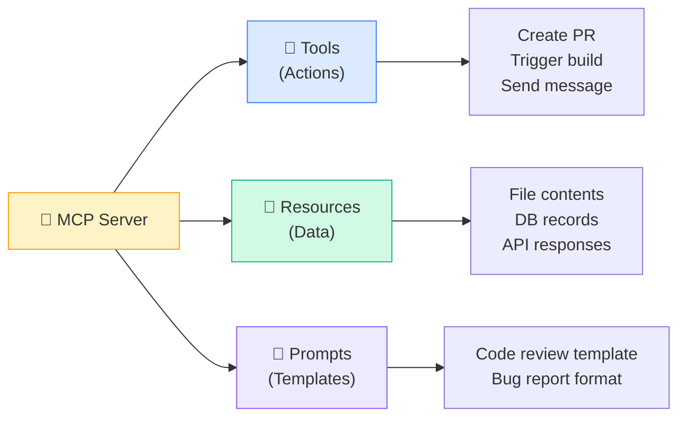
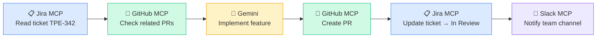
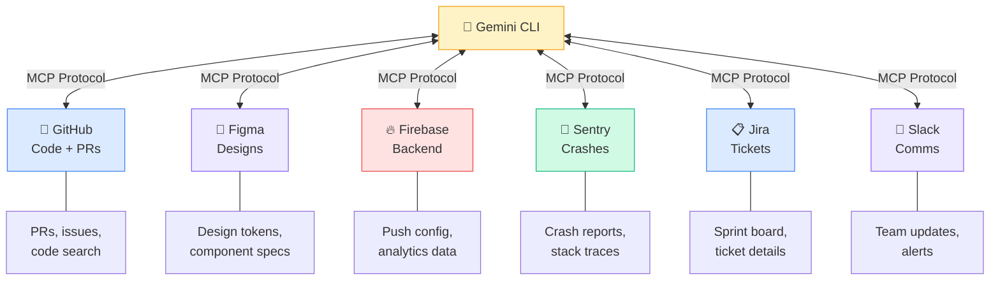

# 🔌 MCP — Connecting AI to Everything

> **USB-C for AI. One protocol, infinite tools.**

Your Gemini can read code, write code, and run commands. But what about your Figma designs? Your Jira tickets? Your Firebase console? Your Sentry crash logs?

That's what MCP unlocks. **Any tool, any service, one standard.**

---

## 🎯 What Is MCP?

**Model Context Protocol** — an open standard created by Google / Google DeepMind and donated to the Linux Foundation.

MCP gives AI models a universal way to connect to external tools and data sources. Instead of every AI building custom integrations with every service, MCP provides **one protocol** that works everywhere.

```
Before MCP:  Gemini ←custom→ GitHub
             Gemini ←custom→ Figma
             Gemini ←custom→ Sentry
             (N×M integrations)

After MCP:   Gemini ←MCP→ Any Server
             (N+M integrations)
```

Think of it like USB-C replaced the cable drawer of nightmares. MCP replaces the integration nightmare.

---

## 🌐 The Ecosystem

MCP took off fast:

- 📊 **10,000+** public MCP servers available
- 🤖 Adopted by **ChatGPT, Cursor, Gemini, VS Code, GitHub Copilot**
- 🏢 Backed by the **Linux Foundation** as an open standard
- 🔧 SDKs for **TypeScript, Python, Java, C#, Swift, Kotlin**

You're not betting on a niche tool. MCP is the industry standard.

---

## 🔧 Three Primitives

MCP servers expose three types of capabilities:



| Primitive | What It Is | Example |
|-----------|-----------|---------|
| 🔧 **Tools** | Actions the AI can take | Create a PR, post a Slack message, trigger a build |
| 📄 **Resources** | Data the AI can read | Figma design tokens, Jira ticket details, crash logs |
| 📝 **Prompts** | Reusable prompt templates | Code review checklist, bug report format |

For mobile devs, **Tools** are the most impactful — they let Gemini take action in your workflow.

---

## 📱 Mobile-Relevant MCP Servers

Here are the servers that matter most for iOS/Android teams:

| Server | What It Does | Mobile Use Case |
|--------|-------------|-----------------|
| 🐙 **GitHub MCP** | PRs, issues, code search | PR workflow automation, issue triage |
| 🎨 **Figma MCP** | Design token access, component inspection | Design-to-code pipeline, pixel-perfect UI |
| 🔥 **Firebase MCP** | Backend management, analytics | Push notification setup, crash analytics |
| 🐛 **Sentry MCP** | Error tracking, stack traces | Crash investigation, error trend analysis |
| 📋 **Jira/Linear MCP** | Ticket management | Sprint workflow, ticket-to-PR automation |
| 💬 **Slack MCP** | Team messaging | Build status updates, review notifications |
| 🗄️ **Postgres MCP** | Database access | Backend data inspection, migration planning |
| 📁 **Filesystem MCP** | Scoped file access | Sandboxed project exploration |

---

## ⚙️ Setup

### Adding MCP Servers to Gemini CLI

MCP servers can be added via the `gemini mcp add` command, or configured in your project's `.gemini/settings.json`:

```bash
# Add servers via CLI
gemini mcp add github -- npx -y @anthropic/github-mcp-server
gemini mcp add figma -- npx -y figma-mcp-server
gemini mcp add firebase -- npx -y firebase-mcp-server
gemini mcp add sentry -- npx -y sentry-mcp-server

# List configured servers
gemini mcp list

# Remove a server
gemini mcp remove github
```

Or configure directly in `.gemini/settings.json`:

```json
{
  "mcpServers": {
    "github": {
      "command": "npx",
      "args": ["-y", "@anthropic/github-mcp-server"],
      "env": {
        "GITHUB_TOKEN": "${GITHUB_TOKEN}"
      }
    },
    "figma": {
      "command": "npx",
      "args": ["-y", "figma-mcp-server"],
      "env": {
        "FIGMA_ACCESS_TOKEN": "${FIGMA_ACCESS_TOKEN}"
      }
    },
    "firebase": {
      "command": "npx",
      "args": ["-y", "firebase-mcp-server"],
      "env": {
        "GOOGLE_APPLICATION_CREDENTIALS": "${GOOGLE_APPLICATION_CREDENTIALS}"
      }
    },
    "sentry": {
      "command": "npx",
      "args": ["-y", "sentry-mcp-server"],
      "env": {
        "SENTRY_AUTH_TOKEN": "${SENTRY_AUTH_TOKEN}"
      }
    }
  }
}
```

**Key points:**
- 🔑 Use `${ENV_VAR}` syntax to keep secrets out of config files
- 📁 Commit `.gemini/settings.json` to your repo (tokens stay in env)
- 🔄 Servers start automatically when Gemini CLI opens your project

### Scoped Configurations

| Scope | File | Use For |
|-------|------|---------|
| Project | `.gemini/settings.json` | Team-shared servers |
| User | `~/.gemini/settings.json` | Personal API tokens |

---

## 🔍 MCP Tool Search

With 10,000+ servers, you don't want to load everything. Gemini CLI supports **dynamic tool discovery** — search for tools on demand instead of loading all at once.

```
You: "Find the Sentry error for crash #4521 and create a GitHub issue"

Gemini: *searches available MCP tools* → finds sentry.get_issue + github.create_issue
        *calls sentry.get_issue(4521)* → gets crash details
        *calls github.create_issue(...)* → creates issue with full stack trace
```

This keeps your context window lean. Only the tools Gemini actually needs get loaded.

---

## 🔗 Chaining MCP Servers — The Real Power

Individual servers are useful. **Chaining them is magic.**



### TaskPulse Example: Full Workflow Chain

```
Prompt:
"Read Jira ticket TPE-342, check if there's already a GitHub PR for it.
If not, implement the feature described in the ticket following our
GEMINI.md conventions. Create a PR, link it to the Jira ticket,
and move the ticket to 'In Review'."
```

**What happens:**

1. 📋 **Jira MCP** → Reads ticket: "Add comment count badge to TaskListView"
2. 🐙 **GitHub MCP** → Searches PRs: no existing PR found
3. 🤖 **Gemini** → Implements the feature following your patterns
4. 🐙 **GitHub MCP** → Creates PR with ticket reference
5. 📋 **Jira MCP** → Moves TPE-342 to "In Review", adds PR link
6. 💬 **Slack MCP** → Posts to #taskpulse-dev: "PR #287 ready for review"

One prompt. Six steps. Zero tab-switching.

---

## 📱 TaskPulse Integration Map

Here's how MCP servers connect to the TaskPulse workflow:



---

## 💡 Pro Tips

1. **Start with GitHub MCP.** It's the highest-value server for any dev team. PR automation alone saves hours.

2. **Add Figma MCP for pixel-perfect UI.** Gemini can read your actual design tokens instead of guessing colors and spacing.

3. **Chain servers in your GEMINI.md.** Add a workflow section:
   ```markdown
   ## Workflow
   When implementing a Jira ticket:
   1. Read the ticket details via Jira MCP
   2. Check for existing PRs via GitHub MCP
   3. Implement following our conventions
   4. Create PR and link to Jira ticket
   ```

4. **Don't overload.** 3–5 MCP servers is the sweet spot. More than that and context gets noisy.

---

## 🧪 Try It Now

1. **Set up GitHub MCP** in your project's `.gemini/settings.json`. Test it:
   ```
   "List my open PRs and summarize which ones need review"
   ```

2. **Chain two servers.** Set up Jira/Linear + GitHub MCP. Ask Gemini:
   ```
   "Read ticket [YOUR-TICKET] and create a branch + PR skeleton for it"
   ```

3. **Audit your tool switching.** For one day, count how many times you switch between browser tabs for:
   - Jira/Linear (ticket details)
   - GitHub (PRs, code review)
   - Figma (design specs)
   - Sentry (crash investigation)

   Each tab switch is a candidate for MCP automation.

4. **Dream big.** Write down your ideal single-prompt workflow. What servers would it need? Check if they exist in the MCP ecosystem.

---

← [Previous: Agent Teams](09-agent-teams.md) | [🗺️ Course Map](../00-course-map.md) | [Next: Custom MCP Servers →](11-custom-mcp.md)
