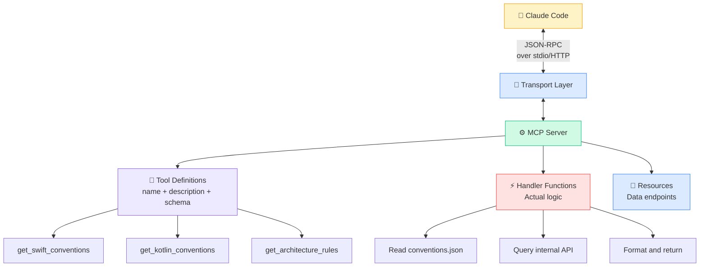

# 🛠️ Building Custom MCP Servers

> **When the ecosystem doesn't have what you need, build it yourself.**

Public MCP servers cover the big platforms. But your team has **internal tools, proprietary APIs, and custom workflows** that no public server will ever support.

Time to build your own.

---

## 🎯 When to Build Custom

Build a custom MCP server when:

- ✅ Your team has **internal APIs** with no public MCP server
- ✅ You need to expose **proprietary data** (design systems, architecture docs)
- ✅ You want **team-specific tools** (coding standards, review checklists)
- ✅ You need **fine-grained access control** over what AI can touch

Don't build when a public server already exists. Check the ecosystem first.

---

## 📱 Mobile Team MCP Ideas

Here's what mobile teams are building:

| MCP Server | What It Exposes | Why It Matters |
|-----------|----------------|----------------|
| 🍎 **App Store Connect** | Crash reports, review status, metadata | Investigate production crashes without leaving the IDE |
| 🤖 **Play Console** | ANR data, release tracking, reviews | Monitor Android vitals from your coding session |
| 📚 **Internal Wiki** | Confluence/Notion architecture docs | Claude reads your actual architecture decisions |
| 🎨 **Design System** | Component catalog, tokens, usage examples | AI generates UI that matches your design system exactly |
| 🔧 **CI/CD Pipeline** | Bitrise/CircleCI status, trigger builds | Check build status and trigger runs from prompts |
| 📏 **Code Metrics** | Coverage reports, complexity scores | AI sees quality metrics before making changes |

The 🎨 **Design System MCP** and 📚 **Internal Wiki MCP** are the highest-impact for most teams. They give Claude the context it's always missing.

---

## 🏗️ Architecture

Every MCP server has the same structure:



**Key components:**

| Component | Role |
|-----------|------|
| **Server** | Registers capabilities, routes requests |
| **Tool Definitions** | Name, description, and JSON schema for inputs |
| **Handlers** | The actual functions that execute when tools are called |
| **Transport** | `stdio` for local CLI tools, `HTTP/SSE` for remote servers |

---

## 📝 Build a "Coding Standards" MCP Server

Let's build something immediately useful — an MCP server that exposes your team's coding standards to Claude.

### Step 1: Project Setup

```bash
mkdir coding-standards-mcp && cd coding-standards-mcp
npm init -y
npm install @modelcontextprotocol/sdk zod
npm install -D typescript @types/node
npx tsc --init
```

### Step 2: The Complete Server

```typescript
// src/index.ts
import { McpServer } from "@modelcontextprotocol/sdk/server/mcp.js";
import { StdioServerTransport } from "@modelcontextprotocol/sdk/server/stdio.js";
import { z } from "zod";

const server = new McpServer({
  name: "coding-standards",
  version: "1.0.0",
});

// 🍎 Swift / iOS conventions
const SWIFT_CONVENTIONS = `
## Swift Conventions — TaskPulse iOS

### Architecture
- MVVM with @MainActor on all ViewModels
- Protocol-first: define protocols before implementations
- Dependency injection via init, never singletons

### Naming
- Views: *View suffix (TaskListView, CommentInputView)
- ViewModels: *ViewModel suffix with @MainActor
- Repositories: *Repository suffix, protocol + implementation

### Patterns
- State enum: .loading, .loaded(Data), .empty, .error(AppError)
- Always use [weak self] in closures
- Combine: debounce(300ms) on all search inputs
- Never force unwrap — use guard let or if let

### File Structure
Sources/Features/{FeatureName}/{FeatureName}View.swift
Sources/Features/{FeatureName}/{FeatureName}ViewModel.swift
Sources/Data/Repositories/{Name}Repository.swift
Tests/Features/{FeatureName}Tests/
`;

// 🤖 Kotlin / Android conventions
const KOTLIN_CONVENTIONS = `
## Kotlin Conventions — TaskPulse Android

### Architecture
- MVVM with Compose + Hilt
- Use viewModelScope for all coroutines (never GlobalScope)
- Repository pattern with suspend functions

### Naming
- Screens: *Screen suffix (TaskListScreen, CommentScreen)
- ViewModels: *ViewModel suffix with @HiltViewModel
- State: *UiState sealed interface

### Patterns
- UiState: sealed interface with Loading, Success, Error subtypes
- Collect with collectAsStateWithLifecycle()
- Navigation: type-safe nav with @Serializable routes
- Never use mutableStateOf in ViewModel — use MutableStateFlow

### File Structure
features/{name}/ui/{Name}Screen.kt
features/{name}/{Name}ViewModel.kt
features/{name}/data/{Name}Repository.kt
features/{name}/data/model/{Name}.kt
`;

// 🏗️ Architecture rules
const ARCHITECTURE_RULES = `
## Architecture Rules — TaskPulse

### Module Boundaries
- features/ modules NEVER import from other features/
- Shared code goes in core/ module
- Data layer exposes protocols/interfaces, never implementations

### Dependencies
- UI → ViewModel → Repository → DataSource
- Never skip layers (UI must not call Repository directly)
- Use dependency injection, not service locators

### Error Handling
- All errors map to AppError enum/sealed class
- Network errors: show retry banner
- Auth errors: redirect to login
- Unknown errors: log to Sentry, show generic message

### Testing Requirements
- ViewModels: 80% coverage minimum
- Repositories: 90% coverage minimum
- UI: snapshot tests for each state (loading, loaded, empty, error)
- Name pattern: test_{method}_{scenario}_{expectedResult}
`;

// Register tools
server.tool(
  "get_swift_conventions",
  "Get Swift/iOS coding conventions for TaskPulse",
  {},
  async () => ({
    content: [{ type: "text", text: SWIFT_CONVENTIONS }],
  })
);

server.tool(
  "get_kotlin_conventions",
  "Get Kotlin/Android coding conventions for TaskPulse",
  {},
  async () => ({
    content: [{ type: "text", text: KOTLIN_CONVENTIONS }],
  })
);

server.tool(
  "get_architecture_rules",
  "Get cross-platform architecture rules for TaskPulse",
  {},
  async () => ({
    content: [{ type: "text", text: ARCHITECTURE_RULES }],
  })
);

server.tool(
  "check_naming",
  "Check if a file/class name follows TaskPulse conventions",
  { name: z.string(), platform: z.enum(["ios", "android"]) },
  async ({ name, platform }) => {
    const issues: string[] = [];

    if (platform === "ios") {
      if (name.endsWith("VC") || name.endsWith("Controller")) {
        issues.push("Use *View not *VC/*Controller — we use SwiftUI");
      }
      if (name.includes("Manager") && !name.includes("Entity")) {
        issues.push("Avoid 'Manager' — use Repository, Service, or Handler");
      }
    } else {
      if (name.endsWith("Activity") || name.endsWith("Fragment")) {
        issues.push("Use *Screen not Activity/Fragment — we use Compose");
      }
      if (name.includes("GlobalScope")) {
        issues.push("Never use GlobalScope — use viewModelScope");
      }
    }

    return {
      content: [{
        type: "text",
        text: issues.length === 0
          ? `✅ "${name}" follows ${platform} conventions`
          : `⚠️ Issues with "${name}":\n${issues.map(i => `- ${i}`).join("\n")}`,
      }],
    };
  }
);

// Start server
async function main() {
  const transport = new StdioServerTransport();
  await server.connect(transport);
  console.error("Coding Standards MCP Server running on stdio");
}

main().catch(console.error);
```

### Step 3: Configure in Claude Code

Add to `.claude/settings.json`:

```json
{
  "mcpServers": {
    "coding-standards": {
      "command": "npx",
      "args": ["tsx", "/path/to/coding-standards-mcp/src/index.ts"]
    }
  }
}
```

### Step 4: Test It

```
You: "What are our Swift naming conventions?"

Claude: *calls get_swift_conventions()* →
"Your Swift conventions require:
- Views use *View suffix (TaskListView, CommentInputView)
- ViewModels use *ViewModel suffix with @MainActor
- Repositories use *Repository suffix with protocol + implementation..."
```

Now Claude **always** knows your team's conventions — without stuffing them into CLAUDE.md.

---

## 🔒 Security

Custom MCP servers have access to whatever you give them. Be careful.

| Concern | Mitigation |
|---------|-----------|
| **API credentials** | Use environment variables, never hardcode |
| **Data scope** | Only expose what Claude needs — not your entire database |
| **Write access** | Start read-only. Add writes cautiously with confirmation |
| **Rate limiting** | Implement rate limits to prevent runaway token-burning loops |
| **Authentication** | Use short-lived tokens, rotate regularly |

**Golden rule:** Start with read-only tools. Add write tools only after you trust the workflow.

---

## 📦 Deployment

### Local (Development)

```json
{
  "mcpServers": {
    "coding-standards": {
      "command": "npx",
      "args": ["tsx", "./tools/mcp/coding-standards/src/index.ts"]
    }
  }
}
```

Uses `stdio` transport. Runs as a subprocess of Claude Code.

### Docker (Team Sharing)

```dockerfile
FROM node:20-slim
WORKDIR /app
COPY package*.json ./
RUN npm ci --production
COPY src/ ./src/
CMD ["node", "src/index.js"]
```

```json
{
  "mcpServers": {
    "coding-standards": {
      "command": "docker",
      "args": ["run", "--rm", "-i", "coding-standards-mcp:latest"]
    }
  }
}
```

### Remote (HTTP Transport)

For shared team servers, use HTTP/SSE transport:

```json
{
  "mcpServers": {
    "coding-standards": {
      "url": "https://mcp.internal.yourcompany.com/coding-standards"
    }
  }
}
```

Best for: CI/CD environments, shared team infrastructure, centralized configuration.

---

## 🎯 What to Build First

Priority order for mobile teams:

1. **🎨 Design System MCP** — Highest ROI. Claude generates UI that matches your design system.
2. **📚 Architecture Wiki MCP** — Give Claude access to your ADRs and architecture decisions.
3. **📏 Coding Standards MCP** — Enforce conventions without relying on CLAUDE.md alone.
4. **🔧 CI/CD MCP** — Check build status and trigger runs from prompts.
5. **🍎/🤖 Store Console MCP** — Production crash investigation workflow.

---

## 🧪 Try It Now

1. **Clone the Coding Standards MCP.** Copy the TypeScript code above and customize it with YOUR team's conventions.

2. **Add it to your project.** Configure it in `.claude/settings.json` and test with:
   ```
   "What are our architecture rules for the data layer?"
   ```

3. **Add a naming checker.** Extend the `check_naming` tool with your team's specific naming anti-patterns.

4. **Design your dream MCP.** Pick one internal tool your team uses daily (design system, CI/CD, wiki). Sketch out:
   - What tools would it expose?
   - What data would it need access to?
   - Read-only or read-write?

5. **Share with your team.** Dockerize your MCP server and add it to the project's `.claude/settings.json` so everyone benefits.

---

← [Previous: MCP Servers](10-mcp-servers.md) | [🗺️ Course Map](../00-course-map.md) | [Next: Ralph Loops →](12-ralph-loops.md)
