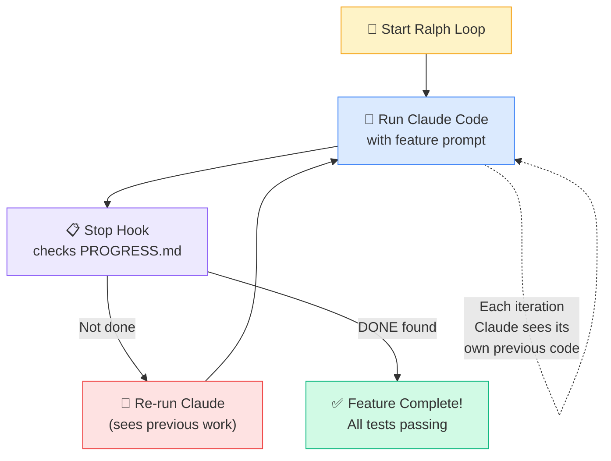
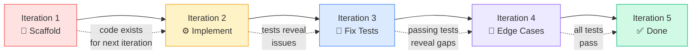
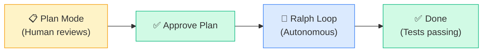

# 🔄 Ralph Loops — Walk Away, Come Back to Done

> **"I'm in danger!" → "I'm helping!"**
> — Ralph Wiggum, The Simpsons

What if you could give Claude a feature, walk away for lunch, and come back to a working implementation with passing tests?

That's a Ralph Loop.

---

## 🎯 What's a Ralph Loop?

A **Ralph Loop** is an autonomous improvement cycle where Claude Code runs repeatedly, reviewing and fixing its own output until the job is done.

Named after Ralph Wiggum — starts confused, keeps trying, eventually gets there.

```
Iteration 1: "I'm in danger!"      → scaffolds the feature
Iteration 2: "I'm learnding!"      → implements core logic
Iteration 3: "My cat's breath..."   → fixes test failures
Iteration 4: "I'm helping!"        → all tests pass, feature complete
```

The key insight: each iteration, Claude sees its **own previous work** as existing code. It notices issues, fixes them, and improves — like a developer doing multiple review passes.

---

## 💡 The Philosophy

Traditional AI workflow:
```
You prompt → AI generates → You review → You fix → You prompt again
```

Ralph Loop workflow:
```
You prompt → AI generates → AI reviews → AI fixes → AI re-checks → Done
```

You go from **co-pilot** to **air traffic controller.** You set the destination, Claude handles the flight.

---

## 🔁 How It Works



**Step by step:**

1. **Create a bash `while` loop** that runs Claude Code with your prompt
2. **Configure a `Stop` hook** that checks completion criteria
3. **If not done** → the loop re-runs Claude → it sees its previous work as existing code → continues
4. **If done** → the hook exits the loop

---

## 📋 Setup

### The Core Script: `ralph.sh`

```bash
#!/bin/bash
# ralph.sh — Autonomous improvement loop

MAX_ITERATIONS=10
ITERATION=0
PROGRESS_FILE="PROGRESS.md"

# Initialize progress tracking
echo "# Ralph Loop Progress" > "$PROGRESS_FILE"
echo "Started: $(date)" >> "$PROGRESS_FILE"
echo "Status: IN_PROGRESS" >> "$PROGRESS_FILE"

while [ $ITERATION -lt $MAX_ITERATIONS ]; do
    ITERATION=$((ITERATION + 1))
    echo "🔄 Iteration $ITERATION of $MAX_ITERATIONS"

    claude --print \
      "Continue implementing the TaskPulse comments feature.

       Check PROGRESS.md for current status and what's been done.

       Your tasks:
       1. Implement any remaining code in Features/Comments/
       2. Run all tests with: swift test --filter CommentTests
       3. Fix any failing tests
       4. Update PROGRESS.md with what you completed this iteration
       5. If ALL tests pass and the feature is complete,
          write 'STATUS: DONE' to PROGRESS.md

       ONLY modify files in Sources/Features/Comments/ and Tests/."

    # Check if done
    if grep -q "STATUS: DONE" "$PROGRESS_FILE"; then
        echo "✅ Feature complete after $ITERATION iterations!"
        exit 0
    fi

    echo "📊 Iteration $ITERATION complete. Continuing..."
done

echo "⚠️ Hit max iterations ($MAX_ITERATIONS). Check PROGRESS.md for status."
exit 1
```

### Make it executable and run:

```bash
chmod +x ralph.sh
./ralph.sh
```

---

## 🧠 Self-Referential Development

This is where Ralph Loops get interesting. Each iteration, Claude:

1. **Reads the codebase** — sees files it wrote in previous iterations
2. **Runs tests** — discovers failures from its own code
3. **Analyzes errors** — understands what went wrong
4. **Fixes issues** — improves its own implementation
5. **Updates progress** — tracks what's done, what's left

It's like code review, but the reviewer and author are the same entity across time.



---

## 📱 Mobile Example — TaskPulse Comments

### The Prompt

```bash
claude --print \
  "Implement the Task Comments feature for TaskPulse iOS.

   Requirements:
   - CommentListView: displays comments for a task
   - CommentInputView: text field + send button
   - CommentListViewModel: @MainActor, uses CommentRepository
   - CommentRepository: protocol + implementation with CoreData
   - States: .loading, .loaded([Comment]), .empty, .error(AppError)

   Follow existing patterns in Sources/Features/TaskList/.
   Write tests in Tests/Features/CommentTests/.
   Run tests after each change.
   Track progress in PROGRESS.md.
   When all tests pass and feature is complete, write 'STATUS: DONE'."
```

### Expected Iteration Progression

| Iteration | What Happens | Files Changed |
|-----------|-------------|---------------|
| **1** | Scaffolds files, creates protocols, basic structs | 6 new files created |
| **2** | Implements ViewModel logic, Repository, CoreData model | 4 files modified |
| **3** | Runs tests — 3 fail. Fixes async handling, missing mock | 3 files modified |
| **4** | All unit tests pass. Adds edge cases: empty state, error handling | 2 files modified |
| **5** | Runs full test suite. Writes STATUS: DONE to PROGRESS.md | 1 file modified |

### What PROGRESS.md Looks Like After

```markdown
# Ralph Loop Progress
Started: 2025-03-15 10:30:00
Status: DONE

## Iteration 1
- Created CommentListView.swift, CommentInputView.swift
- Created CommentListViewModel.swift with state enum
- Created CommentRepository protocol
- Created Comment CoreData entity

## Iteration 2
- Implemented CommentRepository with CoreData persistence
- Connected ViewModel to Repository
- Added optimistic updates for new comments

## Iteration 3
- Fixed: @MainActor missing on ViewModel publish
- Fixed: MockCommentRepository not conforming to protocol
- Fixed: Async test missing await
- Tests: 5/8 passing

## Iteration 4
- Added empty state handling
- Added error state with retry
- Added delete comment with confirmation
- Tests: 8/8 passing

## Iteration 5
- Final test run: all 8 tests pass ✅
- Feature complete
STATUS: DONE
```

---

## ⚠️ Guardrails You MUST Set

Ralph Loops are powerful but can go sideways. **Always set these guardrails:**

| Guardrail | Why | How |
|-----------|-----|-----|
| 🔢 **Max iterations** | Prevent infinite loops | `MAX_ITERATIONS=10` in script |
| 💰 **Token budget** | Prevent runaway costs | Set `--max-tokens` flag |
| 📁 **Scope boundaries** | Prevent unrelated changes | "ONLY modify files in Features/Comments/" |
| 📋 **Progress tracking** | See what happened while you were away | `PROGRESS.md` updated each iteration |
| ⏱️ **Time limit** | Hard stop for long-running loops | `timeout 30m ./ralph.sh` |
| 🧪 **Test requirement** | Ensure quality, not just completion | "All tests must pass before STATUS: DONE" |

**The non-negotiable rule:** Always set `MAX_ITERATIONS`. An infinite loop with an AI coding agent will burn through your token budget fast.

---

## 🔗 Plan Mode + Ralph Loop — The Killer Combo

The ultimate workflow:



**Step 1: Plan with human oversight**
```bash
claude --print "Plan the implementation of TaskPulse Task Comments feature.
List every file you'll create/modify, the tests you'll write,
and the order of implementation. Save the plan to PLAN.md."
```

**Step 2: Human reviews and approves**
```bash
# You read PLAN.md, make adjustments, approve
```

**Step 3: Ralph Loop executes the plan**
```bash
# ralph.sh with:
claude --print "Execute the plan in PLAN.md. Follow it exactly.
Track progress in PROGRESS.md. Run tests after each step."
```

You stay in control of **what** gets built. Claude handles **how** it gets built.

---

## 🚀 Advanced: Ralph Loop + Agent Teams

The final form: a Ralph Loop that orchestrates an Agent Team.

```
Ralph Loop iteration 1:
  → Team Lead assigns tasks to 3 teammates
  → Teammates work in parallel

Ralph Loop iteration 2:
  → Team Lead reviews integration
  → Finds conflicts, reassigns fixes
  → Teammates fix issues

Ralph Loop iteration 3:
  → All tests pass
  → STATUS: DONE
```

This is a **fully autonomous feature squad.** You describe the feature, walk away, come back to a working branch with tests.

Start simple. Work your way up.

---

## 🔄 `/loop` — Built-in Scheduled Repetition

Claude Code has a **built-in `/loop` command** for simpler recurring tasks — no bash script needed:

```bash
# Run a command every 5 minutes
/loop 5m /build-ios

# Default interval is 10 minutes
/loop /run-tests

# Run a custom check repeatedly
/loop 3m "Check if the API server is responding and report status"
```

| Feature | Ralph Loop (bash script) | `/loop` (built-in) |
|---------|------------------------|-------------------|
| Setup | Write `ralph.sh` script | One-line command |
| Complexity | Full control, custom logic | Simple recurring tasks |
| Completion | Custom exit condition | Manual stop (Ctrl+C) |
| Use case | Feature implementation | Monitoring, polling, recurring checks |

**When to use which:**
- **Ralph Loop**: Complex autonomous tasks with completion criteria (build a feature, write tests)
- **`/loop`**: Simple recurring checks (monitor build status, poll deploy, re-run tests)

---

## ⏪ `/rewind` — Rollback When Things Go Wrong

Made a wrong turn? `/rewind` rolls back without losing everything:

```bash
# Interactive rollback
/rewind

# Quick rollback: press Escape twice (Esc+Esc)
```

`/rewind` gives you three options:

| Option | What It Does |
|--------|-------------|
| **Conversation only** | Undo Claude's last messages, keep code changes |
| **Code only** | Revert file changes, keep conversation context |
| **Both** | Full rollback to previous checkpoint |

Claude creates **automatic checkpoints** at each user prompt. `/rewind` returns to the previous checkpoint.

This is especially useful in Ralph Loops — if iteration 3 goes sideways, `/rewind` to the state after iteration 2 and try a different approach.

---

## ⚡ Quick Reference

```bash
# Minimal Ralph Loop — copy and customize
#!/bin/bash
MAX=10; I=0; PROG="PROGRESS.md"
echo "STATUS: IN_PROGRESS" > "$PROG"
while [ $I -lt $MAX ]; do
  I=$((I + 1))
  echo "🔄 Iteration $I"
  claude --print "YOUR PROMPT HERE. Check $PROG. Write 'STATUS: DONE' when complete."
  grep -q "STATUS: DONE" "$PROG" && echo "✅ Done in $I iterations!" && exit 0
done
echo "⚠️ Max iterations reached" && exit 1
```

---

## 🧪 Try It Now

1. **Start simple.** Write a Ralph Loop that:
   - Generates a single SwiftUI view
   - Runs `swiftlint` on it
   - Fixes any lint errors
   - Exits when lint passes clean

2. **Add tests.** Extend your loop to:
   - Implement a feature
   - Run unit tests
   - Fix failures
   - Exit when all tests pass

3. **Add Plan Mode.** Before your Ralph Loop:
   - Run Claude in plan mode
   - Review the plan
   - Then let the Ralph Loop execute it

4. **Set guardrails.** Make sure your script has:
   - [ ] Max iteration limit
   - [ ] Scope boundaries in the prompt
   - [ ] PROGRESS.md tracking
   - [ ] Token/time budget

5. **Monitor your first run.** Watch the iterations happen in real-time. Note how Claude improves its own work across iterations. This builds trust for future walk-away runs.

---

← [Previous: Custom MCP Servers](11-custom-mcp.md) | [🗺️ Course Map](../00-course-map.md) | [Next: Part 4 — Workflow Methodologies →](../Part 4 — Workflow Methodologies/13-plan-and-execute.md)
