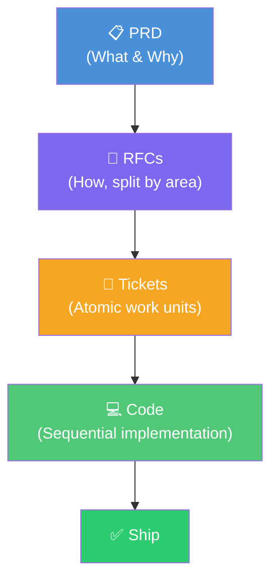
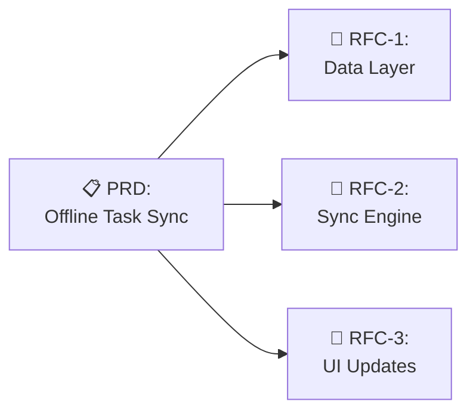

# 📋 PRD → RFC → Tickets → Code

> **Time to read:** ~5 min | **Skill level:** Intermediate | **Platform:** iOS & Android

Stop writing code before you know what you're building. The best AI-assisted mobile teams follow a pipeline: **PRD → RFC → Tickets → Code**. Each step narrows scope and increases precision.

---

## 🎯 The Pipeline



Each step **reduces ambiguity** and **increases AI accuracy**. A well-written ticket produces 3× better AI output than a vague request.

---

## 📝 Writing AI-Friendly PRDs

Your PRD is the **single source of truth**. Claude reads it before every implementation session. Here's the template:

```markdown
# PRD: [Feature Name]

## Context
- What exists today
- Why this feature matters
- Who requested it (stakeholder, user research, metrics)

## User Stories
- As a [role], I want [action] so that [benefit]
- As a [role], I want [action] so that [benefit]

## Technical Requirements
- [ ] Requirement 1 (specific, measurable)
- [ ] Requirement 2
- [ ] Requirement 3

## Success Criteria
- Metric 1: [baseline] → [target]
- Metric 2: [baseline] → [target]

## Constraints
- Must support iOS 16+ / Android API 26+
- Must work offline
- Must not increase app binary by > 2MB

## Non-Goals (Explicit!)
- ❌ We are NOT building [thing that seems related]
- ❌ We are NOT supporting [edge case] in v1
```

> 💡 **Non-Goals are critical.** Without them, AI will gold-plate every feature.

---

## 📐 The Token Ceiling Rule

Frontier LLMs reliably follow **150–200 instructions** in a single context. Beyond that, accuracy drops sharply.

| Spec Size | AI Accuracy | Recommendation |
|-----------|-------------|----------------|
| < 50 requirements | 🟢 95%+ | Single RFC works fine |
| 50–150 requirements | 🟡 85%+ | Split into 2–3 RFCs |
| 150–200 requirements | 🟠 70%+ | Split into 4–5 RFCs |
| 300+ requirements | 🔴 < 50% | **Guaranteed failures** |

**The Rule:** Split your PRD into **5–6 phases** with **30–50 requirements each**. Never dump 300 requirements into one spec.

```
❌ BAD:  "Here's our 300-line spec. Build it all."
✅ GOOD: "Here's Phase 1 (45 requirements). Build this first."
```

---

## 📊 RFC Breakdown

Each RFC focuses on **one area** of the system. Think of them as implementation proposals.



**RFC structure:**

```markdown
# RFC-001: [Area Name]

## Summary
One paragraph. What this RFC covers.

## Requirements (from PRD)
- Req 1.1, 1.2, 1.3 (reference PRD numbers)

## Technical Approach
- Architecture decisions
- Key patterns used
- Dependencies on other RFCs

## Open Questions
- [ ] Question needing team input

## Acceptance Criteria
- [ ] Testable outcome 1
- [ ] Testable outcome 2
```

---

## 🎫 Tickets from RFCs

One RFC → **2–5 tickets**. Each ticket is a single Claude session.

| RFC | Ticket | Scope |
|-----|--------|-------|
| RFC-1: Data Layer | TP-40 | Create CoreData/Room entities |
| RFC-1: Data Layer | TP-41 | Repository layer + unit tests |
| RFC-2: Sync Engine | TP-42 | Conflict resolution logic |
| RFC-2: Sync Engine | TP-43 | Background sync scheduler |
| RFC-3: UI Updates | TP-44 | Offline indicator component |
| RFC-3: UI Updates | TP-45 | Sync status in task list |

**Each ticket prompt to Claude:**

```
Read @PRD.md and @RFC-001.md.
Implement ticket TP-40: Create CoreData entities for offline storage.
Follow existing patterns in the Data/ folder.
Run tests after implementation.
```

---

## 🔄 Living Document

Your spec is **never done**. Update it as you build.

```
Sprint 1: PRD v1.0 → RFC drafts
Sprint 2: PRD v1.1 (updated after RFC questions) → Tickets
Sprint 3: PRD v1.2 (updated after implementation learnings)
```

> 💡 After every significant AI decision, update the relevant RFC. Future sessions will benefit.

---

## 📱 TaskPulse Example — Offline Task Sync

### Mini-PRD

```markdown
# PRD: Offline Task Sync

## Context
TaskPulse users lose work when offline. 38% of support tickets
mention "lost tasks" after subway/airplane usage.

## User Stories
- As a user, I want to create tasks while offline so I don't lose ideas
- As a user, I want to see which tasks haven't synced yet
- As a team lead, I want conflict resolution when two people edit the same task

## Technical Requirements
- [ ] Local persistence (CoreData iOS / Room Android)
- [ ] Queue pending changes with timestamps
- [ ] Last-write-wins conflict resolution (v1)
- [ ] Background sync when connectivity returns
- [ ] Sync status indicator per task
- [ ] Retry with exponential backoff

## Constraints
- Must work on iOS 16+ / Android API 26
- Max 50MB local database
- Sync within 30s of connectivity restored

## Non-Goals
- ❌ Real-time collaborative editing (v2)
- ❌ Offline file attachments (v2)
- ❌ Custom conflict resolution UI (v2)
```

### RFC Breakdown

**RFC-1: Data Layer** → Tickets TP-40 (entities), TP-41 (repository + tests)

**RFC-2: Sync Engine** → Tickets TP-42 (conflict resolution), TP-43 (background scheduler)

**RFC-3: UI Updates** → Tickets TP-44 (offline indicator), TP-45 (sync status badges)

### Sample Ticket Prompt

```
Read @docs/PRD-offline-sync.md and @docs/RFC-002-sync-engine.md.

Implement TP-42: Conflict resolution logic.
- Last-write-wins using server timestamps
- Log conflicts for analytics
- Unit tests for all conflict scenarios

Follow existing patterns in TaskPulse/Sync/.
```

---

## ⚠️ Anti-Patterns

| Anti-Pattern | Why It Fails | Fix |
|-------------|-------------|-----|
| 🚫 Jump to code before spec | AI hallucinates requirements | Write PRD first, always |
| 🚫 Single massive spec | Exceeds token ceiling, accuracy drops | Split into 30–50 req RFCs |
| 🚫 Write-and-forget spec | AI works from stale info | Update after each decision |
| 🚫 Non-goals missing | AI gold-plates features | Explicitly list what you're NOT building |
| 🚫 Vague user stories | AI guesses wrong | Include acceptance criteria |

---

## 🧪 Try It Now

1. **Pick a feature** in your current project that needs building
2. **Write a mini-PRD** using the template above (15 min max)
3. **Ask Claude:** *"Break this PRD into 2-3 RFCs with 30-50 requirements each"*
4. **Ask Claude:** *"Generate Jira tickets from RFC-1 with acceptance criteria"*
5. **Implement one ticket** using the PRD + RFC as context

> 🏆 **Success:** You'll notice AI output is dramatically more focused when it has a spec to follow.

---

← Previous | [🗺️ Course Map](../00-course-map.md) | [Next →](14-plan-mode-mastery.md)
