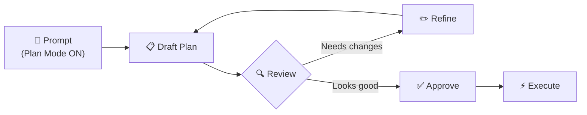
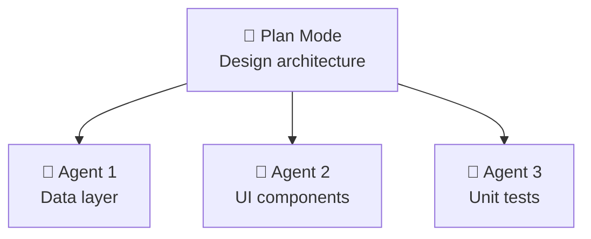

# 🧠 Plan Mode — Think Before You Code

> **Time to read:** ~5 min | **Skill level:** Intermediate | **Platform:** iOS & Android

Your AI just rewrote half your codebase because you said "refactor this." Plan Mode is your safety net. **Think first, execute second.**

---

## 🎯 What is Plan Mode?

Plan Mode tells Gemini to **plan without executing**. No files changed. No code written. Just a structured plan you can review, refine, and approve.

```
⌨️ /plan or Shift+Tab → Toggle Plan Mode ON
💬 Describe what you want
📋 Gemini produces a plan (no code changes)
✏️ You refine the plan
✅ You approve → Gemini executes
```

| Mode | What Happens |
|------|-------------|
| **Normal Mode** | Gemini reads, thinks, and writes code immediately |
| **Plan Mode** | Gemini reads, thinks, and produces a *plan only* |

> 💡 Think of it as **code review before the code exists**.

---

## 🔄 The Workflow



**Typical loop:** 2–3 refinements before approval. That's normal and good.

### The Magic Words

```
"Plan how you would implement push notifications for TaskPulse.
Don't write any code yet — just outline the approach, files to
change, and potential risks."
```

Gemini responds with a structured plan. You say:

```
"Good plan. Two changes:
1. Use Firebase instead of APNs directly
2. Skip the analytics events for now
Update the plan."
```

Gemini updates. You approve. **Now** it writes code.

---

## 📝 Writing Effective Plan Prompts

### ✅ Good Plan Prompts

```
"Plan the implementation of offline caching for TaskPulse.

Context:
- iOS app using SwiftUI + MVVM + SPM
- Network layer uses async/await
- We use CoreData for local persistence

I need:
- List of files to create/modify
- Architecture approach
- Potential breaking changes
- Testing strategy
- Estimated number of sessions needed"
```

### ❌ Bad Plan Prompts

```
"Plan offline caching"
```

Missing: platform, architecture, constraints, what you need in the plan.

### 🎯 The Checklist for Plan Prompts

- [ ] Platform and stack mentioned
- [ ] Current architecture described
- [ ] Constraints listed (performance, compatibility)
- [ ] Expected outputs defined (files list, risks, tests)
- [ ] Non-goals stated

---

## 📱 Mobile Planning Patterns

### 1️⃣ Architecture Review Before Implementation

```
"I'm about to add a real-time messaging feature to TaskPulse.

Before writing any code, review our current architecture:
- @TaskPulse/Sources/ (project structure)
- @TaskPulse/Sources/Data/ (data layer)
- @TaskPulse/Sources/Features/ (feature modules)

Plan: What needs to change? What patterns should we follow?
What risks do you see?"
```

### 2️⃣ Migration Planning

```
"Plan migrating TaskPulse's Settings screen from UIKit to SwiftUI.

Current state: UIKit with UITableView, 12 sections, custom cells.
Target: SwiftUI with NavigationStack and Form.

Give me:
- Migration phases (incremental, not big-bang)
- Bridging strategy (UIHostingController usage)
- Risk areas (deep links, accessibility)
- Files affected per phase"
```

### 3️⃣ Dependency Upgrade Impact

```
"Plan upgrading from Compose BOM 2024.01 to 2025.03.

Analyze:
- Breaking API changes
- Deprecated APIs we currently use
- New APIs we should adopt
- Files that need modification
- Testing focus areas"
```

### 4️⃣ Feature Scoping

```
"Plan the scope for adding biometric authentication to TaskPulse.

Constraints:
- iOS: Face ID + Touch ID (LocalAuthentication framework)
- Android: BiometricPrompt API
- Must support fallback to PIN
- Must not block app launch if biometrics unavailable

What's realistic for a 1-week sprint?"
```

---

## 🔗 Plan → PRD.md

Don't let plans evaporate. **Save them.**

```
"Save this plan as docs/plans/push-notifications-plan.md
with the following additions:
- Add a status section (tracking what's done)
- Add open questions section
- Add decision log section"
```

Now every future session can reference `@docs/plans/push-notifications-plan.md`.

### Plan Document Structure

```markdown
# Plan: Push Notifications

## Status: 🟡 In Progress

## Approach
[The plan Gemini generated]

## Files to Change
- [ ] TaskPulseApp.swift — register for notifications
- [ ] NotificationService.swift — new file
- [ ] TaskViewModel.swift — add notification triggers

## Decision Log
| Date | Decision | Reason |
|------|----------|--------|
| 2025-03-15 | Firebase over raw APNs | Team familiarity |
| 2025-03-15 | Skip rich notifications v1 | Scope control |

## Open Questions
- [ ] Silent push for background sync?
- [ ] Notification grouping strategy?
```

---

## 🤝 Plan + Multi-Agent Coordination

Use Plan Mode to **design**, then subagents to **execute in parallel**.



**Prompt:**

```
"Based on the approved plan in @docs/plans/offline-sync.md:

Use subagents to implement in parallel:
1. Agent 1: Create CoreData entities and repository
2. Agent 2: Build sync status UI components
3. Agent 3: Write unit tests for conflict resolution

Coordinate so Agent 3 tests what Agent 1 builds."
```

---

## ⚡ Plan + Ralph Loop

The ultimate automation: Plan → Approve → Ralph Loop handles execution.

```
Step 1: Plan Mode → Generate implementation plan
Step 2: Review and approve the plan
Step 3: "Execute this plan. After each change:
         - Run tests (swift test / ./gradlew test)
         - Fix any failures before proceeding
         - Commit after each successful step"
```

This gives you a **fully autonomous implementation** with test verification at every step.

---

## 📱 TaskPulse Example — Push Notifications Planning

### Session Start (Plan Mode ON)

```
"Plan adding push notifications to TaskPulse.

Platform: iOS (SwiftUI + MVVM + SPM) and Android (Compose + MVVM + Gradle)

Requirements:
- Notify assignee when task is assigned to them
- Notify team when task status changes
- User can mute notifications per project
- Deep link from notification → task detail screen

Constraints:
- iOS: Use UserNotifications framework + APNs
- Android: Firebase Cloud Messaging
- Backend already has WebSocket — can we reuse?

Give me: phases, file changes, risks, and testing plan."
```

### Gemini's Plan (Summarized)

```markdown
## Phase 1: Infrastructure (2 tickets)
- Register for push + handle tokens
- Notification permission flow UI

## Phase 2: Core Logic (3 tickets)
- NotificationService — parse and route payloads
- Deep link handler — notification → screen navigation
- Mute settings — per-project preference storage

## Phase 3: Polish (2 tickets)
- Notification grouping and badges
- Integration tests + edge cases

## Risks
⚠️ Deep linking with Compose Navigation requires careful backstack management
⚠️ APNs certificates expire — add monitoring
⚠️ Background notification handling differs significantly iOS vs Android
```

### Your Refinement

```
"Good plan. Changes:
1. Move 'mute settings' to Phase 1 — users need this immediately
2. Add a Phase 0 for backend WebSocket evaluation
3. Drop notification grouping from v1

Update the plan and save to docs/plans/push-notifications.md"
```

---

## 🧪 Try It Now

1. **Enable Plan Mode** (`/plan` or Shift+Tab in Gemini CLI)
2. **Pick a feature** you're about to build in your current project
3. **Write a plan prompt** using the checklist above
4. **Iterate 2–3 times** — refine the plan with corrections
5. **Save the plan** as a markdown file in your repo
6. **Execute one phase** with Plan Mode off

> 🏆 **Success:** You'll catch architectural issues *before* writing a single line of code.

---

← [Previous](13-prd-driven-dev.md) | [🗺️ Course Map](../00-course-map.md) | [Next →](15-jira-integration.md)
