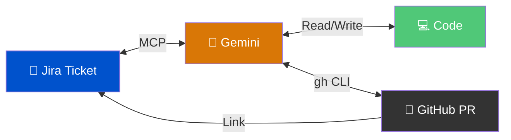
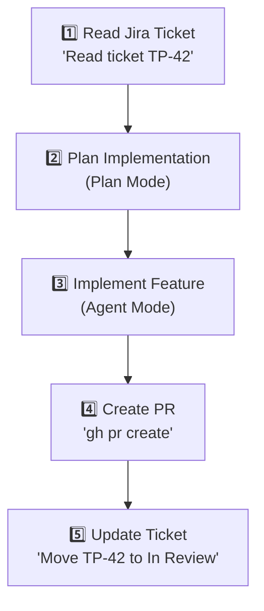

# 🎫 Jira Integration — Tickets Meet Code

> **Time to read:** ~5 min | **Skill level:** Intermediate | **Platform:** iOS & Android

Context-switching kills flow. Reading a Jira ticket in the browser, then switching to your IDE, then explaining requirements to Gemini — that's three hops too many. **Bring Jira into your AI workflow.**

---

## 🎯 Why Integrate



**The closed loop:**
1. 📖 Gemini reads the Jira ticket (requirements, acceptance criteria, comments)
2. 💻 Gemini implements the feature
3. 🔀 Gemini creates a PR linked to the ticket
4. ✅ Gemini updates the ticket status to "In Review"

**Zero tab-switching. Zero copy-pasting requirements.**

---

## 🔧 Setup Options

### Option 1: Atlassian Official MCP Server

The first-party integration. Best for teams already on Atlassian Cloud.

```json
{
  "mcpServers": {
    "atlassian": {
      "command": "npx",
      "args": ["-y", "@atlassian/mcp-server"],
      "env": {
        "ATLASSIAN_SITE": "yourteam.atlassian.net",
        "ATLASSIAN_USER": "you@company.com",
        "ATLASSIAN_API_TOKEN": "your-api-token"
      }
    }
  }
}
```

| Pros | Cons |
|------|------|
| ✅ Official, maintained by Atlassian | ❌ Cloud only (no Server/DC) |
| ✅ Full JQL query support | ❌ Requires API token setup |
| ✅ Read + write access | |

### Option 2: Composio

Quick setup, works with multiple providers.

```bash
npx @composio/mcp@latest setup
# Follow the interactive prompts for Jira
```

| Pros | Cons |
|------|------|
| ✅ One-command setup | ❌ Third-party dependency |
| ✅ Supports 200+ integrations | ❌ May lag behind Jira API changes |
| ✅ OAuth flow built-in | |

### Option 3: Docker MCP Toolkit

Containerized MCP servers for maximum isolation.

```json
{
  "mcpServers": {
    "jira": {
      "command": "docker",
      "args": [
        "run", "--rm", "-i",
        "-e", "JIRA_URL=https://yourteam.atlassian.net",
        "-e", "JIRA_TOKEN=your-api-token",
        "mcp/jira-server"
      ]
    }
  }
}
```

| Pros | Cons |
|------|------|
| ✅ Isolated, secure | ❌ Docker overhead |
| ✅ 200+ servers available | ❌ More complex setup |
| ✅ Works with Server/DC | |

---

## 📱 The Mobile Workflow

### Step-by-Step



### Prompt Sequence

**Step 1 — Read the ticket:**
```
"Read Jira ticket TP-42. Summarize the requirements,
acceptance criteria, and any comments from the team."
```

**Step 2 — Plan:**
```
"Based on TP-42's requirements, plan the implementation.
Reference our PRD at @docs/PRD-offline-sync.md for context."
```

**Step 3 — Implement:**
```
"Implement TP-42 following the approved plan.
Run tests after each major change."
```

**Step 4 — PR + Link:**
```
"Create a PR for this work. Title: 'TP-42: Conflict resolution logic'.
Include the Jira ticket link in the PR description."
```

**Step 5 — Update ticket:**
```
"Move Jira ticket TP-42 to 'In Review'.
Add a comment with the PR link."
```

---

## 🔗 PRD ↔ Jira

Auto-create Jira tickets directly from your PRD.

```
"Read @docs/PRD-offline-sync.md and @docs/RFC-001-data-layer.md.

Create Jira tickets for each requirement in RFC-001:
- Project: TP
- Sprint: Sprint 14
- Labels: offline-sync, data-layer
- Story points: estimate based on complexity
- Include acceptance criteria from the RFC"
```

Gemini creates structured tickets with proper fields — no manual entry.

---

## 📊 Sprint Integration

Process an entire sprint's worth of tickets in batch.

```
"List all tickets assigned to me in Sprint 14 of project TP.
Group them by:
1. Ready to implement (has clear acceptance criteria)
2. Needs clarification (missing info)
3. Blocked (has dependencies)

For group 1, suggest implementation order based on dependencies."
```

### Sprint Standup Helper

```
"Check my Jira tickets in Sprint 14:
- What did I complete yesterday? (recently moved to Done)
- What am I working on today? (In Progress)
- Any blockers? (tickets with blocker flag)"
```

---

## ⚙️ Config Example

Full `.gemini/settings.json` with Jira MCP:

```json
{
  "permissions": {
    "allow": [
      "mcp__atlassian__jira_read",
      "mcp__atlassian__jira_write",
      "mcp__atlassian__jira_comment"
    ]
  },
  "mcpServers": {
    "atlassian": {
      "command": "npx",
      "args": ["-y", "@atlassian/mcp-server"],
      "env": {
        "ATLASSIAN_SITE": "taskpulse.atlassian.net",
        "ATLASSIAN_USER": "dev@taskpulse.io",
        "ATLASSIAN_API_TOKEN": "${JIRA_API_TOKEN}"
      }
    }
  }
}
```

> 💡 **Security:** Use environment variable references (`${JIRA_API_TOKEN}`) — never hardcode tokens in committed files.

---

## 📱 TaskPulse Example — Ticket TP-42

### Full Session

```
You: "Read Jira ticket TP-42"

Gemini: "TP-42: Implement conflict resolution for offline sync
         Status: To Do | Sprint 14 | Points: 5

         Acceptance Criteria:
         - Last-write-wins using server timestamps
         - Log all conflicts to analytics
         - Unit tests for: same-field conflict, delete-vs-edit,
           simultaneous creation

         Comments:
         @sarah: 'Make sure we handle timezone edge cases'
         @mike: 'Reference RFC-002 for the approach'"

You: "Plan the implementation based on this ticket and @docs/RFC-002.md"

Gemini: [Produces plan — 3 files to create, 2 to modify]

You: "Looks good. Implement it."

Gemini: [Creates ConflictResolver.swift, writes tests, runs them]

You: "Create PR and update the ticket"

Gemini: [Creates PR 'TP-42: Last-write-wins conflict resolution',
         moves ticket to In Review, adds PR link as comment]
```

**Total time: ~15 minutes.** No tab-switching. No copy-pasting.

---

## ⚠️ Common Pitfalls

| Pitfall | Fix |
|---------|-----|
| 🚫 Hardcoded API tokens in settings | Use `${ENV_VAR}` references |
| 🚫 Giving Gemini write access to all projects | Scope permissions to your project only |
| 🚫 Forgetting to link PRs to tickets | Add to your GEMINI.md: "Always link PRs to Jira tickets" |
| 🚫 Stale ticket data | Gemini reads live — but verify status before updating |

---

## 🧪 Try It Now

1. **Set up Jira MCP** using one of the three options above
2. **Read a ticket** — ask Gemini to summarize any ticket from your current sprint
3. **Plan from ticket** — use Plan Mode to design the implementation
4. **Implement + PR** — build the feature and create a linked PR
5. **Update ticket** — have Gemini move the ticket and add a comment

> 🏆 **Success:** You complete a ticket without opening Jira in your browser once.

---

← [Previous](14-plan-mode-mastery.md) | [🗺️ Course Map](../00-course-map.md) | [Next →](../Part 5 — Daily Scenarios/16-unknown-codebase.md)
