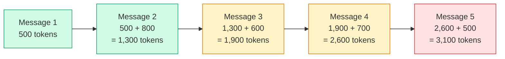
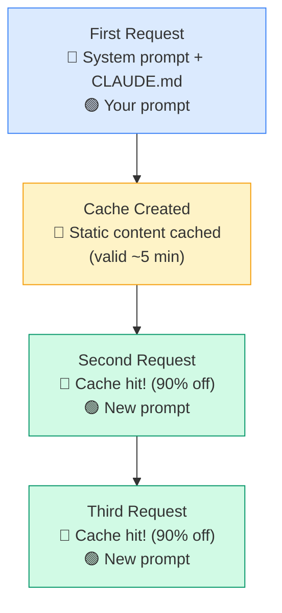

# 💰 Cost Management & Token Optimization

> **Time to read:** ~4 min | **Skill level:** Intermediate | **Platform:** iOS & Android

Agent teams are powerful. They're also expensive. A 3-agent Ralph loop can cost more than your lunch. A week of unoptimized Claude usage can cost more than your IDE subscription for the year.

> "We burned $200 in tokens on a Tuesday. The feature was worth it. The 14 failed iterations where Claude re-read the entire codebase each time were not."

Understanding token economics isn't optional — it's the difference between AI-assisted development being a superpower and being a budget crisis.

---

## 📊 Understanding Token Costs

### What Counts as Tokens?

Everything Claude reads and writes costs tokens. A token is roughly 4 characters or 0.75 words.

| Token Type | What It Includes | Cost Weight |
|-----------|-----------------|-------------|
| **Input tokens** | Your prompt, `CLAUDE.md`, `@`-imported files, conversation history, tool results | Base cost |
| **Output tokens** | Claude's response, generated code, tool calls | 3-5x input cost |
| **Cached input tokens** | Repeated static content (CLAUDE.md, system prompts) that hits cache | Up to 90% discount |

### Context Window = Your Bill

The context window is everything Claude "sees" during a conversation. As conversations get longer, **every new message re-sends the entire history.**



**Key insight:** Message 10 in a conversation costs dramatically more than Message 1 — because it includes the context of all previous messages.

---

## 💸 Cost by Workflow

Not all workflows cost the same. Here's what to expect:

| Workflow | Cost Multiplier | Why | When to Use |
|----------|----------------|-----|-------------|
| **Single session** | 1x (baseline) | One conversation, one task | Quick fixes, single files |
| **Subagents** | 1.5-2x | Parent + child contexts | Parallel tasks, scoped work |
| **Agent teams** | 3-5x | Multiple agents, coordination overhead | Complex multi-file features |
| **Ralph loops** | N x iterations | Each iteration is a fresh context | Autonomous implementation |
| **Ralph + Agent teams** | 5-15x | Multiple agents x multiple iterations | Full feature squads |

### Cost Comparison: Building TaskPulse Comments Feature

| Approach | Estimated Input Tokens | Estimated Output Tokens | Relative Cost |
|----------|----------------------|------------------------|---------------|
| Single session, manual iteration | ~50K | ~15K | $0.50 |
| 2 subagents (model + view) | ~80K | ~25K | $0.90 |
| 3-agent team | ~150K | ~45K | $1.80 |
| Ralph loop (5 iterations) | ~250K | ~75K | $3.00 |
| Ralph + 3-agent team | ~500K | ~150K | $6.50 |

*Estimates based on Sonnet-class pricing. Opus costs approximately 5x more per token.*

---

## ⚡ Prompt Caching — Your Biggest Cost Lever

Prompt caching is the single most impactful optimization. Static content at the start of your conversation gets cached and reused at a steep discount.

### How It Works



### How to Structure Prompts for Cache Hits

**What gets cached:** Content that stays the same across requests — system prompts, `CLAUDE.md` content, `@`-imported reference files.

**What doesn't get cached:** Your specific prompt, conversation history that changes each turn, tool results.

```markdown
# In CLAUDE.md — this gets cached across all requests

## Architecture
- MVVM with Repository pattern
- SwiftUI views, @MainActor ViewModels
- Async/await for all async operations
- SPM for dependency management

## Code Style
- 4-space indentation
- No force unwraps in production code
- All public APIs must have documentation comments
```

By putting your architecture rules, code style, and project context in `CLAUDE.md` rather than repeating them in every prompt, you pay for those tokens once and get cache discounts on subsequent requests.

### Cache Savings Example

| Scenario | Without Cache | With Cache | Savings |
|----------|-------------|-----------|---------|
| 10 prompts, 5K token CLAUDE.md | 50K input tokens | 5K full + 45K cached | ~80% |
| Ralph loop, 5 iterations | 25K static tokens x 5 | 25K full + 100K cached | ~75% |
| Agent team, 3 agents | 15K static x 3 | 15K full + 30K cached | ~60% |

---

## 🎯 Context Efficiency

### Shorter Prompts That Work Better

```
❌ Verbose (85 tokens):
"I need you to create a new SwiftUI view for the TaskPulse application
that displays a list of comments for a specific task. The view should
follow our existing MVVM architecture pattern and use the same styling
conventions that we use throughout the rest of the application. Please
make sure to include proper error handling and loading states."

✅ Concise (32 tokens):
"Create CommentListView for TaskPulse. Follow TaskListView patterns.
Include loading, error, and empty states. Use CommentRepository."
```

The concise prompt works **better** because Claude already has your patterns in `CLAUDE.md`. You don't need to re-describe them.

### When to Use `@` Imports vs. Inline

| Approach | Token Cost | When to Use |
|----------|-----------|-------------|
| `@TaskListView.swift` | Exact file size | Claude needs to see the implementation |
| "Follow TaskListView patterns" | ~5 tokens | Patterns are already in CLAUDE.md |
| Paste entire file inline | File size + prompt overhead | Never — use `@` import instead |

### Avoiding Unnecessary File Reads

Claude reads files to answer your questions. Each file read adds tokens. Be specific:

```
❌ "Look at the entire Sources/ directory and find where we handle authentication"
(Claude reads 30+ files searching)

✅ "Check Sources/Auth/AuthService.swift for the token refresh logic"
(Claude reads 1 file)
```

---

## 🧠 Model Selection for Cost

Not every task needs the most capable model.

| Task Type | Recommended Model | Why | Cost |
|-----------|------------------|-----|------|
| Boilerplate, scaffolding | Haiku | Fast, cheap, perfect for templates | $ |
| Feature implementation | Sonnet | Best balance of quality and cost | $$ |
| Complex architecture | Opus | Deepest reasoning, highest quality | $$$$$ |
| Code review | Sonnet | Good enough for pattern matching | $$ |
| Bug investigation | Sonnet or Opus | Depends on complexity | $$-$$$$$ |
| Test generation | Haiku or Sonnet | Tests follow clear patterns | $-$$ |

```bash
# Use Sonnet for most work
claude --model claude-sonnet-4-6 "Implement CommentListView"

# Switch to Haiku for boilerplate
claude --model claude-haiku-4-6 "Generate unit test stubs for CommentRepository"

# Reserve Opus for hard problems
claude --model claude-opus-4-6 "Debug the race condition in task sync"
```

---

## 📋 Budget Planning

### Estimating Costs by Project Phase

| Phase | Daily Token Usage | Typical Daily Cost (Sonnet) | Notes |
|-------|------------------|---------------------------|-------|
| **Setup & scaffolding** | 100-200K | $0.50-1.00 | Lots of boilerplate, use Haiku |
| **Feature development** | 200-500K | $1.00-3.00 | Main development phase |
| **Bug fixing** | 100-300K | $0.50-2.00 | Varies by bug complexity |
| **Code review (CI)** | 50-150K per PR | $0.25-0.75 per PR | Scales with PR volume |
| **Ralph loops** | 300K-1M per loop | $2.00-6.00 per feature | Most expensive workflow |

### Setting Team Budgets

```
Team of 4 developers:
- Individual daily budget: $10/person
- Weekly team budget: $200
- Monthly budget: ~$800

With optimization:
- Prompt caching saves ~40%
- Model selection saves ~30%
- Effective monthly cost: ~$350-450
```

---

## 🔟 10 Ways to Reduce Token Spend

| # | Technique | Savings | Effort |
|---|-----------|---------|--------|
| 1 | **Keep CLAUDE.md comprehensive** | 30-40% | Low — write once |
| 2 | **Use concise prompts** | 10-20% | Low — practice |
| 3 | **Start new sessions for new tasks** | 20-30% | None — just Cmd+N |
| 4 | **Use `@` imports, not paste** | 5-10% | None |
| 5 | **Use Haiku for boilerplate** | 40-60% on those tasks | Low — add `--model` flag |
| 6 | **Scope file reads precisely** | 10-15% | Low — be specific |
| 7 | **Avoid re-explaining patterns** | 15-25% | Low — put in CLAUDE.md |
| 8 | **Limit Ralph loop iterations** | Prevents runaway | Low — set MAX_ITERATIONS |
| 9 | **Use subagents instead of teams for simple tasks** | 30-50% vs teams | Low — right-size the approach |
| 10 | **Review before re-prompting** | 10-20% | Low — read output first |

---

## 📱 TaskPulse Example: Cost-Conscious Feature Implementation

Building the Comments feature for TaskPulse — comparing approaches:

### Approach A: Unoptimized (Expensive)

```bash
# One giant session, Opus model, no caching strategy
claude --model claude-opus-4-6

> "Build me the entire comments feature for TaskPulse. I need the model,
  repository, view model, views, and tests. Here's our architecture..."
  [pastes 500 lines of existing code inline]
  [continues in same session for 20 messages as things go wrong]

# Result: ~800K tokens, ~$40 with Opus
```

### Approach B: Optimized (Cost-Effective)

```bash
# Step 1: Scaffold with Haiku (cheap model for boilerplate)
claude --model claude-haiku-4-6
> "Generate Comment model, CommentRepository protocol, and file stubs
  for CommentListView and CommentListViewModel. Follow @TaskListView.swift patterns."

# Step 2: Implement with Sonnet (new session — fresh context)
claude --model claude-sonnet-4-6
> "Implement CommentListViewModel. Use @CommentRepository.swift protocol.
  Follow @TaskListViewModel.swift patterns for state management."

# Step 3: Tests with Sonnet (new session)
claude --model claude-sonnet-4-6
> "Write tests for @CommentListViewModel.swift.
  Follow @TaskListViewModelTests.swift patterns."

# Result: ~200K tokens across 3 sessions, ~$1.50 with Sonnet/Haiku mix
```

**Same feature. 96% cost reduction.** The difference is session management, model selection, and prompt efficiency.

---

## 🧪 Try It Now

1. **Measure your current usage.** Run `claude` for a typical task. After the session, note the token count displayed. Multiply by your per-token rate. Are you surprised by the cost?

2. **Optimize a prompt.** Take your last Claude prompt and rewrite it to be half the length. Remove any context that's already in your `CLAUDE.md`. Compare the output quality — it should be identical or better.

3. **Try model switching.** Take a boilerplate task (generate a new view, write test stubs) and run it with both Sonnet and Haiku. Compare output quality and cost. For templates and scaffolding, Haiku is often indistinguishable.

4. **Plan a feature budget.** Before your next feature, estimate the cost using the table above. Choose your workflow (single session vs. subagents vs. team) based on complexity AND budget. Track actual spend against your estimate.

---

← [Previous: Automated Code Review](27-code-review.md) | [🗺️ Course Map](../00-course-map.md) | [Next: Team Onboarding →](27c-team-onboarding.md)
