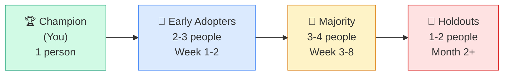
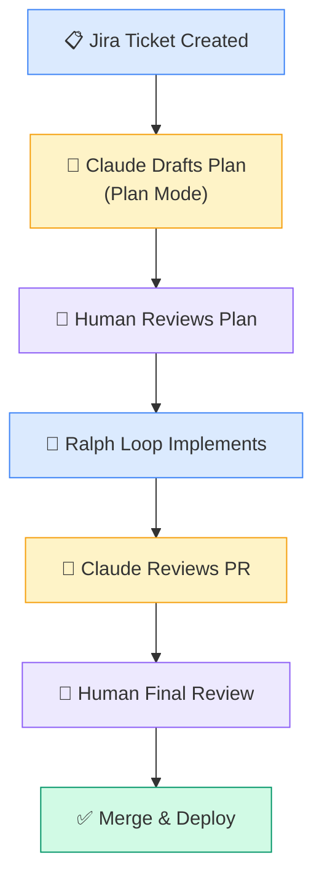

# 👥 Team Onboarding & Scaling AI Adoption

> **Time to read:** ~5 min | **Skill level:** Advanced | **Platform:** iOS & Android

You've 10x'd yourself with Claude. Now multiply that across your team of 8. That's not 80x — it's chaos, unless you have a rollout plan.

> "I spent 3 weeks mastering Claude Code. Then I said 'just use it' to my team. Two people loved it. Three ignored it. Two actively resisted it. One accidentally committed an API key. We needed a plan."

Scaling AI adoption is a people problem, not a technology problem. This chapter gives you the playbook.

---

## 📈 The Adoption Curve

Every team follows the same pattern. Knowing where each person is helps you support them correctly.



| Phase | Who | Motivation | Your Action |
|-------|-----|-----------|-------------|
| **Champion** | You — the person reading this course | Already convinced, already productive | Document what works, create shared config |
| **Early Adopters** | Curious teammates, tech leads | Want to try new tools, trust your judgment | Pair session, share your CLAUDE.md, show real wins |
| **Majority** | Most of the team | Need proof it works, want easy onboarding | Workshop, starter commands, measure results |
| **Holdouts** | Skeptics, senior devs with strong workflows | "My workflow is fine" / "I don't trust AI" | Show ROI data, don't force it, let results speak |

**Critical rule:** Never mandate AI adoption. Mandates create resentment. Instead, make AI-assisted work so visibly effective that people **want** to join.

---

## 📅 Week 1: Foundation

### Day 1: Shared CLAUDE.md

Before anyone writes a prompt, the team needs a shared `CLAUDE.md`. The champion (you) creates the first version:

```markdown
# TaskPulse Team CLAUDE.md

## Project Overview
TaskPulse is a collaborative task manager.
- iOS: SwiftUI + MVVM + SPM (Xcode 16, iOS 17+)
- Android: Jetpack Compose + MVVM + Gradle (API 28+)

## Architecture Rules
- Views → ViewModels → Repositories → Services
- ViewModels are @MainActor (iOS) / use viewModelScope (Android)
- All async operations use async/await (iOS) / coroutines (Android)
- State is modeled as sealed interface (Android) / enum (iOS)

## Code Style
- Follow existing patterns in Sources/Features/TaskList/
- 4-space indentation, no tabs
- No force unwraps in production code
- All public APIs have documentation comments

## Testing
- Unit tests for all ViewModels and Repositories
- Use MockRepository protocol conformances for iOS
- Use Fake implementations for Android testing
- Minimum 80% coverage on business logic

## Security
- Never hardcode secrets — use Keychain/EncryptedSharedPreferences
- Never disable SSL pinning
- Never log sensitive data

## PR Standards
- PRs under 400 lines changed
- Every PR needs tests
- Squash merge to main
```

### Day 2-3: Basic Prompting Workshop (1 hour)

Run a hands-on session. Not slides — live coding.

**Agenda:**

| Time | Activity | Goal |
|------|----------|------|
| 0:00 | Live demo: you build a small feature with Claude | Show the "wow" moment |
| 0:15 | Everyone installs Claude Code | Remove setup friction |
| 0:20 | Everyone opens a terminal and tries 3 starter prompts | First hands-on experience |
| 0:35 | Q&A: "What surprised you?" | Surface concerns early |
| 0:45 | Share CLAUDE.md and explain each section | Establish shared standards |
| 0:55 | Assign homework: use Claude for one real task this week | Build habit |

**Starter prompts for the workshop:**

```bash
# Prompt 1: Explain existing code
claude "Explain the architecture of @Sources/Features/TaskList/TaskListViewModel.swift.
What patterns does it use? What are the key dependencies?"

# Prompt 2: Generate a test
claude "Write unit tests for @Sources/Features/TaskList/TaskListViewModel.swift.
Follow the patterns in @Tests/Features/TaskList/TaskListViewModelTests.swift."

# Prompt 3: Find a bug
claude "Review @Sources/Networking/TaskAPIService.swift for potential issues.
Check error handling, thread safety, and edge cases."
```

### Day 4-5: First Skills

Give the team 2-3 pre-built skills they can use immediately:

```bash
# /generate-view — scaffolds a new view + viewmodel
claude "/generate-view CommentList"

# /review-pr — reviews current branch changes
claude "/review-pr"

# /add-tests — generates tests for a file
claude "/add-tests Sources/Features/Comments/CommentRepository.swift"
```

These skills lower the barrier. Instead of crafting prompts from scratch, developers run a command and get useful output.

---

## 📅 Weeks 2-4: Building Proficiency

### Commands and Hooks

Introduce the team to custom commands and hooks:

```bash
# Share team commands via .claude/commands/
team-commands/
├── review-pr.md        # Review current branch
├── generate-tests.md   # Generate tests for a file
├── check-arch.md       # Verify architecture rules
└── create-feature.md   # Scaffold a new feature module
```

### Code Review Integration

Add Claude to the PR review workflow:

```yaml
# .github/workflows/claude-review.yml
name: Claude Code Review
on:
  pull_request:
    types: [opened, synchronize]
steps:
  - uses: anthropics/claude-code-action@v1
    with:
      anthropic_api_key: ${{ secrets.ANTHROPIC_API_KEY }}
```

This gives **every** team member AI-assisted code review, even if they haven't adopted Claude locally yet. It normalizes AI feedback in the team's workflow.

### Measuring Early Wins

Track these metrics from day one:

| Metric | How to Measure | Target (Week 4) |
|--------|---------------|-----------------|
| **Adoption rate** | % of team using Claude weekly | 60%+ |
| **PR cycle time** | Time from PR open to merge | 20% reduction |
| **Test coverage** | Lines covered by tests | 10% increase |
| **Developer satisfaction** | Anonymous 1-5 survey | 3.5+ average |
| **Bugs per sprint** | Bug tickets created in sprint | Baseline (measuring) |

---

## 📅 Month 2+: Advanced Adoption

### Agent Teams

Once the team is comfortable with single-session Claude, introduce agent teams for larger features:

```bash
# Team lead kicks off a feature with an agent team
claude "Implement the TaskPulse notifications feature.

Assign to your team:
- Agent 1: NotificationService + push registration
- Agent 2: NotificationListView + NotificationViewModel
- Agent 3: Unit tests for all new code

Coordinate via PROGRESS.md. All agents follow CLAUDE.md rules."
```

### Ralph Loops

Reserve Ralph loops for the most confident team members first. Require guardrails:

```bash
# Team standard: every Ralph loop must have
MAX_ITERATIONS=10          # Hard stop
SCOPE="Sources/Features/Notifications/"  # Bounded scope
PROGRESS_FILE="PROGRESS.md"  # Audit trail
TIMEOUT="30m"              # Time limit
```

### Full Pipeline Automation

The end state: Claude is integrated into every phase of development.



---

## 📏 Shared Standards

### Team CLAUDE.md Conventions

| Convention | Rule | Why |
|-----------|------|-----|
| **Location** | Root of repo + module-level overrides | Global rules + specific rules |
| **Ownership** | Tech lead maintains root, feature owners maintain module | Clear responsibility |
| **Updates** | PR required to change CLAUDE.md | Reviewed like any code change |
| **Versioning** | Tagged with sprint number | Track what changed when |

### Style Guide for AI Prompts

Standardize how the team writes prompts to get consistent results:

```markdown
## Team Prompt Standards

1. Always reference existing files with @ syntax
   ✅ "Follow @TaskListView.swift patterns"
   ❌ "Follow our existing patterns" (too vague)

2. Always specify the module scope
   ✅ "Create files in Sources/Features/Comments/"
   ❌ "Create the comments feature" (Claude chooses the location)

3. Always state the testing expectation
   ✅ "Write unit tests. Run them. Fix failures."
   ❌ "Make sure it works" (no verification)

4. Always reference CLAUDE.md rules
   ✅ "Follow CLAUDE.md architecture rules"
   ❌ "Use MVVM" (might not match your specific MVVM)
```

### Review Criteria for AI-Generated Code

Add this to your PR template:

```markdown
## AI-Assisted Code Checklist
- [ ] AI-generated code compiles without warnings
- [ ] AI-generated code follows CLAUDE.md rules
- [ ] AI-generated tests actually test meaningful behavior (not just coverage)
- [ ] No hardcoded secrets, tokens, or API keys
- [ ] No invented APIs or hallucinated method names
- [ ] Security-critical code was manually reviewed line-by-line
- [ ] AI was not used for: [list any areas where AI is restricted]
```

---

## 📊 Measuring ROI

### What to Track

| Category | Metric | Measurement Method | Expected Impact |
|----------|--------|-------------------|-----------------|
| **Speed** | Time to implement feature | Jira ticket lifecycle | 30-50% faster |
| **Speed** | PR review turnaround | GitHub PR analytics | 40-60% faster |
| **Quality** | Bugs per sprint | Bug tracker | 15-25% reduction |
| **Quality** | Test coverage | CI coverage reports | 10-20% increase |
| **Volume** | PRs merged per week | GitHub analytics | 20-40% increase |
| **Satisfaction** | Developer happiness | Anonymous survey | Varies |

### Making the Case to Leadership

```
Before Claude Code (Q3):
- Average feature: 5 days
- PR review time: 4 hours
- Test coverage: 62%
- Bugs per sprint: 8

After Claude Code (Q4):
- Average feature: 3 days (40% faster)
- PR review time: 1.5 hours (62% faster)
- Test coverage: 78% (16-point increase)
- Bugs per sprint: 5 (37% fewer)

Monthly cost: $400 (team of 4)
Monthly savings: ~$8,000 in developer time
ROI: 20x
```

---

## 🤝 Handling Resistance

### Common Objections and Responses

| Objection | Root Cause | Response |
|-----------|-----------|----------|
| **"AI will replace me"** | Job security fear | "AI replaces tasks, not people. You'll spend less time on boilerplate and more time on architecture, design, and the hard problems only humans solve." |
| **"I don't trust AI code"** | Quality concern (valid) | "Neither do I — that's why we have the verification checklist, tests, and human review. AI writes the first draft. You're the editor." |
| **"It's slower than doing it myself"** | Learning curve frustration | "It is slower at first. Like any tool, there's a learning curve. Give it 2 weeks of daily use. If it's still slower, we'll adjust." |
| **"It'll make junior devs lazy"** | Mentorship concern | "We require AI code to pass the same review standards. Juniors still need to understand what the code does and defend it in review." |
| **"The output isn't good enough"** | Poor prompt quality | "Let me show you my CLAUDE.md and prompt patterns. The difference between bad AI output and great AI output is the input." |

### What NOT to Do

- Do not mandate daily usage quotas
- Do not compare individual adoption rates publicly
- Do not remove someone's existing tools to force AI adoption
- Do not skip the workshop and just send a Slack message with a link
- Do not expect 100% adoption — 80% is a win

---

## 🏛️ Governance

### Who Owns CLAUDE.md?

```
Root CLAUDE.md → Tech Lead / Staff Engineer
├── Sources/Features/CLAUDE.md → Feature Team Lead
├── Sources/Networking/CLAUDE.md → Platform Team Lead
├── Tests/CLAUDE.md → QA Lead
└── .github/CLAUDE.md → DevOps Lead
```

### How to Update Shared Configs

Treat `CLAUDE.md` changes like code changes:

1. Create a branch
2. Make changes to `CLAUDE.md`
3. Open a PR with rationale
4. Team reviews and approves
5. Merge to main

This prevents one person from silently changing rules that affect everyone's AI output.

### Versioning AI Workflows

```markdown
# CLAUDE.md Changelog

## v3 (Sprint 14)
- Added: Room migration rules for Android
- Changed: Test coverage requirement from 70% to 80%
- Removed: Combine-related rules (migration complete)

## v2 (Sprint 12)
- Added: Security rules section
- Added: PR size limits (400 lines)
- Changed: State modeling from enum to sealed interface (Android)

## v1 (Sprint 10)
- Initial team CLAUDE.md
- Architecture rules, code style, testing requirements
```

---

## 📱 TaskPulse Example: Rolling Out Claude Code

### The TaskPulse Team

| Person | Role | Adoption Phase | Notes |
|--------|------|---------------|-------|
| **Sarah** | Tech Lead | Champion | Completed this course, uses Claude daily |
| **James** | iOS Senior | Early Adopter | Tried Claude, liked it for tests |
| **Priya** | Android Senior | Early Adopter | Uses it for Compose boilerplate |
| **Alex** | iOS Mid | Majority | Interested but hasn't started |
| **Kim** | Android Mid | Majority | Waiting to see team results |
| **Dev** | Backend | Majority | "I'll try it when the mobile team proves it" |
| **Marcus** | iOS Senior | Holdout | "I've been writing Swift for 10 years, I'm faster without AI" |
| **Lin** | QA | Holdout | "If AI writes the code AND tests, who's actually testing?" |

### Sarah's Rollout Plan

**Week 1:**
- Created shared `CLAUDE.md` from her personal version
- Ran 1-hour workshop with live demo (built a TaskPulse filter feature in 10 minutes)
- Shared 3 starter commands: `/review-pr`, `/generate-tests`, `/explain-code`
- James and Priya started using Claude the same day

**Week 2-3:**
- Added Claude code review to CI — every PR gets AI feedback
- Alex tried Claude after seeing it catch a retain cycle in his PR
- Kim used `/generate-tests` and went from 55% to 72% coverage on her module
- Marcus acknowledged the CI reviews were "sometimes useful"

**Week 4:**
- Shared metrics: 35% faster PR cycle, 12-point coverage increase
- Dev started using Claude for API endpoint scaffolding
- Lin used Claude to generate edge case test scenarios (became a fan)

**Month 2:**
- Marcus tried Claude for a complex refactor — saved 2 days
- Team adopted agent teams for large features
- Monthly AI cost: $350. Monthly time saved: estimated 40+ developer-hours

---

## 🧪 Try It Now

1. **Create your team's CLAUDE.md.** Take your personal `CLAUDE.md`, generalize it for the team, and open a PR. Ask 2 teammates to review it. This single file is the foundation of everything else.

2. **Run a pilot workshop.** Pick one willing teammate. Spend 30 minutes showing them Claude with your project. Let them drive while you coach. Their success becomes your proof point for the wider team.

3. **Set up CI code review.** Add `anthropics/claude-code-action` to one repository. This gives the entire team AI-assisted reviews without requiring anyone to change their local workflow. Track how many review comments Claude catches that humans missed.

4. **Measure your baseline.** Before rolling out to the team, record current metrics: average PR cycle time, test coverage, bugs per sprint, features per sprint. You'll need these numbers to prove ROI in 4 weeks.

---

← [Previous: Cost Management](27b-cost-management.md) | [🗺️ Course Map](../00-course-map.md) | [Next: Part 5 →](../Part%205%20—%20Daily%20Scenarios/16-unknown-codebase.md)
