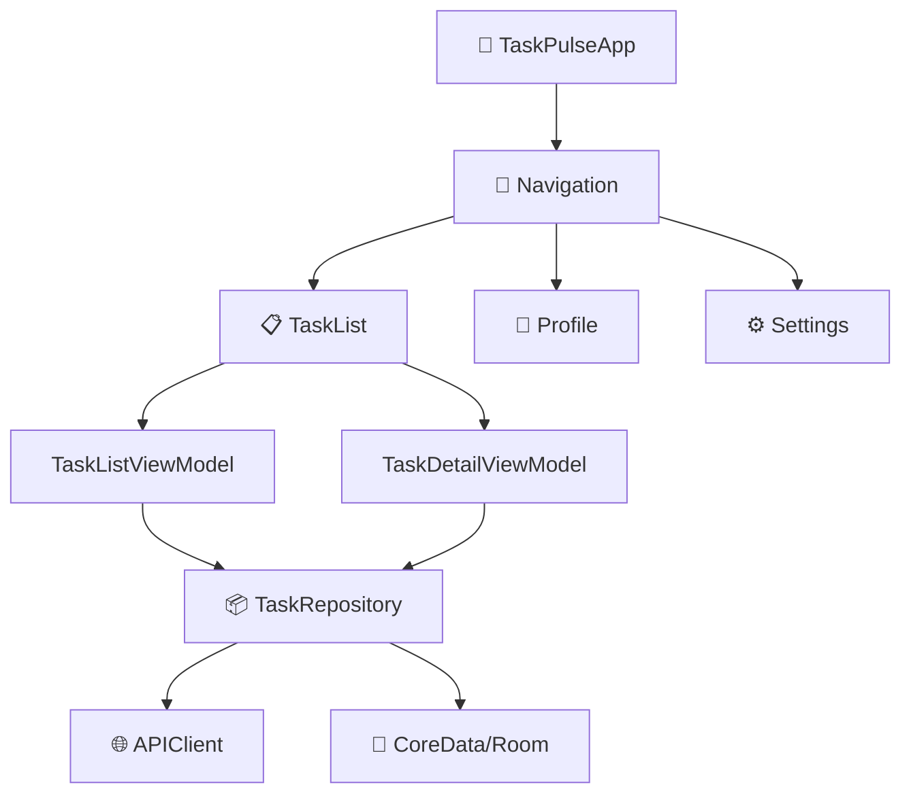

# 🔍 Working in an Unfamiliar Codebase

> **Time to read:** ~5 min | **Skill level:** Intermediate | **Platform:** iOS & Android

New team. New repo. 200K lines of code you've never seen. Your first instinct is to read everything. **Don't.** Let AI map the terrain for you.

---

## 🎯 When to Use This

- 🆕 You just joined a new team or project
- 🔀 You're assigned to an unfamiliar module
- 🏚️ You're dealing with legacy code nobody understands
- 🤝 You're reviewing a PR in a codebase you don't own

---

## 📋 Prerequisites

- [ ] Claude Code installed and configured
- [ ] Git repo cloned locally
- [ ] Basic understanding of the platform (iOS or Android)
- [ ] 30–60 minutes for initial exploration

---

## 🔄 Step-by-Step Workflow

### Step 1: Bootstrap CLAUDE.md

Your first action in any new codebase. **Always.**

```
"Explore this codebase and create a CLAUDE.md file. Include:
- Project purpose and architecture pattern
- Key directories and what they contain
- Build commands (build, test, lint)
- Important conventions you observe
- Dependency management approach
- Navigation/routing pattern"
```

Claude scans the project structure, reads key files (`Package.swift`, `build.gradle`, `Info.plist`), and produces a comprehensive context file.

### Step 2: Map the Architecture

```
"Create an architecture map of this project as a Mermaid diagram.

Show:
- Module/package boundaries
- Data flow direction
- Key dependencies between modules
- Entry points (App, Activities, Scenes)"
```

**Example output:**



### Step 3: Understand Patterns Before Changing

```
"Before I make any changes, show me the established patterns for:
1. How screens/features are structured
2. How data flows from API → UI
3. How errors are handled
4. How navigation works
5. How dependency injection is configured

Show me one concrete example of each from the existing code."
```

> ⚡ **This is the most important step.** AI output quality doubles when it follows existing patterns instead of inventing new ones.

### Step 4: Progressive Learning — Start Small

```
"I need to make a small change: update the task card to show
the assignee's avatar.

Walk me through:
1. Where the task card component lives
2. What data it currently receives
3. Where avatar URL comes from in the data model
4. The minimal change needed"
```

Start with a **tiny, low-risk change** to validate your understanding before tackling big features.

---

## 📱 Mobile-Specific Tips

### 🍎 iOS Discovery Prompts

```
"Analyze the iOS project structure:
- Is this UIKit, SwiftUI, or hybrid?
- What's the navigation pattern? (NavigationStack, Coordinator, Router?)
- How is DI handled? (Swinject, Factory, manual?)
- What's the data layer? (CoreData, SwiftData, Realm?)
- Are there any Objective-C bridging headers?"
```

### 🤖 Android Discovery Prompts

```
"Analyze the Android project structure:
- Single module or multi-module?
- Compose, XML Views, or hybrid?
- What's the DI framework? (Hilt, Koin, manual?)
- Navigation: Compose Navigation, Fragments, or custom?
- How are Gradle modules organized?"
```

### 🔍 Finding the Data Flow

```
"Trace the complete data flow for displaying a task list:
1. Where does the API call originate?
2. What model transformations happen?
3. Where is caching/persistence?
4. How does data reach the UI?
5. How are loading/error states handled?

Show me the actual file paths for each step."
```

---

## ⚡ Smart Prompts (Copy-Paste Ready)

### 🗺️ Architecture Discovery
```
"Analyze this codebase. Give me a 2-minute briefing:
- What does this app do?
- What architecture pattern is used?
- What are the 5 most important files?
- What's the testing situation (coverage, patterns)?
- What technical debt do you notice?"
```

### 🔗 Dependency Mapping
```
"Map the third-party dependencies in this project.
For each one, tell me:
- What it does
- Where it's used
- Current version vs latest version
- Any known security issues"
```

### 📐 Pattern Identification
```
"Find and describe the recurring patterns in this codebase:
- How are ViewModels structured?
- How are network calls made?
- How are errors propagated?
- How are tests organized?
Show one example of each pattern with file paths."
```

### 🏗️ Module Boundary Analysis
```
"Show me the module boundaries in this project.
For each module:
- Public API surface (what it exports)
- Dependencies (what it imports)
- Size (approximate file count)
Create a dependency graph as a Mermaid diagram."
```

---

## ⚠️ Common Pitfalls

| Pitfall | Fix |
|---------|-----|
| 🚫 Reading every file top-to-bottom | Let AI map structure first, then dive into specifics |
| 🚫 Making big changes on day 1 | Start with tiny changes to validate understanding |
| 🚫 Ignoring existing patterns | Ask Claude to show patterns *before* writing new code |
| 🚫 Skipping CLAUDE.md creation | Always create it first — it pays for itself in session 2 |
| 🚫 Assuming one architecture | Many real apps are hybrid (some UIKit, some SwiftUI) |

---

## ✅ Checklist

- [ ] CLAUDE.md created with build commands and conventions
- [ ] Architecture diagram generated
- [ ] Key patterns identified (at least 3)
- [ ] Data flow traced for one feature end-to-end
- [ ] DI/navigation setup understood
- [ ] One small change made successfully following existing patterns
- [ ] Third-party dependencies cataloged

---

## 🧪 Try It Now

1. **Clone a popular open-source app** you've never worked with:
   - iOS: [Ice Cubes](https://github.com/Dimillian/IceCubesApp) (Mastodon client, SwiftUI)
   - Android: [Now in Android](https://github.com/android/nowinandroid) (Compose)
2. **Run the bootstrap prompt** from Step 1 to generate CLAUDE.md
3. **Ask Claude to map the architecture** as a Mermaid diagram
4. **Trace one data flow** end-to-end (e.g., "How does a post/task get displayed?")
5. **Make one tiny change** (e.g., add a label, change a color) following existing patterns

> 🏆 **Success:** You understand the codebase well enough to make a confident PR within 1 hour.

---

← [Previous](../Part 4 — Workflow Methodologies/15-jira-integration.md) | [🗺️ Course Map](../00-course-map.md) | [Next →](17-rfc-spike.md)
