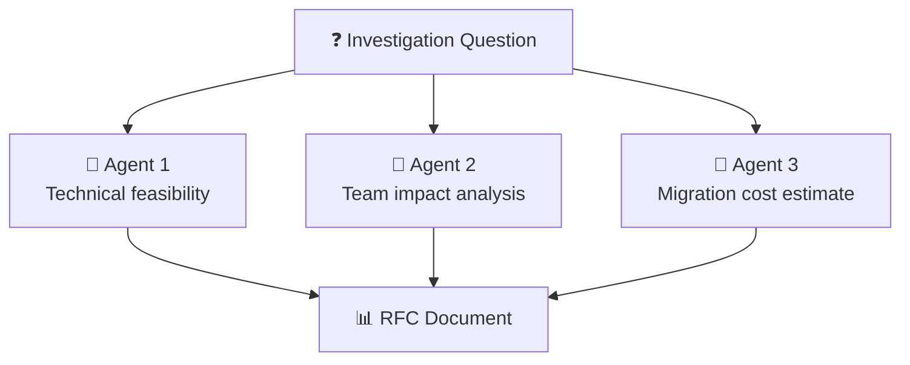

# 📊 RFC/SPIKE Investigations

> **Time to read:** ~5 min | **Skill level:** Intermediate | **Platform:** iOS & Android

Your tech lead asks: *"Should we migrate to Compose Multiplatform or keep separate codebases?"* You need a decision by Friday. **AI turns a week of research into an afternoon.**

---

## 🎯 When to Use This

- 🔬 Evaluating a new SDK or framework
- 🏗️ Comparing architecture approaches
- 🔄 Planning a migration (UIKit → SwiftUI, Java → Kotlin)
- 📊 Making a build-vs-buy decision
- ⚖️ Choosing between competing technical solutions

---

## 📋 Prerequisites

- [ ] Clear question(s) to answer
- [ ] Stakeholder expectations for deliverable format
- [ ] Timeboxed investigation (1 day, 3 days, 1 week)
- [ ] Access to relevant codebases and documentation

---

## 🔄 Step-by-Step Workflow

### Step 1: Define the Investigation Scope

Before touching any tools, write your investigation brief.

```
"I'm conducting a SPIKE investigation. Help me structure it.

Question: Should TaskPulse adopt Compose Multiplatform for
shared UI between iOS and Android?

Constraints:
- Team: 3 iOS devs, 2 Android devs
- Timeline: must decide in 3 days
- Current codebase: 80K lines iOS, 65K lines Android
- Shared business logic: ~30% overlap

Help me create:
1. Specific questions to answer
2. Evaluation criteria with weights
3. Research plan"
```

### Step 2: Parallel Research with Subagents



**Prompt:**

```
"Run three parallel investigations:

Agent 1 — Technical Feasibility:
- Can Compose Multiplatform handle our UI complexity?
- Analyze our most complex screens in @Features/
- Identify components that WON'T work cross-platform

Agent 2 — Team Impact:
- Learning curve for iOS devs learning Kotlin/Compose
- Team velocity impact during migration (estimate)
- Hiring implications

Agent 3 — Migration Cost:
- Estimate effort to migrate our top 5 screens
- Identify shared vs platform-specific code boundaries
- Dependency compatibility check"
```

### Step 3: Structure Findings as RFC

```markdown
# RFC: Compose Multiplatform Adoption

## Status: 📝 Draft
## Author: [Your Name]
## Date: 2025-03-18

## Summary
One paragraph: what we're proposing and why.

## Context
Why this question came up. What problem we're solving.

## Options Evaluated

### Option A: Adopt Compose Multiplatform
**Pros:** [findings from investigation]
**Cons:** [findings from investigation]
**Effort:** [estimate]

### Option B: Keep Separate Codebases
**Pros:** [findings]
**Cons:** [findings]
**Effort:** [estimate]

### Option C: Share Only Business Logic (KMP)
**Pros:** [findings]
**Cons:** [findings]
**Effort:** [estimate]

## Decision Matrix
[See Step 4 below]

## Recommendation
Based on the analysis, we recommend Option [X] because...

## Next Steps
1. [action item]
2. [action item]
```

### Step 4: Decision Matrix

```
"Create a weighted decision matrix for our three options.

Criteria and weights:
- Development velocity (25%)
- Code maintainability (20%)
- Team expertise match (20%)
- Performance (15%)
- Hiring pool (10%)
- Community/ecosystem (10%)

Score each option 1-5 per criterion. Show the weighted totals."
```

**Example output:**

| Criteria | Weight | CMP | Separate | KMP Only |
|----------|--------|-----|----------|----------|
| Dev velocity | 25% | 4 (1.0) | 3 (0.75) | 3 (0.75) |
| Maintainability | 20% | 4 (0.8) | 2 (0.4) | 3 (0.6) |
| Team expertise | 20% | 2 (0.4) | 5 (1.0) | 3 (0.6) |
| Performance | 15% | 3 (0.45) | 5 (0.75) | 4 (0.6) |
| Hiring pool | 10% | 3 (0.3) | 4 (0.4) | 3 (0.3) |
| Ecosystem | 10% | 3 (0.3) | 5 (0.5) | 4 (0.4) |
| **Total** | | **3.25** | **3.80** | **3.25** |

---

## 📱 Mobile-Specific Tips

### 🔍 SDK Evaluation Prompts

```
"Evaluate [SDK name] for use in TaskPulse.

Check:
- Binary size impact (iOS framework / Android AAR)
- Min SDK version compatibility
- Permissions required
- Privacy manifest / data collection declarations
- Open issues count and maintenance activity
- License compatibility with our project
- Integration complexity with our DI setup"
```

### 🔄 Migration Analysis

```
"Analyze migrating TaskPulse from [X] to [Y].

For our codebase:
1. Identify all usage sites of [X]
2. Map each usage to equivalent [Y] API
3. Flag any gaps (features in X not in Y)
4. Estimate effort per module
5. Suggest migration phases (incremental, not big-bang)"
```

**iOS example:** CoreData → SwiftData migration
**Android example:** RxJava → Kotlin Coroutines/Flow migration

### 📐 Architecture Comparison

```
"Compare these architecture patterns for TaskPulse's needs:

Pattern A: [e.g., MVI with Redux-style store]
Pattern B: [e.g., MVVM with repository pattern]

Evaluate against:
- Our team's experience level
- Testability requirements
- State management complexity in our app
- Performance characteristics for our use case
- Show a concrete example of our TaskList feature in each pattern"
```

---

## ⚡ Smart Prompts (Copy-Paste Ready)

### 🔬 Quick SDK Evaluation
```
"I'm evaluating [SDK]. In under 5 minutes, tell me:
1. What it does (one sentence)
2. Would it work with our stack? (SwiftUI+SPM / Compose+Gradle)
3. Three biggest risks of adopting it
4. Three alternatives I should also consider
5. Your recommendation: adopt, wait, or skip?"
```

### 📊 Build vs Buy
```
"Build vs buy analysis for [capability].

If we build:
- Estimated development effort
- Maintenance burden
- Full customization

If we buy/adopt [specific library]:
- Integration effort
- Ongoing cost (if any)
- Limitations we'd inherit

Which approach for a team of [N] with [timeline]?"
```

### 🔄 Migration Feasibility
```
"Is it feasible to migrate from [X] to [Y] in [timeframe]?

Analyze our codebase:
- How many files use [X]?
- Can we migrate incrementally?
- What's the riskiest part?
- Suggest a phased rollout plan."
```

---

## ⚠️ Common Pitfalls

| Pitfall | Fix |
|---------|-----|
| 🚫 Open-ended investigation with no timebox | Set a hard deadline. 1 day, 3 days, max 1 week. |
| 🚫 Researching without criteria | Define evaluation criteria BEFORE investigating |
| 🚫 Bias toward the new/shiny option | Include "keep current approach" as an explicit option |
| 🚫 AI hallucinating SDK capabilities | Verify critical claims against official docs |
| 🚫 Analysis paralysis | Decision matrix forces a quantitative answer |

---

## ✅ Checklist

- [ ] Investigation question clearly defined
- [ ] Evaluation criteria and weights agreed with stakeholders
- [ ] All options researched (including "do nothing")
- [ ] Decision matrix completed with scores
- [ ] RFC document written and shared
- [ ] Prototype/proof-of-concept for top option (if needed)
- [ ] Next steps and timeline documented
- [ ] Team review scheduled

---

## 🧪 Try It Now

1. **Pick a real decision** your team is facing (library choice, migration, architecture)
2. **Write the investigation brief** using the Step 1 prompt above
3. **Run parallel research** with subagents on at least 2 options
4. **Build a decision matrix** with weighted criteria
5. **Generate the RFC** document and share with your team

> 🏆 **Success:** A decision your team has been debating for weeks gets a structured recommendation in one afternoon.

---

← [Previous](16-unknown-codebase.md) | [🗺️ Course Map](../00-course-map.md) | [Next →](18-fmea-analysis.md)
