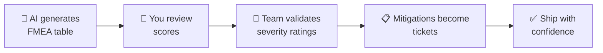

# ⚠️ FMEA — Risk Analysis with AI

> **Time to read:** ~5 min | **Skill level:** Intermediate | **Platform:** iOS & Android

You're about to launch a feature. What could go wrong? **Everything.** FMEA (Failure Mode and Effects Analysis) is a structured way to find risks before your users do. AI makes it fast.

---

## 🎯 When to Use This

- 🚀 Before launching a new feature to production
- 🏗️ Evaluating architecture changes
- 🔒 Security review of authentication/payment flows
- 📱 Offline mode or data sync implementations
- 🔄 Major dependency upgrades

---

## 📋 Prerequisites

- [ ] Feature/system design documented (PRD or RFC)
- [ ] Understanding of the user-facing flows
- [ ] Access to the codebase for AI analysis
- [ ] Stakeholder availability to validate severity ratings

---

## 🔄 Step-by-Step Workflow

### What is FMEA?

A table-driven risk analysis. Each row identifies **what could fail**, **how bad it is**, and **what to do about it**.

| Column | Meaning | Scale |
|--------|---------|-------|
| **Failure Mode** | What goes wrong | Description |
| **Severity (S)** | How bad is it for the user? | 1 (cosmetic) → 10 (data loss/crash) |
| **Occurrence (O)** | How likely is it to happen? | 1 (nearly impossible) → 10 (happens constantly) |
| **Detection (D)** | How likely are we to catch it before users? | 1 (always caught) → 10 (invisible until production) |
| **RPN** | Risk Priority Number = S × O × D | 1–1000 (higher = scarier) |
| **Mitigation** | What we'll do about it | Action plan |

> 💡 **RPN > 200 = Must fix before launch.** RPN > 100 = Should fix. RPN < 100 = Accept or monitor.

### Step 1: Identify Failure Modes

```
"Perform an FMEA analysis on TaskPulse's Offline Sync feature.

Read @docs/PRD-offline-sync.md and @TaskPulse/Sources/Sync/

Identify all failure modes across:
- Data layer (storage, corruption, migration)
- Network layer (connectivity, timeouts, partial sync)
- UI layer (stale data display, user confusion)
- Security (unauthorized data access, token expiry)
- Platform (background task limits, memory pressure)"
```

### Step 2: Score Each Failure Mode

```
"For each failure mode you identified, assign scores:
- Severity (1-10): How bad for the user?
- Occurrence (1-10): How likely given our implementation?
- Detection (1-10): How likely to escape our test suite?

Calculate RPN = S × O × D.
Sort by RPN descending.
Flag anything above 200 as 🔴 CRITICAL."
```

### Step 3: Generate Mitigations

```
"For every failure mode with RPN > 100:
1. Propose a specific mitigation strategy
2. Estimate effort to implement (S/M/L)
3. Show the new RPN after mitigation
4. Write the mitigation as a Jira ticket description"
```

### Step 4: Review and Validate



---

## 📱 Mobile-Specific Tips

### 📱 TaskPulse FMEA Example

| # | Failure Mode | S | O | D | RPN | Mitigation |
|---|-------------|---|---|---|-----|------------|
| 1 | 🔴 Sync overwrites newer server data | 9 | 4 | 7 | **252** | Add vector clocks + conflict UI |
| 2 | 🔴 App crashes during background sync (iOS) | 8 | 5 | 6 | **240** | Add crash recovery + retry queue |
| 3 | 🟡 Stale data shown after reconnect | 6 | 6 | 4 | **144** | Force refresh on connectivity change |
| 4 | 🟡 Offline queue grows unbounded | 7 | 3 | 6 | **126** | Add queue size limit + warning UI |
| 5 | 🟢 Sync indicator not visible | 3 | 4 | 3 | **36** | Add accessibility label |

### 🍎 iOS-Specific Failure Modes

```
"Analyze iOS-specific failure modes for offline sync:
- BGTaskScheduler limits (30s execution window)
- CoreData context merge conflicts on background threads
- Memory pressure during large sync batches
- Push notification token refresh during offline period
- App Tracking Transparency impact on analytics sync
- iCloud account changes mid-sync"
```

### 🤖 Android-Specific Failure Modes

```
"Analyze Android-specific failure modes for offline sync:
- WorkManager constraints and battery optimization (Doze mode)
- Room database migration failures on upgrade
- Process death during sync (ViewModel state loss)
- Foreground service notification requirements (Android 14+)
- Split APK / Play Feature Delivery edge cases
- OEM-specific battery restrictions (Samsung, Xiaomi)"
```

### 🔒 Security Failure Modes

```
"Analyze security failure modes in TaskPulse's offline sync:
- Stored auth tokens (Keychain/EncryptedSharedPrefs)
- Unencrypted local database contents
- Data leakage through backup (iCloud/Google backup)
- Token refresh race conditions
- MITM during sync resume after offline
- Shared device / multi-user scenarios"
```

---

## ⚡ Smart Prompts (Copy-Paste Ready)

### 🎯 Quick FMEA
```
"Generate an FMEA table for [feature].
Include at least 10 failure modes.
Score S/O/D on 1-10 scale.
Sort by RPN descending.
Format as markdown table."
```

### 🔍 Deep-Dive on Critical Risk
```
"Failure mode: [describe the failure].
This has RPN of [X].

Deep-dive:
1. Root cause analysis — why would this happen?
2. Three different mitigation strategies
3. Which mitigation gives the best RPN reduction per effort?
4. Write a test case that would catch this failure."
```

### 📊 Pre-Launch Risk Summary
```
"Review the complete FMEA at @docs/fmea-offline-sync.md.

Produce a launch readiness report:
- 🔴 Critical risks (RPN > 200): must fix
- 🟡 Medium risks (RPN 100-200): should fix or accept with monitoring
- 🟢 Low risks (RPN < 100): accepted

For each critical risk, confirm mitigation status."
```

### 🔄 Post-Mitigation Re-Score
```
"I've implemented these mitigations: [list them].
Re-score the FMEA table with updated O and D values.
Show before/after RPN comparison.
Are we ready to launch?"
```

---

## ⚠️ Common Pitfalls

| Pitfall | Fix |
|---------|-----|
| 🚫 AI scores everything as medium (5/5/5) | Push for specificity: "Why 5 and not 3 or 7?" |
| 🚫 Only considering happy-path failures | Explicitly ask about edge cases, platform limits, concurrency |
| 🚫 Skipping detection scoring | Detection is often the most actionable — improve testing to lower D |
| 🚫 FMEA as a one-time exercise | Re-run after major changes. Keep the document alive. |
| 🚫 Ignoring platform-specific risks | Always run iOS-specific AND Android-specific failure mode prompts |

---

## ✅ Checklist

- [ ] Feature/system scope defined for analysis
- [ ] AI-generated FMEA with 10+ failure modes
- [ ] All scores reviewed by a human (not just AI defaults)
- [ ] Critical risks (RPN > 200) have mitigations planned
- [ ] Mitigations converted to Jira tickets
- [ ] Post-mitigation re-scoring completed
- [ ] Team sign-off on residual risk
- [ ] FMEA document saved in repo for future reference

---

## 🧪 Try It Now

1. **Pick a feature** you've recently shipped or are about to ship
2. **Run the Quick FMEA prompt** — get 10+ failure modes
3. **Challenge the scores** — ask "why?" on at least 3 ratings
4. **Deep-dive** on the highest RPN item
5. **Write one mitigation** as a concrete code change or test

> 🏆 **Success:** You find at least one risk you hadn't considered — before your users find it for you.

---

← [Previous](17-rfc-spike.md) | [🗺️ Course Map](../00-course-map.md) | [Next →](19-bug-investigation.md)
