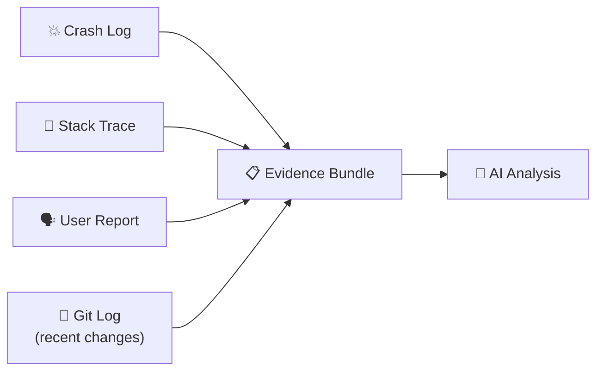
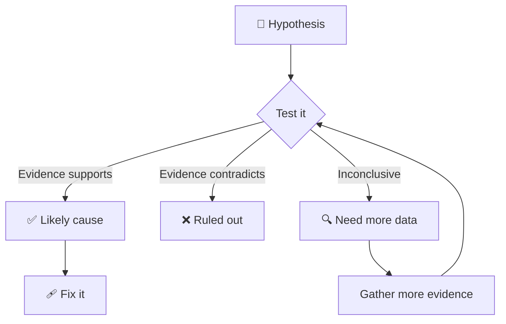

# 🐛 Bug Hunting with AI

> **Time to read:** ~5 min | **Skill level:** Intermediate | **Platform:** iOS & Android

It's Monday morning. Crashlytics shows 2,000 crashes over the weekend. A stack trace that makes no sense. A user report that says "it just stopped working." **AI is your investigation partner.**

---

## 🎯 When to Use This

- 💥 Crash reports from Crashlytics / Firebase / Sentry
- 🐌 User-reported performance issues or ANRs
- 🔴 CI test failures you can't reproduce locally
- 🤔 "It works on my machine" bugs
- 🔄 Intermittent / flaky issues

---

## 📋 Prerequisites

- [ ] Crash log, stack trace, or reproduction steps
- [ ] Access to the relevant source code
- [ ] Logs from the timeframe of the bug (if available)
- [ ] Knowledge of recent changes (git log)

---

## 🔄 Step-by-Step Workflow

### Step 1: Gather Evidence

Before asking AI anything, **collect all available evidence** into one prompt.



**The Evidence Bundle prompt:**

```
"Investigate this crash. Here's everything I have:

CRASH LOG:
[paste crash log]

STACK TRACE:
[paste stack trace]

USER REPORT:
'App freezes when I tap on a task, then crashes after ~5 seconds'

RECENT CHANGES (last 3 days):
[paste git log --oneline -20]

ENVIRONMENT:
- iOS 17.2, iPhone 15 Pro
- TaskPulse v2.3.1 (build 142)
- Happens for ~5% of users"
```

### Step 2: AI-Assisted Analysis

```
"Based on the evidence above:

1. What are your top 3 hypotheses for the root cause?
2. For each hypothesis, what evidence supports or contradicts it?
3. What additional information would help narrow it down?
4. Which recent commits are most likely related?
5. Suggest specific code locations to investigate."
```

### Step 3: Hypothesis Generation and Validation

Gemini generates hypotheses. Now **validate each one**.

```
"Let's test Hypothesis 1: Race condition in TaskDetailViewModel.

Search for:
- All places where taskDetail state is mutated
- Any background thread access to published properties
- Missing MainActor annotations
- Concurrent access patterns in @TaskPulse/Sources/Features/TaskDetail/"
```

**Validation flow:**



### Step 4: Root Cause Identification

```
"We've confirmed the issue is in TaskDetailViewModel.swift.

The @Published property 'taskDetail' is being mutated from a
background thread when the sync callback fires.

Explain:
1. Exactly why this causes a crash
2. The minimum fix (smallest change)
3. How to write a test that reproduces this
4. Other places in the codebase with the same pattern"
```

---

## 📱 Mobile-Specific Tips

### 🍎 iOS Crash Report Analysis

```
"Analyze this iOS crash report from Crashlytics:

[paste symbolicated crash report]

Specifically check for:
- EXC_BAD_ACCESS (memory issues)
- EXC_BREAKPOINT (force unwrap / fatalError)
- Main thread checker violations
- Watchdog timeout (0x8badf00d)
- Background task expiration crashes"
```

**Common iOS crash patterns:**

| Code | Meaning | Usual Cause |
|------|---------|------------|
| `0x8badf00d` | Watchdog timeout | Blocking main thread |
| `0xdead10cc` | Deadlock | Holding file lock in background |
| `0xbad22222` | VoIP killed | Background VoIP misuse |
| `EXC_BAD_ACCESS` | Memory violation | Use-after-free, dangling pointer |
| `EXC_BREAKPOINT` | Trap triggered | Force unwrap nil, fatalError |

### 🤖 Android ANR Analysis

```
"Analyze this ANR trace from Play Console:

[paste ANR trace]

Check for:
- Main thread blocked by synchronous I/O
- Database queries on main thread
- Lock contention (synchronized blocks)
- Large layout inflation
- SharedPreferences.apply() blocking commit"
```

### 🔍 Memory Investigation

```
"I suspect a memory leak in TaskPulse.

Analyze @TaskPulse/Sources/Features/ for:
- Strong reference cycles (delegate patterns without weak)
- Closures capturing self strongly
- Timer/NotificationCenter observers not removed
- Combine/Flow subscriptions without cancellation
- Large allocations in scrolling lists (missing cell reuse)"
```

### 🧪 Instruments / Profiler Guidance

```
"I have an Instruments trace showing high memory usage.

The allocations show:
- TaskModel: 50,000 instances (expected: ~200)
- UIImage: 2GB total (expected: ~100MB)

Help me find:
1. Where TaskModel instances are being retained
2. Where UIImage caching might be unbounded
3. Specific code paths to investigate"
```

---

## ⚡ Smart Prompts (Copy-Paste Ready)

### 💥 Crash Triage
```
"Triage this crash. Tell me in 30 seconds:
- Severity: how many users affected?
- Root cause: most likely explanation
- Blast radius: what else could be affected?
- Quick fix: can we hotfix or need a full release?
[paste crash data]"
```

### 🔍 Find Similar Bugs
```
"The bug is a race condition in TaskDetailViewModel.

Search the entire codebase for the same pattern:
- Properties mutated off main thread
- Missing @MainActor annotations on ObservableObject classes
- Background callbacks updating @Published properties
List every occurrence with file path and line."
```

### 📊 Regression Detection
```
"This bug started appearing in v2.3.1 (build 142).

Compare the diff between v2.3.0 and v2.3.1:
- Which changes could cause [symptom]?
- Focus on files in [module]
- Flag any threading-related changes"
```

### 🧵 Thread Safety Audit
```
"Audit @TaskPulse/Sources/Features/TaskDetail/ for
thread safety issues.

Check:
- Actor isolation correctness
- Sendable conformance
- Data races in shared mutable state
- Correct use of DispatchQueue/MainActor
Show each issue with file, line, and fix."
```

---

## ⚠️ Common Pitfalls

| Pitfall | Fix |
|---------|-----|
| 🚫 Pasting unsymbolicated crash logs | Symbolicate first — AI can't read raw addresses |
| 🚫 Jumping to conclusions from one crash | Gather multiple crash instances to find the pattern |
| 🚫 Ignoring "recent changes" context | Always include git log — the bug was probably just introduced |
| 🚫 Fixing symptoms, not root cause | Ask "why does this happen?" until you hit the fundamental issue |
| 🚫 Only fixing the one occurrence | Use "find similar bugs" prompt to fix ALL instances |

---

## ✅ Checklist

- [ ] Evidence bundle assembled (crash log + stack trace + user report + git log)
- [ ] Top 3 hypotheses generated
- [ ] Each hypothesis tested against evidence
- [ ] Root cause identified and explained
- [ ] Similar patterns searched across codebase
- [ ] Fix designed (see [next chapter: Bug Fixing](20-bug-fix.md))
- [ ] Post-mortem notes captured for team

---

## 🧪 Try It Now

1. **Find a recent crash** in your project's crash reporting tool
2. **Build an evidence bundle** — crash log, stack trace, recent changes
3. **Ask Gemini to generate 3 hypotheses** for the root cause
4. **Validate the top hypothesis** — ask Gemini to search for supporting evidence in your code
5. **Find similar patterns** — search for the same anti-pattern across your codebase

> 🏆 **Success:** You identify a root cause that would have taken hours of manual debugging in under 20 minutes.

---

← [Previous](18-fmea-analysis.md) | [🗺️ Course Map](../00-course-map.md) | [Next →](20-bug-fix.md)
