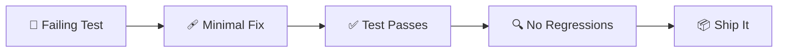

# 🩹 Fixing Bugs Safely

> **Time to read:** ~5 min | **Skill level:** Intermediate | **Platform:** iOS & Android

You found the bug. Now fix it **without breaking everything else.** The goal: smallest possible change, maximum confidence, zero regressions.

---

## 🎯 When to Use This

- ✅ Root cause confirmed (see [Bug Investigation](19-bug-investigation.md))
- 🔥 Hotfix needed for production crash
- 🧪 Flaky test that needs a reliable fix
- 🔒 Security vulnerability patch
- 🐌 Performance regression fix

---

## 📋 Prerequisites

- [ ] Root cause identified and documented
- [ ] Reproduction steps (manual or automated)
- [ ] Understanding of affected code paths
- [ ] Test environment ready (simulator/emulator/device)

---

## 🔄 Step-by-Step Workflow

### Step 1: Write the Failing Test First

**Always.** Before you touch production code, prove the bug exists in a test.

```
"Write a failing test that reproduces this bug:

Bug: TaskDetailViewModel crashes when sync callback fires
on background thread, mutating @Published property.

The test should:
1. Create a TaskDetailViewModel
2. Trigger a sync callback from a background thread
3. Assert that the update happens on the main thread
4. Currently this test should FAIL (proving the bug exists)"
```

**iOS Example:**

```swift
func test_syncCallback_updatesOnMainThread() async {
    let viewModel = TaskDetailViewModel(repository: mockRepo)

    // Simulate background sync callback
    await withCheckedContinuation { continuation in
        DispatchQueue.global().async {
            mockRepo.simulateSyncUpdate(task: updatedTask)

            // This should NOT crash
            DispatchQueue.main.async {
                XCTAssertEqual(viewModel.taskDetail?.title, "Updated")
                continuation.resume()
            }
        }
    }
}
```

**Android Example:**

```kotlin
@Test
fun `sync callback updates on main thread`() = runTest {
    val viewModel = TaskDetailViewModel(mockRepository)

    // Simulate background sync callback
    withContext(Dispatchers.Default) {
        mockRepository.emitSyncUpdate(updatedTask)
    }

    // Collect on main — should not crash
    val result = viewModel.taskDetail.first()
    assertEquals("Updated", result?.title)
}
```

### Step 2: Implement Minimal Fix

```
"Fix this bug with the SMALLEST possible change.

Root cause: TaskDetailViewModel.taskDetail is updated from
a background thread in the sync callback.

Rules:
- Change as few files as possible (ideally 1)
- Don't refactor anything unrelated
- Don't add features
- Preserve existing behavior for all non-buggy paths
- The failing test from Step 1 must now pass"
```



**iOS Fix (minimal):**

```swift
// BEFORE (buggy):
func onSyncUpdate(_ task: TaskModel) {
    self.taskDetail = task  // ❌ Called from background thread
}

// AFTER (fixed):
@MainActor
func onSyncUpdate(_ task: TaskModel) {
    self.taskDetail = task  // ✅ Guaranteed main thread
}
```

**Android Fix (minimal):**

```kotlin
// BEFORE (buggy):
fun onSyncUpdate(task: TaskModel) {
    _taskDetail.value = task  // ❌ Called from background thread
}

// AFTER (fixed):
fun onSyncUpdate(task: TaskModel) {
    viewModelScope.launch(Dispatchers.Main) {
        _taskDetail.value = task  // ✅ Guaranteed main thread
    }
}
```

### Step 3: Verify Fix + No Regressions

```
"Run the full test suite. I need:
1. The new test passes ✅
2. All existing tests still pass ✅
3. No new warnings introduced
4. Show me the test results summary"
```

**The verification prompt:**

```
"After fixing the bug:

1. Run: swift test (or ./gradlew test)
2. If any tests fail, determine if they're:
   a. Related to our change → fix them
   b. Pre-existing flaky tests → note but don't fix
3. Run lint: swiftlint (or ./gradlew detekt)
4. Confirm zero regressions"
```

### Step 4: Hook Guardrails for Safe Deployment

Add a pre-commit hook or CI check to prevent this class of bug from recurring.

```
"Create a guardrail to prevent this bug pattern from recurring.

Options:
1. Custom lint rule that flags @Published mutations off main thread
2. CI check for missing @MainActor annotations
3. Automated test that audits all ViewModels for thread safety

Pick the option with the best effort-to-coverage ratio
and implement it."
```

---

## 📱 Mobile-Specific Tips

### 🧵 Thread Safety Fixes

**iOS — Common patterns:**

```swift
// Fix 1: @MainActor on the class
@MainActor
class TaskDetailViewModel: ObservableObject { ... }

// Fix 2: MainActor.run for specific callbacks
Task { @MainActor in
    self.taskDetail = newValue
}

// Fix 3: Combine's receive(on:)
publisher
    .receive(on: DispatchQueue.main)  // ✅ Always add this
    .assign(to: &$taskDetail)
```

**Android — Common patterns:**

```kotlin
// Fix 1: Dispatchers.Main in viewModelScope
viewModelScope.launch(Dispatchers.Main) { ... }

// Fix 2: flowOn for upstream flows
repository.taskFlow
    .flowOn(Dispatchers.IO)  // upstream on IO
    .collect { task ->       // collected on Main (viewModelScope default)
        _state.value = task
    }

// Fix 3: StateFlow with correct context
private val _state = MutableStateFlow<Task?>(null)
val state: StateFlow<Task?> = _state.asStateFlow()
```

### 🔄 Lifecycle Bug Fixes

```
"Fix this lifecycle bug:

Symptom: Screen shows stale data after returning from background.
Root cause: ViewModel doesn't refresh when app becomes active.

Fix it for both:
- iOS: Use scenePhase or NotificationCenter .willEnterForeground
- Android: Use Lifecycle.Event.ON_RESUME observer

Minimal change only. Write the test first."
```

### 💾 State Management Fixes

```
"Fix this state management bug:

Symptom: Task edit screen loses changes when device rotates.
Root cause: State stored in Composable/View, not ViewModel.

Show me:
1. Where state is currently stored (find the code)
2. The minimal fix to move it to ViewModel
3. How to preserve it across configuration changes
4. The test that proves it works"
```

### 🧠 Memory Leak Fixes

```
"Fix this memory leak:

Symptom: Memory grows 10MB per screen navigation cycle.
Root cause: [identified in investigation phase]

Fix strategy:
1. Show me the retain cycle / reference graph
2. Minimal fix (weak reference, cancellation, etc.)
3. Test that proves the leak is fixed
4. How to detect this pattern in CI"
```

---

## ⚡ Smart Prompts (Copy-Paste Ready)

### 🧪 Test-First Bug Fix
```
"Bug: [describe the bug and root cause]

Step 1: Write a failing test that reproduces it.
Step 2: Show me the minimal fix (fewest lines changed).
Step 3: Confirm the test passes.
Step 4: Run the full test suite — zero regressions."
```

### 🎯 Minimal Blast Radius
```
"I need to fix [bug] in [file].

Rules:
- Touch only the files necessary for the fix
- No refactoring, no cleanups, no 'while I'm here'
- Preserve all existing behavior except the bug
- Show me a diff preview before making changes"
```

### 🔍 Regression Check
```
"I just fixed [bug] by changing [file/method].

Check for regressions:
1. What other code calls this method?
2. Could the fix change behavior for any of those callers?
3. Are there edge cases the fix doesn't cover?
4. Run tests and confirm zero failures."
```

### 🛡️ Prevent Recurrence
```
"We just fixed [bug type] in [location].

How do we prevent this class of bug from ever recurring?
Options: lint rule, CI check, architectural pattern, test.
Pick the most practical option and implement it."
```

---

## ⚠️ Common Pitfalls

| Pitfall | Fix |
|---------|-----|
| 🚫 Fixing without a failing test | Always write the test first — proves the bug AND prevents regression |
| 🚫 "While I'm here" refactoring | Separate PRs. Bug fix = bug fix only. |
| 🚫 Large blast radius fix | Ask for the MINIMAL change. Review the diff before committing. |
| 🚫 Fixing one instance, ignoring others | Use "find similar patterns" to fix ALL occurrences |
| 🚫 No guardrail after fix | Add a lint rule or CI check to prevent recurrence |

---

## ✅ Checklist

- [ ] Root cause documented (from investigation phase)
- [ ] Failing test written that reproduces the bug
- [ ] Minimal fix implemented (smallest possible change)
- [ ] Failing test now passes
- [ ] Full test suite passes (zero regressions)
- [ ] Lint/formatting passes
- [ ] Similar patterns fixed across codebase
- [ ] Guardrail added to prevent recurrence
- [ ] PR created with clear description linking to bug report

---

## 🧪 Try It Now

1. **Pick a known bug** in your project (or introduce one intentionally in a branch)
2. **Write a failing test** that reproduces it — don't fix anything yet
3. **Ask Gemini for the minimal fix** — "fewest lines changed"
4. **Run the full test suite** — confirm zero regressions
5. **Add a guardrail** — lint rule, CI check, or pattern test

> 🏆 **Success:** Your fix is 5-15 lines of code, has a test proving it works, and a guardrail preventing recurrence.

---

← [Previous](19-bug-investigation.md) | [🗺️ Course Map](../00-course-map.md) | [Next →](21-greenfield-feature.md)
