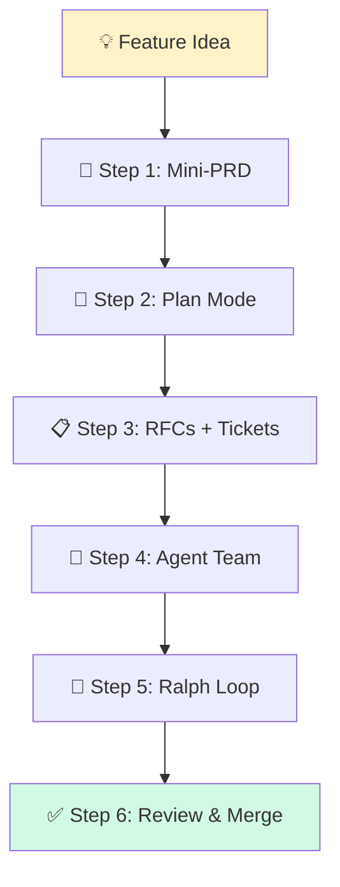

# ✨ Building New Features — From Zero to Shipped

> **Time to read:** ~5 min | **Skill level:** Advanced | **Platform:** iOS & Android

You got a new feature request. The backlog item says "Add Tags/Labels to tasks." Now what? This guide takes you from **vague idea → shipped code** using the full AI-powered pipeline.

---

## 🎯 When to Use This

- Greenfield feature implementation
- Sprint planning — turning stories into code
- Any work that needs **new files, new modules, new tests**
- When you want AI to handle 80% of the scaffolding

---

## 📋 Prerequisites

- ✅ `CLAUDE.md` configured with project architecture ([Part 1](../Part%201%20—%20Foundations/01-why-ai-fails.md))
- ✅ Skills for UI components and tests ([Part 2](../Part%202%20—%20Power%20Tools/05-skills.md))
- ✅ Agent teams understood ([Part 3](../Part%203%20—%20Agentic%20Patterns/09-agent-teams.md))
- ✅ Ralph Loop basics ([Part 4](../Part%204%20—%20Workflow%20Methodologies/))

---

## 🔄 Step-by-Step Workflow



### Step 1: Write a Mini-PRD 📝

Don't jump into code. Spend 5 minutes telling AI what you want.

```
I need to add a "Tags/Labels" feature to TaskPulse. Brain dump:

- Users can create colored tags (e.g., "Urgent", "Backend", "Design")
- Tags are assigned to tasks (many-to-many)
- Filter task list by tag
- Tags sync across collaborators
- Max 20 tags per workspace

Turn this into a structured mini-PRD with: Goal, User Stories,
Acceptance Criteria, Technical Constraints, and Out of Scope.
```

### Step 2: Plan Mode Architecture 🧠

Hit **Shift+Tab** to enter plan mode. No code — just thinking.

```
Given this PRD for Tags/Labels, plan the architecture:

iOS: SwiftUI + MVVM + SPM modules
Android: Compose + MVVM + Hilt + Gradle modules

For each platform, specify:
1. New files needed (models, ViewModels, views, repositories)
2. Modified files (existing task models, API layer)
3. Database schema changes
4. API endpoints required
5. Module dependency graph changes
```

### Step 3: Break Into RFCs and Tickets 📋

```
Break the Tags feature architecture into 3-4 RFCs:
1. Data layer (models, DB, API)
2. Business logic (repository, ViewModel)
3. UI (tag picker, tag chips, filter bar)
4. Tests

For each RFC, generate GitHub-issue-style tickets with:
- Title, description, acceptance criteria, estimated complexity (S/M/L)
```

### Step 4: Compose Your Agent Team 🤖

Spin up focused agents for parallel work:

```
Launch 3 subagents for the Tags feature:

Agent 1 — "Data Layer": Create Tag model, TagRepository,
  API endpoints, DB migration. Files: Sources/Models/Tag.swift,
  core/model/Tag.kt, etc.

Agent 2 — "UI Components": Create TagChipView, TagPickerSheet,
  TagFilterBar. Follow existing component skills.

Agent 3 — "Test Suite": Write unit tests for TagRepository,
  TagViewModel. Write UI tests for TagPickerSheet.

All agents reference the RFC from Step 3.
```

### Step 5: Ralph Loop for Implementation 🔄

Let the agents run autonomously with self-correction:

```
Implement RFC-1 (Tags Data Layer) using Ralph Loop:

1. Create the files from the RFC
2. Run `swift build` / `./gradlew build` after each file
3. If build fails, read the error, fix it, rebuild
4. Run `swift test` / `./gradlew test` after all files created
5. If tests fail, fix and re-run
6. Continue until green build + green tests

Stop and ask me if: API contract questions, schema design decisions,
or if you hit 3 consecutive failures on the same issue.
```

### Step 6: Review and Merge ✅

```
Review the Tags feature implementation:

1. Check all new files follow CLAUDE.md conventions
2. Verify test coverage > 80% for new code
3. Ensure no hardcoded strings (all localized)
4. Confirm accessibility labels on all interactive elements
5. Generate a PR description summarizing changes
```

---

## 📱 Mobile-Specific Tips

### 🍎 iOS Feature Module Structure
```
Sources/
  Features/
    Tags/
      Models/
        Tag.swift
        TagColor.swift
      ViewModels/
        TagListViewModel.swift
        TagPickerViewModel.swift
      Views/
        TagChipView.swift
        TagPickerSheet.swift
        TagFilterBar.swift
      Repository/
        TagRepository.swift
Tests/
  TagsTests/
    TagListViewModelTests.swift
    TagRepositoryTests.swift
```

### 🤖 Android Feature Module Structure
```
feature/tags/
  src/main/kotlin/
    model/Tag.kt
    ui/
      TagChipComponent.kt
      TagPickerSheet.kt
      TagFilterBar.kt
    viewmodel/TagViewModel.kt
    repository/TagRepository.kt
  src/test/kotlin/
    TagViewModelTest.kt
    TagRepositoryTest.kt
```

### 🎨 Design System Integration

Always remind AI to use your design tokens:

```
When creating Tag UI components:
- iOS: Use TaskPulseTheme.Colors for tag colors, .tpCaption font
- Android: Use MaterialTheme.colorScheme, TaskPulseTheme tokens
- Never hardcode hex colors or dp values
```

---

## ⚡ Smart Prompts (copy-paste ready)

### Module Scaffolding
```
Scaffold a new feature module called [FEATURE_NAME] in TaskPulse.

Create the full directory structure following our conventions:
- iOS: Sources/Features/[FEATURE_NAME]/ with Models, ViewModels, Views, Repository
- Android: feature/[FEATURE_NAME]/ with model, ui, viewmodel, repository packages

Include empty files with correct imports and class/struct stubs.
```

### API Integration
```
Add API endpoints for [FEATURE_NAME]:

iOS: Add to Sources/Networking/Endpoints/ following TaskEndpoint pattern
Android: Add to core/network/api/ following existing Retrofit interfaces

Endpoints needed: [LIST_ENDPOINTS]
Include request/response models with Codable/Serializable.
```

### Test Generation
```
Generate comprehensive tests for [CLASS_NAME]:

iOS: XCTest in Tests/[Module]Tests/ with Given/When/Then pattern
Android: JUnit + Turbine in feature/[name]/src/test/

Cover: success path, error handling, edge cases, empty states.
Use existing mocks from TaskPulseMocks / MockK.
```

---

## ⚠️ Common Pitfalls

| Pitfall | Fix |
|---------|-----|
| 🚫 Jumping straight to code | Always start with PRD + Plan Mode |
| 🚫 One giant prompt for everything | Break into RFC → Tickets → Agents |
| 🚫 No build verification | Ralph Loop: build after every step |
| 🚫 Forgetting existing patterns | Reference existing features in prompts |
| 🚫 Skipping tests | Agent 3 exists specifically for tests |
| 🚫 Hardcoded UI values | Always mention design system in prompts |

---

## ✅ Checklist

Before calling the feature "done":

- [ ] Mini-PRD written and reviewed
- [ ] Architecture planned in plan mode
- [ ] RFCs created and broken into tickets
- [ ] Agent team composed (UI, Data, Tests)
- [ ] Ralph Loop ran to green build + green tests
- [ ] Code review completed
- [ ] PR description generated
- [ ] Feature tested on device (not just simulator)
- [ ] Accessibility verified
- [ ] Strings localized

---

## 🧪 Try It Now

### Exercise: Build "Task Labels" End-to-End

1. **Write the mini-PRD** — Paste the brain dump prompt above. Review AI's structured output. Does it capture all requirements?

2. **Plan Mode architecture** — Enter plan mode (Shift+Tab) and design the Tags module. Compare iOS vs Android structures.

3. **Generate tickets** — Ask AI to break the plan into 6-8 tickets. Would you actually assign these in a sprint?

4. **Scaffold one module** — Use the scaffolding prompt to create the Tags directory structure. Verify it matches your project conventions.

5. **Ralph Loop one ticket** — Pick the simplest ticket (e.g., Tag model). Let AI implement it with build verification. Count how many iterations it takes to get green.

---

← Previous: [20-previous-topic.md](20-previous-topic.md) | [🗺️ Course Map](../00-course-map.md) | Next →: [22-update-feature.md](22-update-feature.md)
