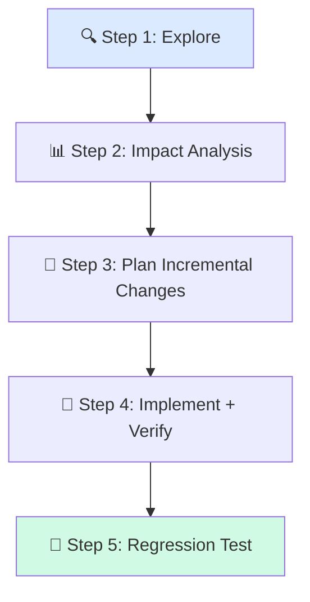

# 🔄 Updating Existing Features

> **Time to read:** ~5 min | **Skill level:** Intermediate | **Platform:** iOS & Android

Adding a "due date" to your existing Task model sounds simple. Then you realize it touches **the model, the API, the database, 4 ViewModels, 6 views, and 12 tests.** Here's how to update features without breaking everything.

---

## 🎯 When to Use This

- Adding a field to an existing model
- Extending an existing screen with new functionality
- Changing behavior of a shipped feature
- **Any change where existing code must be modified, not created from scratch**

---

## 📋 Prerequisites

- ✅ Working `CLAUDE.md` with project architecture
- ✅ Subagent basics ([Part 3](../Part%203%20—%20Agentic%20Patterns/09-agent-teams.md))
- ✅ Existing feature to update (we'll use TaskPulse's Task model)

---

## 🔄 Step-by-Step Workflow



### Step 1: Explore Existing Code 🔍

**Rule #1: Understand before you change.**

Don't tell AI "add a due date field." First, have it explore:

```
Before making any changes, explore the existing Task feature:

1. Read the Task model (iOS: Sources/Models/Task.swift,
   Android: core/model/Task.kt)
2. Find all files that import/reference the Task model
3. List all ViewModels that use Task
4. Find all views that display Task properties
5. Identify all tests that create Task instances

Output: a dependency map showing what touches Task.
```

AI will produce something like:

```
Task Model Dependency Map:
├── Models: Task.swift / Task.kt
├── DTOs: TaskDTO.swift / TaskDto.kt
├── API: TaskEndpoint / TaskApi
├── Repository: TaskRepository (iOS + Android)
├── ViewModels: TaskListVM, TaskDetailVM, TaskCreateVM, TaskEditVM
├── Views: TaskRow, TaskDetailView, TaskCreateSheet, TaskEditSheet
├── Tests: TaskListVMTests, TaskDetailVMTests, TaskRepoTests (×12 files)
└── Database: TaskEntity (Core Data / Room)
```

### Step 2: Impact Analysis 📊

Now ask for the blast radius:

```
Given the Task dependency map above, analyze the impact of
adding an optional `dueDate: Date?` field:

For each affected file, classify the change as:
- 🟢 Trivial (add field, no logic change)
- 🟡 Moderate (new UI element, conditional logic)
- 🔴 Complex (behavior change, migration needed)

Also identify: breaking API changes, database migrations,
and any backward compatibility concerns.
```

### Step 3: Plan Incremental Changes 📝

**Never rewrite. Always extend.**

```
Plan incremental implementation of the dueDate field.
Order changes so the app compiles and tests pass after EACH step:

Step A: Add field to model + DTO (app compiles, tests pass with nil)
Step B: Add database migration (data layer complete)
Step C: Update repository layer
Step D: Update ViewModels to expose dueDate
Step E: Add UI components (date picker, display)
Step F: Update existing tests + add new tests

Each step must be independently buildable and testable.
```

### Step 4: Implement with Verification 🔨

Execute each step with build checks:

```
Implement Step A — Add dueDate to Task model:

iOS:
- Add `var dueDate: Date?` to Task.swift
- Add `dueDate` to TaskDTO.swift with CodingKeys
- Update Task.preview and Task.empty factories

Android:
- Add `val dueDate: Instant?` to Task.kt
- Add `dueDate` to TaskDto.kt with @Serializable
- Update preview/test factories

After changes: run build, run existing tests.
Everything must still pass — dueDate is optional so existing
code should be unaffected.
```

### Step 5: Regression Testing 🧪

After all steps complete:

```
Run full regression for the Task feature update:

1. Run ALL Task-related tests (not just new ones)
2. Check: no existing tests broken by the dueDate addition
3. Verify: nil dueDate renders correctly (no "Optional(...)" in UI)
4. Verify: date formatting follows locale settings
5. Check: API backward compatibility (old server responses without
   dueDate field should still parse)
6. Run UI tests for task list and task detail screens
```

---

## 📱 Mobile-Specific Tips

### 🍎 iOS: Updating Models Safely

```swift
// ✅ Add optional field — backward compatible
struct Task: Codable, Identifiable {
    let id: String
    var title: String
    var isCompleted: Bool
    var dueDate: Date?  // 👈 New field, optional = safe

    // Update CodingKeys if using custom keys
    enum CodingKeys: String, CodingKey {
        case id, title, isCompleted
        case dueDate = "due_date"  // 👈 Match API snake_case
    }
}
```

### 🤖 Android: Updating Models Safely

```kotlin
// ✅ Default value = backward compatible
@Serializable
data class TaskDto(
    val id: String,
    val title: String,
    val isCompleted: Boolean,
    val dueDate: Instant? = null  // 👈 Default null = safe
)
```

### 🗄️ Database Migrations

**iOS (Core Data):**
```
Add a lightweight migration for the dueDate field:
- Add optional Date attribute to TaskEntity
- Core Data handles lightweight migration automatically for new optional fields
- No custom mapping model needed
```

**Android (Room):**
```kotlin
// Room migration
val MIGRATION_2_3 = object : Migration(2, 3) {
    override fun migrate(db: SupportSQLiteDatabase) {
        db.execSQL("ALTER TABLE tasks ADD COLUMN due_date INTEGER")
    }
}
```

### 🔌 API Contract Changes

```
When adding dueDate to the API contract:

1. The field MUST be optional in responses (old tasks won't have it)
2. Use ISO 8601 format: "2025-03-15T10:00:00Z"
3. Update API documentation / OpenAPI spec
4. Test with: response WITH dueDate, response WITHOUT dueDate,
   response with dueDate = null
```

---

## ⚡ Smart Prompts (copy-paste ready)

### Code Exploration
```
Map all dependencies of [CLASS_NAME] in this project.
Show: which files import it, which functions use it,
which tests create instances of it. Output as a tree.
```

### Impact Analysis
```
I want to add [CHANGE_DESCRIPTION] to [CLASS_NAME].
Analyze the impact: list every file that needs modification,
classify each as trivial/moderate/complex, and flag any
breaking changes or required migrations.
```

### Incremental Implementation
```
Implement [CHANGE] in [N] incremental steps.
After each step, the project must compile and all existing tests must pass.
Order: data model → API/DB → repository → ViewModel → UI → tests.
Run build verification after each step.
```

### Regression Testing
```
Run regression tests for the [FEATURE] module after adding [CHANGE].
Verify: no existing tests broken, new edge cases covered,
backward compatibility maintained, null/empty states handled.
```

---

## ⚠️ Common Pitfalls

| Pitfall | Fix |
|---------|-----|
| 🚫 Changing model without exploring dependencies | Always run dependency map first |
| 🚫 Making breaking API changes | New fields must be optional |
| 🚫 Forgetting database migration | Room/Core Data need migration for schema changes |
| 🚫 Updating all files in one big diff | Incremental steps — compile after each one |
| 🚫 Only testing the happy path | Test: nil, empty, malformed, and existing data |
| 🚫 "Optional(...)" in UI text | Always unwrap optionals before display |

---

## ✅ Checklist

- [ ] Dependency map generated before any changes
- [ ] Impact analysis completed with severity ratings
- [ ] Incremental plan created (each step compiles)
- [ ] Model updated with backward-compatible optional field
- [ ] Database migration added (if needed)
- [ ] API contract updated (optional field)
- [ ] All existing tests still pass
- [ ] New tests added for the new field
- [ ] UI handles nil/empty state gracefully
- [ ] Date formatting uses locale-aware formatters

---

## 🧪 Try It Now

### Exercise: Add "Due Date" to TaskPulse

1. **Explore** — Ask AI to map all dependencies of your Task model. How many files reference it?

2. **Impact analysis** — Ask AI to classify the impact of adding `dueDate: Date?`. Were there any surprises?

3. **Incremental plan** — Generate a step-by-step plan. Verify each step is independently buildable.

4. **Implement Step A** — Add the field to just the model and DTO. Build. Do existing tests pass?

5. **Full implementation** — Complete all steps. Compare: how many files were actually modified vs. what impact analysis predicted?

---

← Previous: [21-new-feature.md](21-new-feature.md) | [🗺️ Course Map](../00-course-map.md) | Next →: [23-feature-flags.md](23-feature-flags.md)
