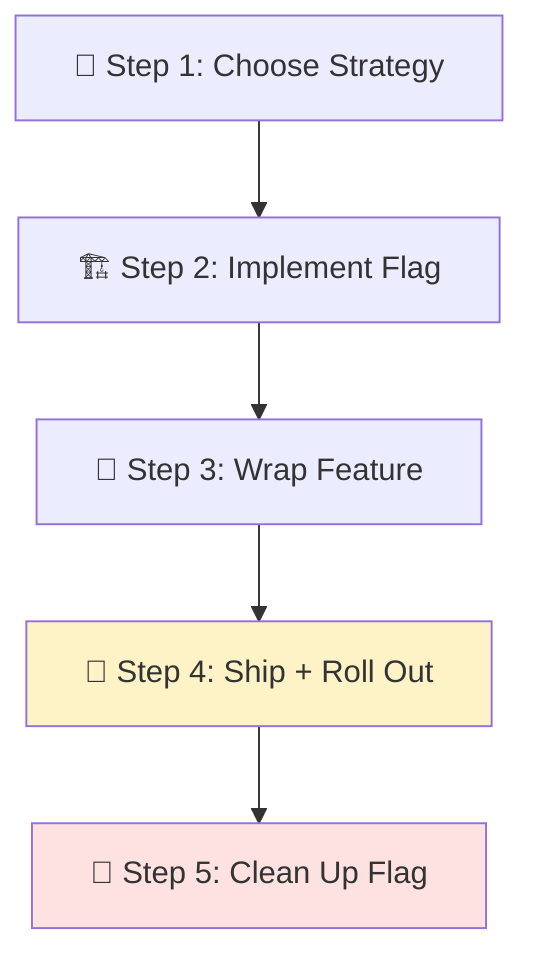
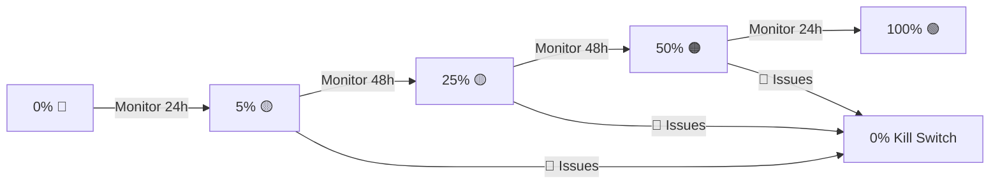

# 🚩 Feature Flags — Ship Safely

> **Time to read:** ~5 min | **Skill level:** Intermediate | **Platform:** iOS & Android

You finished "Dark Mode." It works on your device. But rolling it out to 500K users at once? That's a speedrun to 1-star reviews. **Feature flags let you ship code without shipping risk.**

---

## 🎯 When to Use This

- Gradual rollout (1% → 10% → 50% → 100%)
- A/B testing a new UI
- Kill switch for risky features
- Dark launches (code deployed but hidden)
- Platform-specific rollouts (iOS first, then Android)

---

## 📋 Prerequisites

- ✅ Feature implementation complete (behind flag)
- ✅ Firebase project or LaunchDarkly account (for remote flags)
- ✅ Understanding of your release pipeline

---

## 🔄 Step-by-Step Workflow



### Step 1: Choose Your Flag Strategy 🤔

| Strategy | When | Tool |
|----------|------|------|
| **Local flag** | Dev/debug only | `UserDefaults` / `SharedPreferences` |
| **Remote config** | Gradual rollout | Firebase Remote Config |
| **Full platform** | A/B testing, targeting | LaunchDarkly / Statsig |
| **Build flag** | Compile-time exclusion | Compiler directives |

```
Help me choose a feature flag strategy for [FEATURE_NAME]:

- Is this a gradual rollout or a dev toggle?
- Do I need percentage-based targeting?
- Do I need user-segment targeting (country, plan, etc.)?
- How quickly do I need to kill it remotely?

Recommend: local flag, remote config, or full platform.
```

### Step 2: Implement the Flag Check 🏗️

**iOS — Firebase Remote Config:**

```swift
// Sources/FeatureFlags/FeatureFlag.swift
enum FeatureFlag: String {
    case darkMode = "dark_mode_enabled"
    case taskLabels = "task_labels_enabled"
    case realTimeCollab = "realtime_collab_enabled"
}

// Sources/FeatureFlags/FeatureFlagService.swift
@MainActor
@Observable
final class FeatureFlagService {
    static let shared = FeatureFlagService()
    private let remoteConfig = RemoteConfig.remoteConfig()

    func isEnabled(_ flag: FeatureFlag) -> Bool {
        remoteConfig.configValue(forKey: flag.rawValue).boolValue
    }

    func fetchFlags() async {
        try? await remoteConfig.fetchAndActivate()
    }
}
```

**Android — Firebase Remote Config:**

```kotlin
// core/featureflags/FeatureFlag.kt
enum class FeatureFlag(val key: String) {
    DARK_MODE("dark_mode_enabled"),
    TASK_LABELS("task_labels_enabled"),
    REALTIME_COLLAB("realtime_collab_enabled")
}

// core/featureflags/FeatureFlagService.kt
@Singleton
class FeatureFlagService @Inject constructor(
    private val remoteConfig: FirebaseRemoteConfig
) {
    fun isEnabled(flag: FeatureFlag): Boolean =
        remoteConfig.getBoolean(flag.key)

    suspend fun fetchFlags() {
        remoteConfig.fetchAndActivate().await()
    }
}
```

### Step 3: Wrap Feature Behind Flag 🎁

**iOS:**
```swift
struct TaskDetailView: View {
    @State private var flags = FeatureFlagService.shared

    var body: some View {
        VStack {
            TaskInfoSection(task: task)

            if flags.isEnabled(.darkMode) {
                // 🚩 Flagged feature
                ThemeToggleRow()
            }

            TaskActionsSection(task: task)
        }
    }
}
```

**Android:**
```kotlin
@Composable
fun TaskDetailScreen(
    viewModel: TaskDetailViewModel = hiltViewModel()
) {
    val isDarkModeEnabled by viewModel.isDarkModeEnabled
        .collectAsStateWithLifecycle()

    Column {
        TaskInfoSection(task = uiState.task)

        if (isDarkModeEnabled) {
            // 🚩 Flagged feature
            ThemeToggleRow()
        }

        TaskActionsSection(task = uiState.task)
    }
}
```

### Step 4: Ship and Roll Out 🚀



### Step 5: Clean Up the Flag 🧹

**This is the step everyone skips. Don't.**

```
The dark_mode_enabled flag is now at 100% for 2 weeks with no issues.
Clean up the feature flag:

1. Find all references to FeatureFlag.darkMode / DARK_MODE
2. Remove the conditional checks — keep only the "enabled" code path
3. Remove the flag from the FeatureFlag enum
4. Remove the flag from Firebase Remote Config defaults
5. Update tests that mocked the flag
6. Run full build and test suite

List all files modified during cleanup.
```

---

## 📱 Mobile-Specific Tips

### 🔧 Local Debug Flags

For dev-only toggles, skip Firebase overhead:

**iOS:**
```swift
// Debug menu flag — UserDefaults backed
extension FeatureFlagService {
    #if DEBUG
    func overrideFlag(_ flag: FeatureFlag, value: Bool) {
        UserDefaults.standard.set(value, forKey: "debug_\(flag.rawValue)")
    }

    func isOverridden(_ flag: FeatureFlag) -> Bool {
        UserDefaults.standard.object(forKey: "debug_\(flag.rawValue)") != nil
    }
    #endif
}
```

**Android:**
```kotlin
// Debug only — SharedPreferences backed
class DebugFlagOverrides @Inject constructor(
    @ApplicationContext private val context: Context
) {
    private val prefs = context.getSharedPreferences("debug_flags", MODE_PRIVATE)

    fun override(flag: FeatureFlag, value: Boolean) {
        prefs.edit { putBoolean(flag.key, value) }
    }
}
```

### 📊 A/B Testing Pattern

```
Set up A/B test for [FEATURE_NAME]:

- Variant A: Current behavior (control)
- Variant B: New behavior (treatment)
- Split: 50/50
- Tracking: Log variant assignment with analytics event
- Success metric: [METRIC_NAME]
- Duration: 2 weeks minimum

Include analytics logging for both assignment and outcome events.
```

---

## ⚡ Smart Prompts (copy-paste ready)

### Flag Implementation
```
Add a feature flag called [FLAG_NAME] for [FEATURE_DESCRIPTION]:
- iOS: Add to FeatureFlag enum, implement check in [VIEW_NAME]
- Android: Add to FeatureFlag enum, implement check in [SCREEN_NAME]
- Include: default value (false), Firebase Remote Config key,
  debug override support
```

### Conditional UI
```
Wrap [UI_COMPONENT] behind the [FLAG_NAME] feature flag.
Show [ALTERNATIVE] when flag is disabled.
Ensure the layout doesn't shift/jump when toggling.
```

### Flag Cleanup
```
Feature flag [FLAG_NAME] is at 100% rollout. Remove it:
1. Find all references across iOS and Android codebases
2. Remove conditionals, keep enabled-path code only
3. Remove from FeatureFlag enums
4. Update affected tests
5. Build and run tests
```

---

## ⚠️ Common Pitfalls

| Pitfall | Fix |
|---------|-----|
| 🚫 Nesting flags inside flags | Keep flag checks at the top level only |
| 🚫 Flag in business logic | Flags belong in UI/ViewModel layer, not repositories |
| 🚫 Never cleaning up old flags | Set a calendar reminder for 2 weeks after 100% rollout |
| 🚫 No default value | Always define defaults — network failures happen |
| 🚫 Testing only "enabled" path | Test BOTH paths: enabled and disabled |
| 🚫 Forgetting analytics | Log flag evaluation for rollout monitoring |

---

## ✅ Checklist

- [ ] Flag strategy chosen (local / remote / platform)
- [ ] FeatureFlag enum updated on both platforms
- [ ] Flag check implemented in correct layer (UI/ViewModel)
- [ ] Default value set (false for new features)
- [ ] Debug override available for testing
- [ ] Both enabled/disabled paths tested
- [ ] Rollout plan documented (percentages + monitoring)
- [ ] Cleanup ticket created with target date
- [ ] Analytics event logged for flag evaluation

---

## 🧪 Try It Now

### Exercise: Feature-Flag "Dark Mode"

1. **Create the flag** — Add `darkMode` to your FeatureFlag enum on both platforms. Set default to `false`.

2. **Wrap the UI** — Add a conditional check in your Settings screen. When enabled, show a theme toggle. When disabled, show nothing.

3. **Debug override** — Implement a debug-menu toggle that forces the flag on/off regardless of remote config.

4. **Test both paths** — Write a test that verifies the Settings screen renders correctly with dark mode flag ON and OFF.

5. **Write the cleanup prompt** — Draft the prompt you'd use to remove the flag after 100% rollout. How many files would it touch?

---

← Previous: [22-update-feature.md](22-update-feature.md) | [🗺️ Course Map](../00-course-map.md) | Next →: [24-update-docs.md](24-update-docs.md)
