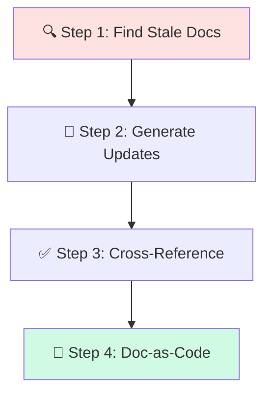
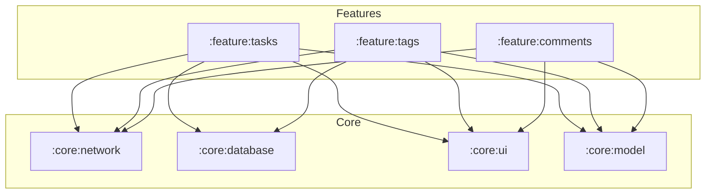

# 📖 Documentation Maintenance

> **Time to read:** ~5 min | **Skill level:** Beginner | **Platform:** iOS & Android

Your architecture doc says "we use Combine for networking." You migrated to async/await six months ago. Sound familiar? **Stale docs are worse than no docs.** Let AI keep them current.

---

## 🎯 When to Use This

- After shipping a feature (update architecture docs)
- After refactoring (update module docs)
- Onboarding new team members (verify guides are current)
- Sprint retrospective (changelog + what changed)

---

## 📋 Prerequisites

- ✅ Existing documentation (even if outdated)
- ✅ Access to the codebase (AI needs to cross-reference)
- ✅ `GEMINI.md` configured

---

## 🔄 Step-by-Step Workflow



### Step 1: Identify Outdated Docs 🔍

Let AI scan your docs against your actual code:

```
Scan our documentation for accuracy:

1. Read docs/ARCHITECTURE.md
2. Compare against actual codebase structure
3. Flag any discrepancies:
   - Mentioned files/modules that no longer exist
   - Missing new modules not documented
   - Incorrect technology references (e.g., doc says Combine, code uses async/await)
   - Outdated dependency versions
   - Wrong file paths

Output: a table of discrepancies with location and severity.
```

**Example output:**

| Doc Section | Says | Reality | Severity |
|-------------|------|---------|----------|
| Networking | "Uses Combine publishers" | Migrated to async/await | 🔴 High |
| Modules | Lists 8 modules | Now 11 modules | 🟡 Medium |
| Dependencies | "Alamofire 5.6" | Now uses URLSession | 🔴 High |
| File paths | `Sources/Network/` | Renamed to `Sources/Networking/` | 🟡 Medium |

### Step 2: Generate Updated Docs 📝

```
Update docs/ARCHITECTURE.md based on the discrepancies found.

Rules:
- Keep the existing structure and formatting
- Only change what's actually wrong
- Add new sections for new modules
- Remove references to deleted code
- Update all file paths to current reality
- Use present tense ("uses", not "will use")
- Include date of last update at the top
```

### Step 3: Verify with Cross-Reference ✅

```
Cross-reference the updated ARCHITECTURE.md:

For every file path mentioned in the doc:
- Verify the file actually exists
- Verify the described purpose matches the file's actual content

For every technology/pattern mentioned:
- Verify it's actually used in the codebase
- Find at least one concrete example

Output: ✅ for verified, ❌ for still incorrect.
```

### Step 4: Keep Docs Close to Code 📂

**Doc-as-code** means docs live in the repo and evolve with code:

```
Our documentation structure:

docs/
  ARCHITECTURE.md      — High-level system design
  MODULES.md           — Module descriptions and dependencies
  ONBOARDING.md        — New developer setup guide
  API.md               — API contracts and endpoints
  CHANGELOG.md         — Version history

Each feature module:
  feature/tags/README.md — Module-specific docs

Rules:
- Docs are PR-reviewed just like code
- If you change code, update the matching doc
- Changelog updated with every release
```

---

## 📱 Mobile-Specific Tips

### 🍎 iOS Documentation Patterns

```
Generate/update documentation for the iOS TaskPulse project:

1. Module map — SPM packages and their dependencies
2. Architecture — MVVM-C pattern, data flow diagram
3. Build — Xcode schemes, configurations, signing
4. Testing — How to run unit/UI/snapshot tests
5. Design system — Color tokens, typography, spacing
```

### 🤖 Android Documentation Patterns

```
Generate/update documentation for the Android TaskPulse project:

1. Module map — Gradle modules and their dependencies
2. Architecture — MVVM + Clean Architecture layers
3. Build — Build variants, flavors, signing configs
4. Testing — How to run unit/instrumented/screenshot tests
5. DI graph — Hilt modules and component hierarchy
```

### 📊 Mermaid Architecture Diagram

Ask AI to generate an updated diagram:

```
Generate a Mermaid diagram showing the current module dependency graph.

Read the actual build files:
- iOS: Package.swift dependencies
- Android: build.gradle.kts dependencies

Output a flowchart showing module → dependency relationships.
Mark shared modules differently from feature modules.
```

Example output:



### 📋 Changelog Generation

```
Generate a CHANGELOG entry for version [VERSION]:

1. Read all commits since the last tag/release
2. Group by: Features, Bug Fixes, Improvements, Breaking Changes
3. Format as Keep a Changelog style
4. Include PR numbers where available
5. Highlight anything that affects API contracts or data migration
```

---

## ⚡ Smart Prompts (copy-paste ready)

### Doc Freshness Scan
```
Audit [DOC_FILE] for accuracy against the current codebase.
Flag: wrong file paths, outdated tech references, missing modules,
incorrect descriptions. Output as a discrepancy table.
```

### Architecture Doc Update
```
Update [DOC_FILE] to reflect the current codebase state.
Keep existing structure. Only change what's actually outdated.
Add a "Last updated: [DATE]" header. Verify all file paths exist.
```

### Module README
```
Generate a README.md for the [MODULE_NAME] module:
- Purpose (1-2 sentences)
- Key classes/files with brief descriptions
- Dependencies (what this module imports)
- Usage examples (how other modules use this)
- Testing: how to run this module's tests
```

### Onboarding Guide Refresh
```
Update ONBOARDING.md for a new developer joining today:
1. Verify all setup steps still work
2. Update tool versions (Xcode, Android Studio, etc.)
3. Verify all linked resources are still accessible
4. Add any new required environment variables or configs
5. Test the "first build" instructions
```

---

## ⚠️ Common Pitfalls

| Pitfall | Fix |
|---------|-----|
| 🚫 Docs drift silently for months | Add doc-check to PR template |
| 🚫 AI hallucinating file paths | Always cross-reference with actual codebase |
| 🚫 Overly detailed docs | Keep high-level; code is the detail source |
| 🚫 Docs in external wiki (Confluence) | Keep docs in repo — they travel with the code |
| 🚫 No one owns documentation | Assign doc-update as part of feature work |
| 🚫 Generating docs without review | AI docs still need human review for accuracy |

---

## ✅ Checklist

- [ ] Doc freshness audit completed
- [ ] All file paths verified against codebase
- [ ] Technology references updated
- [ ] New modules documented
- [ ] Deleted modules removed from docs
- [ ] Architecture diagram updated (Mermaid)
- [ ] Changelog entry written
- [ ] Cross-reference verification passed
- [ ] "Last updated" date added

---

## 🧪 Try It Now

### Exercise: Update TaskPulse Architecture Docs After Adding Comments Module

1. **Audit** — Point AI at your architecture doc. Ask it to find 3 things that are outdated or missing.

2. **Generate module diagram** — Ask AI to produce a Mermaid diagram from your actual build files. Does it match reality?

3. **Write a module README** — Pick one feature module. Generate its README. Is it accurate enough for a new team member?

4. **Changelog** — Ask AI to generate a changelog entry from the last 5 commits. Is the categorization correct?

5. **Onboarding test** — Have a teammate follow your ONBOARDING.md. Note every step that's wrong or unclear. Use AI to fix them.

---

← Previous: [23-feature-flags.md](23-feature-flags.md) | [🗺️ Course Map](../00-course-map.md) | Next →: [25-create-prd.md](25-create-prd.md)
