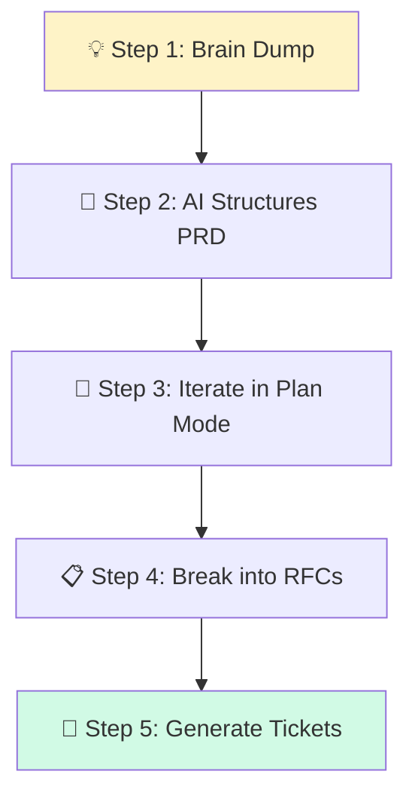

# 📝 Writing PRDs with AI

> **Time to read:** ~5 min | **Skill level:** Beginner | **Platform:** iOS & Android

You have a great idea. It's in your head, some Slack messages, and a napkin sketch. Stakeholders need a proper PRD by Thursday. **Let AI be your technical writer.**

---

## 🎯 When to Use This

- Starting a new initiative or epic
- Formalizing a vague idea into structured requirements
- Stakeholder alignment — getting everyone on the same page
- Creating the input document for engineering planning

---

## 📋 Prerequisites

- ✅ A feature idea (even a rough one)
- ✅ Knowledge of your user personas
- ✅ Plan mode available (Shift+Tab)

---

## 🔄 Step-by-Step Workflow



### Step 1: Brain Dump Your Idea 💡

Just talk. Don't structure. Let AI do the organizing.

```
I want to add real-time collaboration to TaskPulse. Here's my brain dump:

- Multiple users editing the same task simultaneously
- See who's currently viewing/editing a task (presence indicators)
- Changes sync instantly — no refresh needed
- Conflict resolution when 2 people edit the same field
- Works on both iOS and Android
- Should work on flaky connections (queue changes offline)
- We have ~50K DAU, usually 2-5 people per workspace
- Budget for infrastructure: moderate (no unlimited WebSocket servers)
- Timeline: Q3 launch

Turn this into a structured PRD. Ask me clarifying questions first
if anything is ambiguous.
```

AI will ask things like:
- *"Should presence show in task list or only task detail?"*
- *"For conflicts, do you prefer last-write-wins or manual merge?"*
- *"What's the maximum acceptable latency for sync?"*

**This is gold.** AI catches gaps you didn't think about.

### Step 2: AI Structures the PRD 📝

After clarifying questions, AI produces:

```markdown
# PRD: Real-time Collaboration for TaskPulse

## Overview
Enable multiple users to simultaneously view and edit tasks
with instant sync and presence awareness.

## Goals
- Reduce "stale data" support tickets by 80%
- Increase daily collaboration actions by 40%
- Match user expectations set by Google Docs / Figma

## User Stories
- As a team lead, I want to see who is viewing a task...
- As an editor, I want my changes to appear instantly...
- As a mobile user, I want offline edits to sync when reconnected...

## Acceptance Criteria
...

## Technical Constraints
...

## Out of Scope
...
```

### Step 3: Iterate in Plan Mode 🔄

Hit **Shift+Tab** for plan mode. Refine without generating code:

```
Review this PRD in plan mode:

1. Are there any missing user stories?
2. Are the acceptance criteria testable and specific?
3. Are technical constraints realistic for our stack?
4. What are the top 3 risks?
5. Suggest: what should we cut for an MVP vs V2?

Don't generate code. Just analyze and suggest improvements.
```

### Step 4: Break into RFCs 📋

```
Break this PRD into 3-5 RFCs (Request for Comments):

RFC-1: WebSocket Infrastructure (connection, reconnection, auth)
RFC-2: Real-time Sync Engine (CRDT or OT, conflict resolution)
RFC-3: Presence System (who's here, cursor positions)
RFC-4: Offline Queue (store-and-forward, reconciliation)
RFC-5: UI Integration (indicators, animations, error states)

For each RFC:
- Summary (2-3 sentences)
- Key technical decisions to make
- Dependencies on other RFCs
- Estimated complexity (S/M/L/XL)
- Open questions
```

### Step 5: Generate Tickets 🎫

```
Generate GitHub issues from RFC-1 (WebSocket Infrastructure):

For each ticket:
- Title (concise, actionable)
- Description (what, why, acceptance criteria)
- Labels (platform: ios/android/backend, size: S/M/L)
- Dependencies (blocked by / blocks)

Output in a format I can paste into GitHub Issues.
Group as: Must-have (MVP), Should-have, Nice-to-have.
```

---

## 📱 Mobile-Specific Tips

### 📱 Platform Considerations Checklist

Always include these in mobile PRDs:

```
Add a "Platform Considerations" section to the PRD:

iOS:
- Minimum iOS version supported
- Background execution limitations
- Push notification requirements
- App Store review implications

Android:
- Minimum API level
- Background service restrictions (Doze, App Standby)
- Battery optimization impact
- Play Store policy compliance

Cross-platform:
- Feature parity requirements (same-day launch?)
- Shared vs platform-specific UI
- API contract shared between platforms
- Offline behavior consistency
```

### 🔌 Connectivity Requirements

```
For this feature, define connectivity behavior:

| State | Behavior |
|-------|----------|
| Strong connection | Real-time sync via WebSocket |
| Weak connection | Debounced sync, show latency indicator |
| No connection | Queue changes locally, show offline badge |
| Reconnection | Replay queued changes, resolve conflicts |

Test scenarios:
- Airplane mode toggle mid-edit
- Server restart while user is active
- Two users editing same field simultaneously offline
```

### 📏 Performance Requirements

```
Add performance requirements to the PRD:

- Sync latency: <200ms on WiFi, <500ms on cellular
- Presence update frequency: every 5 seconds
- Maximum concurrent editors: 10 per task
- Offline queue size: up to 100 pending operations
- Battery impact: <5% additional drain per hour of active use
- Memory: WebSocket connection <2MB overhead
```

---

## ⚡ Smart Prompts (copy-paste ready)

### Brain Dump to PRD
```
Here's my feature idea (brain dump):
[PASTE_YOUR_NOTES]

Turn this into a structured PRD with: Overview, Goals, User Stories,
Acceptance Criteria, Technical Constraints, Out of Scope,
Platform Considerations, Open Questions.
Ask clarifying questions before writing.
```

### PRD Review
```
Review this PRD for completeness:
[PASTE_PRD]

Check: testable acceptance criteria, realistic constraints,
missing edge cases, platform-specific gaps, security considerations,
accessibility requirements. Score each section 1-5.
```

### PRD to RFCs
```
Break this PRD into RFCs:
[PASTE_PRD]

Each RFC: summary, key decisions, dependencies, complexity estimate,
open questions. Order by dependency (foundational first).
```

### RFC to Tickets
```
Generate tickets from this RFC:
[PASTE_RFC]

Format: Title, Description, Acceptance Criteria, Labels, Dependencies.
Group: Must-have / Should-have / Nice-to-have.
Estimate: S (1-2 days), M (3-5 days), L (1-2 weeks).
```

---

## 📋 Full PRD Template (AI-Optimized)

```markdown
# PRD: [Feature Name]
**Author:** [Name] | **Date:** [Date] | **Status:** Draft/Review/Approved

## 1. Overview
[2-3 sentences: what is this and why now?]

## 2. Goals & Success Metrics
| Goal | Metric | Target |
|------|--------|--------|
| [Goal 1] | [Metric] | [Number] |

## 3. User Stories
- As a [persona], I want [action] so that [benefit]

## 4. Acceptance Criteria
- [ ] [Specific, testable criterion]

## 5. Design
[Links to Figma/mockups]

## 6. Technical Approach
[High-level architecture, not implementation details]

## 7. Platform Considerations
### iOS
### Android
### Shared

## 8. Edge Cases & Error States
| Scenario | Expected Behavior |
|----------|------------------|

## 9. Out of Scope
- [Explicitly listed non-goals]

## 10. Open Questions
- [ ] [Unresolved question needing stakeholder input]

## 11. Timeline
| Phase | Duration | Deliverable |
|-------|----------|-------------|
```

---

## ⚠️ Common Pitfalls

| Pitfall | Fix |
|---------|-----|
| 🚫 PRD too vague ("make it fast") | Use specific, measurable acceptance criteria |
| 🚫 No out-of-scope section | Scope creep starts when boundaries aren't set |
| 🚫 Skipping platform considerations | iOS and Android have different constraints |
| 🚫 Writing implementation in PRD | PRD = what and why, RFC = how |
| 🚫 No open questions section | Unresolved items block engineering |
| 🚫 PRD written in isolation | AI helps, but stakeholders must review |

---

## ✅ Checklist

- [ ] Brain dump captured (even messy is fine)
- [ ] AI asked clarifying questions (and you answered them)
- [ ] PRD has all 11 sections from template
- [ ] Acceptance criteria are testable (yes/no answerable)
- [ ] Platform considerations filled in for iOS + Android
- [ ] Out of scope explicitly listed
- [ ] Open questions documented
- [ ] PRD reviewed by at least one stakeholder
- [ ] RFCs generated from PRD
- [ ] Tickets generated from RFCs

---

## 🧪 Try It Now

### Exercise: PRD for "Real-time Collaboration"

1. **Brain dump** — Write 5-10 bullet points about a feature you want to build. Don't structure it. Paste it to AI.

2. **Clarifying questions** — Did AI ask good questions? Did any surprise you? Answer them.

3. **Generate PRD** — Review the structured PRD. Is anything missing? Ask AI to add platform considerations.

4. **Cut for MVP** — Ask AI to split the PRD into MVP (4 weeks) and V2 (future). Does the MVP still deliver value?

5. **Generate tickets** — Pick one RFC and ask AI to create sprint-ready tickets. Would your team be able to start work from these?

---

← Previous: [24-update-docs.md](24-update-docs.md) | [🗺️ Course Map](../00-course-map.md) | Next →: [Appendix A — Cheat Sheet](../appendix/A-cheat-sheet.md)
