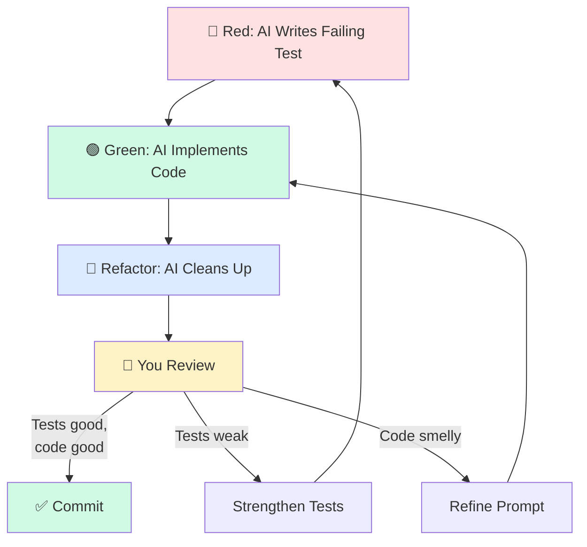

# 🧪 Testing AI-Generated Code

> **Time to read:** ~5 min | **Skill level:** Intermediate | **Platform:** iOS & Android

AI writes code fast. It also writes bugs fast. Tests are your only defense at scale. Without a disciplined testing strategy, AI-generated code becomes a liability — shipping faster just means shipping bugs faster.

> "The team that tests AI output ships 3x faster. The team that doesn't ships 3x more bugs."

---

## 🎯 The Test-First Approach

The single most important habit: **write the test prompt BEFORE the implementation prompt.** This flips the typical AI workflow and gives you a specification to code against.

```
# Step 1: Test prompt (FIRST)
Write XCTest unit tests for a TaskFilterViewModel that:
- Filters tasks by status (todo, inProgress, done)
- Filters tasks by assignee
- Combines multiple filters with AND logic
- Returns empty array when no tasks match
- Preserves sort order after filtering

Use Given/When/Then naming. Follow TaskPulse test conventions.

# Step 2: Implementation prompt (SECOND)
Implement TaskFilterViewModel to make all these tests pass.
Follow existing ViewModel patterns in Sources/Features/.
```

Why this works: AI is better at implementing when it has concrete test cases as a target. The tests define the contract; the implementation fulfills it.

---

## 🤖 AI Test Generation Patterns

### Pattern 1: Generate Tests for Existing Code

```
Read Sources/Features/Tasks/ViewModels/TaskListViewModel.swift
and generate comprehensive XCTest unit tests covering:
- All public methods
- Error handling paths
- Edge cases (empty list, single item, max items)
- State transitions (loading → loaded → error)

Use the mock patterns from Tests/Mocks/MockTaskRepository.swift.
```

### Pattern 2: Review AI-Written Tests

After AI generates tests, ask it to critique its own work:

```
Review the tests you just wrote. For each test, answer:
1. Could this test pass with a broken implementation? (tautological check)
2. What mutation would this test NOT catch?
3. Is this testing the code or the mock?
```

### Pattern 3: Gap Analysis

```
Compare TaskListViewModel.swift against TaskListViewModelTests.swift.
List every code path that has no test coverage.
For each gap, write the missing test.
```

---

## ✅ When to Trust AI Tests

Not all AI-generated tests are equal. Here is how to calibrate your trust:

| Test Category | Trust Level | Action |
|--------------|-------------|--------|
| Boilerplate assertions (init, defaults) | High | Accept with quick scan |
| Serialization / Codable / Parcelize | High | Accept — mechanical and verifiable |
| Happy path business logic | Medium | Verify assertions match requirements |
| Error handling paths | Medium | Check all error types are covered |
| Edge cases (boundary values, nil) | Low | Write or heavily review yourself |
| Concurrency / async timing | Low | Write yourself — AI often misses race conditions |
| UI interaction tests | Low | Review carefully — AI mocks too aggressively |

---

## ⚠️ Common AI Testing Mistakes

### 1. Tautological Tests (Always Pass)

```swift
// ❌ BAD: Tests the mock, not the code
func testFetchTasks() async {
    let mockTasks = [Task(title: "Test")]
    mockRepository.tasksToReturn = mockTasks
    await viewModel.fetchTasks()
    XCTAssertEqual(viewModel.tasks, mockTasks) // Just confirms mock returns what you set
}
```

```swift
// ✅ GOOD: Tests actual behavior
func testFetchTasks_sortsAlphabetically() async {
    mockRepository.tasksToReturn = [
        Task(title: "Zebra"),
        Task(title: "Apple"),
        Task(title: "Mango")
    ]
    await viewModel.fetchTasks()
    XCTAssertEqual(viewModel.tasks.map(\.title), ["Apple", "Mango", "Zebra"])
}
```

### 2. Missing Edge Cases

AI loves happy paths. It rarely tests:
- Empty inputs
- Maximum length strings
- Concurrent modifications
- Network timeout vs. network error
- First launch vs. returning user

### 3. Over-Mocking

```kotlin
// ❌ BAD: Everything is mocked — no integration value
@Test
fun `test task creation`() {
    val mockRepo = mockk<TaskRepository>()
    val mockValidator = mockk<TaskValidator>()
    val mockMapper = mockk<TaskMapper>()
    val mockLogger = mockk<AnalyticsLogger>()
    // You're testing that mockk works, not your code
}
```

```kotlin
// ✅ GOOD: Mock the boundary, test the logic
@Test
fun `test task creation validates and saves`() {
    val fakeRepo = FakeTaskRepository()
    val viewModel = TaskCreateViewModel(
        repository = fakeRepo,
        validator = TaskValidator(), // Real validator
        mapper = TaskMapper()        // Real mapper
    )
    viewModel.createTask(title = "New Task", priority = .high)
    assertEquals(1, fakeRepo.savedTasks.size)
    assertEquals("New Task", fakeRepo.savedTasks.first().title)
}
```

### 4. Testing the Mock, Not the Code

Ask AI: "In each test, what would break if I deleted the implementation? Would this test still pass?" If yes, the test is useless.

---

## 🔄 TDD with AI Workflow



### The Prompt Sequence

```
# 1. RED — Write failing tests
Write 5 XCTest cases for a new TaskCompletionViewModel that:
- Marks a task as complete
- Triggers a celebration animation on first completion
- Updates the completion streak counter
- Handles offline completion (queues for sync)
- Prevents double-completion

Do NOT write the implementation. Tests should fail.

# 2. GREEN — Implement to pass
Implement TaskCompletionViewModel to make all 5 tests pass.
Follow MVVM pattern from existing ViewModels.

# 3. REFACTOR — Clean up
Refactor TaskCompletionViewModel:
- Extract streak logic into a TaskStreakCalculator
- Ensure all tests still pass after refactoring
- Run swift test to verify
```

---

## 📱 Mobile Testing Specifics

### 🍎 iOS: SwiftUI Preview Tests

```swift
// Ask AI to generate preview test configurations
struct TaskRowView_Previews: PreviewProvider {
    static var previews: some View {
        Group {
            TaskRowView(task: .sample(status: .todo))
                .previewDisplayName("Todo State")

            TaskRowView(task: .sample(status: .done))
                .previewDisplayName("Completed State")

            TaskRowView(task: .sample(title: String(repeating: "Long ", count: 50)))
                .previewDisplayName("Long Title Overflow")

            TaskRowView(task: .sample(assignees: []))
                .previewDisplayName("No Assignees")
        }
        .previewLayout(.sizeThatFits)
    }
}
```

### 🤖 Android: ViewModel State Testing with Turbine

```kotlin
@Test
fun `completing task updates state correctly`() = runTest {
    val viewModel = TaskCompletionViewModel(FakeTaskRepository())

    viewModel.state.test {
        assertEquals(TaskState.Idle, awaitItem())

        viewModel.completeTask(taskId = "123")
        assertEquals(TaskState.Loading, awaitItem())
        assertEquals(
            TaskState.Completed(showCelebration = true),
            awaitItem()
        )

        cancelAndConsumeRemainingEvents()
    }
}
```

### State Testing Pattern for Both Platforms

```
Generate ViewModel state tests for [VIEWMODEL_NAME]:

iOS: Use @MainActor, XCTestExpectation for async state.
     Test Published property changes in order.

Android: Use Turbine for Flow testing, runTest for coroutines.
         Test StateFlow emissions in order.

Cover these states: Initial → Loading → Success/Error → Idle
```

---

## 📊 Coverage Analysis with AI

Use AI to identify untested paths:

```
Run the following analysis:
1. Read all source files in Sources/Features/Tasks/
2. Read all test files in Tests/TasksTests/
3. Create a coverage matrix: each public method vs. test that covers it
4. List methods with 0 test coverage
5. For each uncovered method, write the missing test
```

| Coverage Strategy | Prompt |
|------------------|--------|
| Find untested code | "List all public methods in X that have no corresponding test" |
| Find weak tests | "Which tests would still pass if the implementation returned a hardcoded value?" |
| Find missing edge cases | "For each tested method, list edge cases not covered" |
| Find integration gaps | "Which component interactions are only tested via mocks?" |

---

## 🏗️ TaskPulse Example: Full TDD for TaskArchiveViewModel

Here is the complete TDD workflow for adding task archiving to TaskPulse:

### Step 1: Red — AI Writes Tests

```swift
// Tests/TasksTests/TaskArchiveViewModelTests.swift
import XCTest
@testable import TaskPulse

@MainActor
final class TaskArchiveViewModelTests: XCTestCase {

    private var mockRepository: MockTaskRepository!
    private var sut: TaskArchiveViewModel!

    override func setUp() {
        mockRepository = MockTaskRepository()
        sut = TaskArchiveViewModel(repository: mockRepository)
    }

    func test_archiveTask_movesTaskToArchive() async {
        let task = Task.sample(id: "1", status: .done)
        mockRepository.stubbedTasks = [task]
        await sut.loadTasks()

        await sut.archiveTask(id: "1")

        XCTAssertTrue(sut.activeTasks.isEmpty)
        XCTAssertEqual(sut.archivedTasks.count, 1)
        XCTAssertEqual(sut.archivedTasks.first?.id, "1")
    }

    func test_archiveTask_onlyArchivesCompletedTasks() async {
        let task = Task.sample(id: "1", status: .inProgress)
        mockRepository.stubbedTasks = [task]
        await sut.loadTasks()

        await sut.archiveTask(id: "1")

        XCTAssertEqual(sut.activeTasks.count, 1, "In-progress task should not be archived")
        XCTAssertTrue(sut.archivedTasks.isEmpty)
    }

    func test_bulkArchive_archivesAllCompletedTasks() async {
        mockRepository.stubbedTasks = [
            .sample(id: "1", status: .done),
            .sample(id: "2", status: .inProgress),
            .sample(id: "3", status: .done)
        ]
        await sut.loadTasks()

        await sut.archiveAllCompleted()

        XCTAssertEqual(sut.activeTasks.count, 1)
        XCTAssertEqual(sut.activeTasks.first?.id, "2")
        XCTAssertEqual(sut.archivedTasks.count, 2)
    }

    func test_unarchiveTask_restoresTaskToActive() async {
        let task = Task.sample(id: "1", status: .done)
        mockRepository.stubbedTasks = [task]
        await sut.loadTasks()
        await sut.archiveTask(id: "1")

        await sut.unarchiveTask(id: "1")

        XCTAssertEqual(sut.activeTasks.count, 1)
        XCTAssertTrue(sut.archivedTasks.isEmpty)
    }

    func test_archiveTask_failsGracefully_whenRepositoryThrows() async {
        mockRepository.shouldThrowOnSave = true
        mockRepository.stubbedTasks = [.sample(id: "1", status: .done)]
        await sut.loadTasks()

        await sut.archiveTask(id: "1")

        XCTAssertEqual(sut.activeTasks.count, 1, "Task should remain active on error")
        XCTAssertNotNil(sut.errorMessage)
    }
}
```

### Step 2: Green — AI Implements

```
Implement TaskArchiveViewModel to make all 5 tests pass.
Place it in Sources/Features/Tasks/ViewModels/.
Follow existing ViewModel patterns (Published properties, MainActor).
```

### Step 3: Refactor — AI Cleans Up, You Review

```
Refactor TaskArchiveViewModel:
- Extract archive eligibility check into a method
- Add doc comments to all public methods
- Ensure naming follows project conventions
- Run swift test to verify all 5 tests still pass
```

---

## 🧪 Try It Now

1. **Test-first a ViewModel.** Write a prompt asking AI to generate tests for a `TaskSortViewModel` that sorts by date, priority, and alphabetically. Then ask AI to implement it. Count how many tests pass on first implementation.

2. **Audit existing AI tests.** Take a test file AI previously generated. Ask AI: "For each test, could a broken implementation still pass this test?" Fix every test where the answer is yes.

3. **Find coverage gaps.** Point AI at a ViewModel and its test file. Ask it to list every untested code path. Have it write the missing tests.

4. **Practice the TDD cycle.** Use the Red-Green-Refactor sequence to build a `TaskSearchViewModel` that searches by title and filters by date range. Time how long the full cycle takes.

---

← Previous: [29-cloud-sessions.md](29-cloud-sessions.md) | [🗺️ Course Map](../00-course-map.md) | Next →: [31-refactoring.md](31-refactoring.md)
