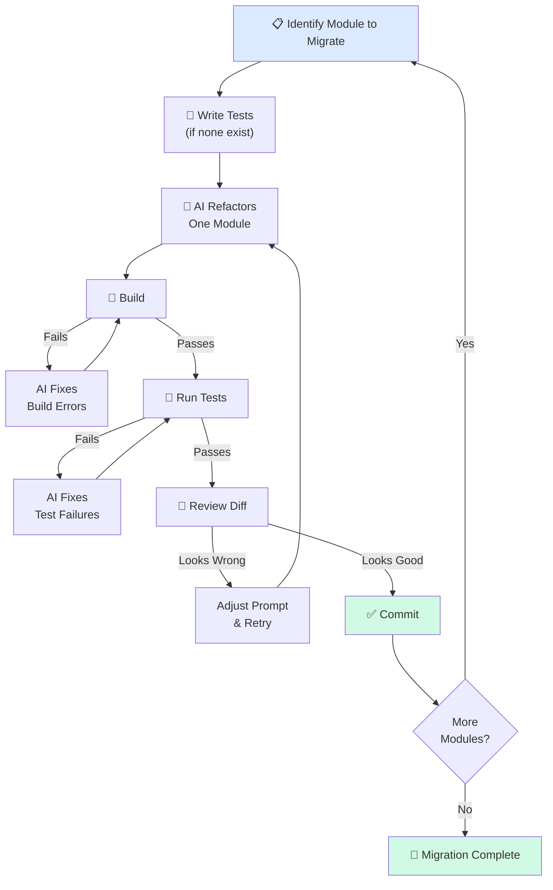

# 🔄 Refactoring with AI

> **Time to read:** ~5 min | **Skill level:** Advanced | **Platform:** iOS & Android

Refactoring is where AI shines brightest — tedious, mechanical, and easy to verify. If you're still refactoring by hand, you're wasting your superpower.

> "A senior dev spends 40% of their time on refactoring. AI can do 80% of that work in 10% of the time — if you know how to ask."

---

## 🎯 Safe Refactoring Principles

Before you let AI touch your code, establish three non-negotiable rules:

1. **Always have tests first.** If there are no tests, write them before refactoring. AI is great at writing tests for existing code — use that.
2. **One type of change at a time.** Don't rename, restructure, and optimize in the same prompt. Each refactor should be a single, verifiable step.
3. **Verify after each step.** Build. Test. Review diff. Then move to the next step.

```
# ❌ BAD: Everything at once
Refactor TaskListViewModel — rename variables, extract methods,
migrate from Combine to async/await, and add error handling.

# ✅ GOOD: One step at a time
Step 1: Rename all abbreviated variables in TaskListViewModel to
        descriptive names. Run swift build after.
Step 2: Extract the filtering logic into a separate TaskFilter type.
        Run swift test after.
Step 3: Migrate Combine publishers to async/await. Run swift test after.
```

---

## 🔧 Rename / Extract / Move Patterns

These mechanical transformations are AI's sweet spot. They require zero business knowledge and are trivially verifiable.

### Rename Across Files

```
Rename the protocol `TaskDataSource` to `TaskRepository` across the
entire codebase. Update:
- Protocol declaration
- All conforming types
- All call sites
- All test mocks
- Import statements if module name changed

Run swift build after to verify.
```

### Extract Method / Type

```
In TaskListViewModel.swift, extract the sorting logic (lines in
the `applySorting` method) into a new `TaskSorter` struct.

Requirements:
- TaskSorter should be a pure function type (no side effects)
- Move all sort-related enums (SortField, SortDirection) into TaskSorter.swift
- Update TaskListViewModel to use TaskSorter
- All existing tests must still pass
```

### Move Between Modules

```
Move TaskValidator from Sources/Features/Tasks/ViewModels/ to
Sources/Core/Validation/.

- Update all import statements
- Update Package.swift module dependencies
- Ensure no circular dependencies are introduced
- Run swift build to verify
```

### Android Equivalents

```kotlin
// Rename prompt for Android
// "Rename TaskDataSource to TaskRepository in all Kotlin files.
//  Update Hilt modules, all @Inject sites, and test fakes."

// Extract prompt for Android
// "Extract the filtering logic from TaskListViewModel into a
//  TaskFilterUseCase class. Follow our existing UseCase pattern
//  in domain/usecase/. Inject it via Hilt."
```

---

## 🏗️ Architecture Migrations

This is where AI saves weeks of work. Architecture migrations are mechanical but tedious — the perfect AI task.

### Combine to async/await (iOS)

```
Migrate TaskListViewModel from Combine to async/await:

Current pattern:
- Uses @Published properties with Combine pipelines
- AnyCancellable set for subscriptions
- sink/map/flatMap chains

Target pattern:
- async/await with @MainActor
- Task {} for launching async work
- AsyncSequence where streaming is needed

Rules:
- Keep all @Published property names identical
- Maintain the same public API
- One pipeline at a time — commit after each
- Run swift test between each migration
```

### XML Layouts to Compose (Android)

```
Migrate TaskListFragment from XML + ViewBinding to Jetpack Compose:

Current: fragment_task_list.xml + TaskListFragment.kt + TaskListAdapter.kt
Target: TaskListScreen.kt (Compose) + TaskListViewModel.kt (keep existing)

Rules:
- Preserve all existing behavior exactly
- Use MaterialTheme tokens, not hardcoded values
- Extract reusable composables (TaskRowItem, EmptyStateView)
- Remove XML layout file and adapter after migration
- Run ./gradlew connectedAndroidTest to verify
```

### UIKit to SwiftUI (iOS)

```
Migrate TaskDetailViewController to SwiftUI:

Current: TaskDetailViewController.swift (UIKit, 450 lines)
Target: TaskDetailView.swift (SwiftUI) + TaskDetailViewModel.swift (keep)

Rules:
- Wrap in UIHostingController for navigation compatibility
- Use existing TaskPulseTheme for styling
- Match current layout pixel-for-pixel
- Keep the same ViewModel — only replace the view layer
- Test in Xcode previews for all states
```

---

## 📐 The Incremental Approach

Never migrate everything at once. AI is better at small, focused transformations.



### The Strategy

```
Migrate TaskPulse from Combine to async/await. Use this order:

Phase 1: Core layer (Models, Networking) — no UI dependencies
Phase 2: Repository layer — depends only on Core
Phase 3: ViewModel layer — one ViewModel at a time
Phase 4: Remove Combine import from each file after migration

Between each phase:
- Run full test suite
- Keep both patterns working (old modules use Combine, new use async)
- Tag each phase as a git commit for easy rollback
```

---

## 💡 Prompts That Work

| Refactoring Goal | Effective Prompt |
|-----------------|------------------|
| Rename symbol | "Rename X to Y across all files. Run build after." |
| Extract type | "Extract [logic] from [Class] into a new [Type]. Keep same tests passing." |
| Change signature | "Add `priority` parameter to `createTask()`. Update all 23 call sites. Default to `.medium`." |
| Remove dead code | "Find all unused functions in Sources/Features/Tasks/. List them first, then delete after my approval." |
| Flatten hierarchy | "Collapse TaskBaseViewModel → TaskListViewModel inheritance into a single class. Move shared logic to extension." |
| Protocol extraction | "Extract a protocol from TaskRepository's public methods. Name it TaskRepositoryProtocol. Update DI container." |

### Prompt Techniques That Improve Results

```
# 1. Reference existing patterns
"Follow the same pattern used in UserRepository when refactoring TaskRepository"

# 2. Be specific about scope
"Only modify files in Sources/Features/Tasks/. Do not touch Core/ or Networking/"

# 3. Ask for a migration log
"After refactoring, output a summary: files changed, lines added/removed,
tests affected, and any concerns about the changes"

# 4. Set guardrails
"Do NOT change any public API signatures. Internal restructuring only."
```

---

## ⚠️ What AI Struggles With

Not every refactoring is a good fit for AI. Know the limits.

| Refactoring Type | AI Suitability | Why |
|-----------------|---------------|-----|
| Rename / move / extract | ★★★★★ | Purely mechanical, zero ambiguity |
| Code formatting / style | ★★★★★ | Pattern matching, no decisions |
| Remove dead code | ★★★★☆ | Needs to verify "dead" — may miss dynamic calls |
| Simplify conditionals | ★★★★☆ | Logic transformation, verifiable |
| Change data structures | ★★★☆☆ | May miss performance implications |
| Redesign API boundaries | ★★☆☆☆ | Requires understanding consumer needs |
| Merge/split modules | ★★☆☆☆ | Requires architectural judgment |
| Refactor business rules | ★☆☆☆☆ | Requires domain expertise AI lacks |

### Red Flags — Stop and Review

- AI refactors a method and changes its behavior (not just structure)
- AI introduces a new abstraction you didn't ask for
- AI removes error handling "for simplicity"
- The diff is larger than expected — AI went beyond scope
- Tests pass, but test count decreased

---

## 🏗️ TaskPulse Example: Combine to async/await Migration

Here is the complete migration of `TaskListViewModel` from Combine to async/await:

### Before (Combine)

```swift
// Sources/Features/Tasks/ViewModels/TaskListViewModel.swift
import Combine

class TaskListViewModel: ObservableObject {
    @Published var tasks: [Task] = []
    @Published var isLoading = false
    @Published var errorMessage: String?

    private let repository: TaskRepository
    private var cancellables = Set<AnyCancellable>()

    init(repository: TaskRepository) {
        self.repository = repository
    }

    func loadTasks() {
        isLoading = true
        repository.fetchTasks()
            .receive(on: DispatchQueue.main)
            .sink(
                receiveCompletion: { [weak self] completion in
                    self?.isLoading = false
                    if case .failure(let error) = completion {
                        self?.errorMessage = error.localizedDescription
                    }
                },
                receiveValue: { [weak self] tasks in
                    self?.tasks = tasks
                }
            )
            .store(in: &cancellables)
    }

    func deleteTask(id: String) {
        repository.deleteTask(id: id)
            .receive(on: DispatchQueue.main)
            .sink(
                receiveCompletion: { [weak self] completion in
                    if case .failure(let error) = completion {
                        self?.errorMessage = error.localizedDescription
                    }
                },
                receiveValue: { [weak self] _ in
                    self?.tasks.removeAll { $0.id == id }
                }
            )
            .store(in: &cancellables)
    }
}
```

### The Prompt

```
Migrate TaskListViewModel from Combine to async/await.

Rules:
- Replace AnyCancellable and sink chains with async/await
- Use @MainActor for thread safety
- Keep all @Published properties and their names
- Use Task {} for launching async work from sync contexts
- Handle errors with do/catch instead of receiveCompletion
- Remove the Combine import
- Run swift test to verify all existing tests pass
```

### After (async/await)

```swift
// Sources/Features/Tasks/ViewModels/TaskListViewModel.swift
import Foundation

@MainActor
class TaskListViewModel: ObservableObject {
    @Published var tasks: [Task] = []
    @Published var isLoading = false
    @Published var errorMessage: String?

    private let repository: TaskRepository

    init(repository: TaskRepository) {
        self.repository = repository
    }

    func loadTasks() {
        isLoading = true
        Task {
            do {
                tasks = try await repository.fetchTasks()
            } catch {
                errorMessage = error.localizedDescription
            }
            isLoading = false
        }
    }

    func deleteTask(id: String) {
        Task {
            do {
                try await repository.deleteTask(id: id)
                tasks.removeAll { $0.id == id }
            } catch {
                errorMessage = error.localizedDescription
            }
        }
    }
}
```

### What Changed

| Aspect | Before | After |
|--------|--------|-------|
| Threading | `receive(on: DispatchQueue.main)` | `@MainActor` |
| Async calls | `sink` + `AnyCancellable` | `async/await` + `Task {}` |
| Error handling | `receiveCompletion` switch | `do/catch` |
| Memory management | `[weak self]` captures | Not needed with `@MainActor` |
| Lines of code | 45 | 30 |
| Readability | Nested closures | Linear flow |

---

## 🧪 Try It Now

1. **Rename a symbol.** Pick a poorly named class in your project. Ask AI to rename it across every file. Verify with a build. Count how many files it touched correctly.

2. **Extract a type.** Find a ViewModel with more than 200 lines. Ask AI to extract one responsibility into a separate type. Run tests before and after — same count, same results.

3. **Migrate one method.** Pick a single Combine pipeline (iOS) or RxJava chain (Android). Ask AI to convert it to async/await or coroutines. Compare the before/after line count.

4. **Architecture migration plan.** Ask AI to create a phased migration plan for converting an entire module from one pattern to another. Review the plan for dependency ordering — does it migrate leaves before roots?

---

← Previous: [30-testing-ai-code.md](30-testing-ai-code.md) | [🗺️ Course Map](../00-course-map.md) | Next →: [32-performance.md](32-performance.md)
