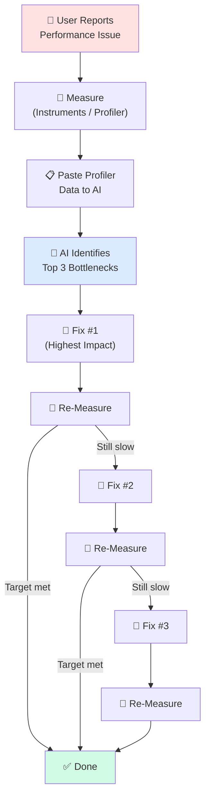

# ⚡ Performance Profiling with AI

> **Time to read:** ~4 min | **Skill level:** Advanced | **Platform:** iOS & Android

Your app takes 3 seconds to launch. The profiler shows 47 function calls. AI can tell you which 3 matter.

> "Profiling without AI is like reading a foreign newspaper — you see the data but miss the story. AI translates the numbers into action items."

---

## 🎯 AI as Profiler Interpreter

The hardest part of performance work is not collecting data — it is understanding it. Instruments and Android Profiler generate mountains of traces, allocations, and flame graphs. AI excels at finding the signal in that noise.

### How to Feed Profiler Data to AI

```
# iOS: Instruments trace summary
I ran Time Profiler on TaskPulse launch. Here are the top functions
by self time:

1. TaskListViewModel.loadTasks() — 820ms (34%)
2. JSONDecoder.decode([Task].self) — 410ms (17%)
3. TaskRowView.body — 290ms (12%) — called 847 times
4. CoreData fetch — 180ms (7%)
5. UIImage.resize() — 160ms (6%)

App total launch time: 2.4s. Target is under 1s.
Which functions should I optimize first, and what do you suggest?
```

```
# Android: Perfetto / Android Profiler output
TaskPulse startup trace:

Application.onCreate(): 340ms
  - Hilt injection: 180ms
  - Room DB initialization: 120ms
  - Analytics SDK init: 40ms
TaskListActivity.onCreate(): 890ms
  - TaskListViewModel.init: 210ms
  - Initial Compose layout: 480ms
    - TaskRowItem recomposition: 312ms (called 156x)
  - Network call (cold): 200ms

Total cold start: 1.8s. Target: 800ms.
Identify the top 3 optimizations.
```

AI will typically respond with prioritized recommendations, estimated impact, and specific code changes. This saves hours of manual analysis.

---

## 📱 Mobile Performance Priorities

Not all performance problems are equal. Here is what matters most on mobile, ranked by user impact:

| Priority | Metric | User Feels It As | Target |
|----------|--------|-------------------|--------|
| 1 | Cold start time | "This app is slow to open" | < 1s |
| 2 | Scroll frame rate | Jank, stuttering lists | 60fps (16ms/frame) |
| 3 | Memory usage | Background kills, re-launches | < 150MB active |
| 4 | Battery drain | "This app kills my battery" | < 5% per hour active |
| 5 | Network efficiency | Slow loading, data usage | Minimize requests |

---

## 💬 Prompting for Performance Analysis

The quality of AI's performance advice depends entirely on how you describe the problem.

### ❌ Vague (Unhelpful)

```
My app is slow. How do I make it faster?
```

### ✅ Specific (Actionable)

```
TaskListView scrolling drops to 24fps when the list has 500+ tasks.
Each TaskRowView displays: title, assignee avatar (loaded from URL),
priority badge, and due date.

Current implementation:
- LazyVStack with ForEach
- AsyncImage for avatars (no caching)
- DateFormatter created inside body
- Priority badge uses a gradient overlay

Profiler shows TaskRowView.body called 3x per visible row on scroll.
What is causing the re-renders and how do I fix each one?
```

### The Performance Prompt Template

```
Performance issue in [VIEW/COMPONENT]:

What happens: [Describe the visible symptom]
When it happens: [Trigger — scroll, launch, tap, background]
Measurement: [fps, ms, MB — actual numbers]
Target: [What "good" looks like]

Current implementation:
[Relevant code or architecture description]

Profiler data:
[Paste key metrics from Instruments / Android Profiler]
```

---

## 🐛 Common Mobile Performance Patterns AI Can Fix

### 1. Unnecessary Recomposition (Android)

```kotlin
// ❌ BAD: Entire list recomposes when any task changes
@Composable
fun TaskListScreen(viewModel: TaskListViewModel = hiltViewModel()) {
    val tasks by viewModel.tasks.collectAsState()
    val filter by viewModel.filter.collectAsState()

    LazyColumn {
        items(tasks) { task ->
            TaskRowItem(
                task = task,
                onComplete = { viewModel.completeTask(task.id) }
            )
        }
    }
}
```

```kotlin
// ✅ GOOD: Stable keys + skippable composables
@Composable
fun TaskListScreen(viewModel: TaskListViewModel = hiltViewModel()) {
    val tasks by viewModel.tasks.collectAsState()

    LazyColumn {
        items(
            items = tasks,
            key = { it.id }  // Stable keys prevent re-layout
        ) { task ->
            TaskRowItem(
                task = task,
                onComplete = remember(task.id) {
                    { viewModel.completeTask(task.id) }
                }
            )
        }
    }
}

// Make data class Stable for Compose compiler
@Immutable
data class TaskUiModel(
    val id: String,
    val title: String,
    val status: TaskStatus,
    val assigneeAvatarUrl: String?
)
```

### 2. Excessive body Recalculation (iOS)

```swift
// ❌ BAD: DateFormatter created every time body runs
struct TaskRowView: View {
    let task: Task

    var body: some View {
        HStack {
            Text(task.title)
            Spacer()
            Text(formatDate(task.dueDate)) // Creates formatter each call
        }
    }

    private func formatDate(_ date: Date) -> String {
        let formatter = DateFormatter()    // Expensive allocation
        formatter.dateStyle = .short
        return formatter.string(from: date)
    }
}
```

```swift
// ✅ GOOD: Static formatter, extracted subview
struct TaskRowView: View {
    let task: Task

    private static let dateFormatter: DateFormatter = {
        let f = DateFormatter()
        f.dateStyle = .short
        return f
    }()

    var body: some View {
        HStack {
            Text(task.title)
            Spacer()
            Text(Self.dateFormatter.string(from: task.dueDate))
        }
    }
}
```

### 3. Image Loading Without Caching

```
AI prompt:
TaskRowView uses AsyncImage for user avatars. With 200 tasks visible
during scroll, this causes:
- 200 network requests on first load
- No disk cache — re-downloads on every app launch
- Blank placeholders flash during scroll

Recommend an image caching strategy that:
- Caches in memory (LRU, 50MB limit) and on disk
- Prefetches visible + 10 rows ahead
- Shows a placeholder from a cached tiny thumbnail
- Works with both iOS AsyncImage and Android Coil
```

### 4. Excessive Allocations

```
AI prompt:
TaskListViewModel.filterTasks() is called on every keystroke
in the search bar. It creates a new filtered array each time:

func filterTasks(query: String) -> [Task] {
    return allTasks.filter { $0.title.lowercased().contains(query.lowercased()) }
}

With 5000 tasks, this allocates ~40KB per keystroke.
Suggest optimizations: debouncing, pre-computed lowercase,
incremental filtering, or other strategies.
```

---

## 🤖 Subagents for Performance Audits

Use parallel subagents to audit different performance areas simultaneously:

```
Launch 3 performance audit subagents:

Agent 1 — "Launch Time Audit":
  Analyze AppDelegate/Application.onCreate, measure initialization
  order. Identify anything that can be lazy-loaded or moved to
  background. Read Sources/App/ and report.

Agent 2 — "Scroll Performance Audit":
  Review all LazyVStack/LazyColumn usage. Check for missing keys,
  unnecessary recomposition, heavy body computations.
  Read Sources/Features/Tasks/Views/ and report.

Agent 3 — "Memory Audit":
  Find potential retain cycles, strong reference chains,
  uncancelled Tasks/coroutines, and leaked observers.
  Read Sources/Features/ and report.

Each agent: list findings ranked by severity, with fix suggestions.
```

---

## 🔍 Memory Leak Detection with AI

Memory leaks are notoriously hard to find manually. AI can analyze code structure to spot common leak patterns.

### iOS: Retain Cycle Analysis

```
Analyze Sources/Features/Tasks/ for retain cycles:

Look for:
1. Closures that capture `self` strongly (missing [weak self])
2. Delegate properties not marked `weak`
3. NotificationCenter observers without removal
4. Timer references without invalidation
5. Combine sinks stored in properties without cancellation

For each finding, show the code and the fix.
```

### Android: Coroutine Leak Analysis

```
Analyze feature/tasks/ for coroutine/lifecycle leaks:

Look for:
1. GlobalScope usage (should be viewModelScope)
2. Flows collected in Activity/Fragment without lifecycleScope
3. Callbacks registered without unregistration
4. Context references in ViewModel (Activity/Fragment context leaks)
5. LiveData observed without lifecycle owner

For each finding, show the code and the fix.
```

---

## 📊 Performance Optimization Workflow



### Key Rule: Measure Before and After Every Change

Never trust that a fix works without re-profiling. AI might suggest an optimization that is theoretically correct but irrelevant to your actual bottleneck.

---

## 🏗️ TaskPulse Example: Fixing Slow TaskListView Scrolling

**Problem:** TaskListView drops to 18fps when scrolling 500+ tasks.

### Step 1: Profiler Data to AI

```
Time Profiler on TaskListView scroll (500 tasks):

TaskRowView.body — 8.2ms average (target: <2ms)
  ├── AsyncImage load — 3.1ms
  ├── DateFormatter.string(from:) — 2.4ms
  ├── PriorityBadge gradient render — 1.8ms
  └── AvatarView shadow calculation — 0.9ms

TaskRowView.body called 3.2x per row on scroll (should be 1x).
Total visible rows: 12. Offscreen buffer: 5.
```

### Step 2: AI Identifies Fixes

AI response (summarized):

1. **DateFormatter in body** — Create static formatter (saves 2.4ms/row)
2. **AsyncImage without cache** — Switch to cached image loader (saves 3.1ms/row on re-scroll)
3. **Multiple body calls** — Add `EquatableView` or extract to separate view with `@State` isolation (reduces from 3.2x to 1x)
4. **Gradient in PriorityBadge** — Pre-render gradient as image asset (saves 1.8ms/row)

### Step 3: Apply Fix #1 (Biggest Impact)

```swift
// Before: 8.2ms per row
struct TaskRowView: View {
    let task: Task

    // After fixes applied:
    private static let dateFormatter: DateFormatter = {
        let f = DateFormatter()
        f.dateStyle = .short
        return f
    }()

    var body: some View {
        HStack(spacing: 12) {
            CachedAsyncImage(url: task.assignee?.avatarURL) // Cached
                .frame(width: 32, height: 32)
                .clipShape(Circle())

            VStack(alignment: .leading, spacing: 4) {
                Text(task.title)
                    .font(.tpBody)
                Text(Self.dateFormatter.string(from: task.dueDate)) // Static
                    .font(.tpCaption)
                    .foregroundColor(.secondary)
            }

            Spacer()

            PriorityBadge(priority: task.priority) // Pre-rendered asset
        }
        .padding(.vertical, 8)
    }
}
```

### Step 4: Re-Measure

```
After fixes:
TaskRowView.body — 1.6ms average ✅ (was 8.2ms)
Body calls per row — 1.0x ✅ (was 3.2x)
Scroll fps — 58-60fps ✅ (was 18fps)
```

---

## 🧪 Try It Now

1. **Profile and prompt.** Run Instruments (iOS) or Android Profiler on your app's main list screen. Paste the top 5 functions by time into AI. Compare its recommendations to your own analysis.

2. **Fix a scroll jank.** Find a list view that drops below 60fps. Ask AI to identify the cause from the view code alone (no profiler data). See if it finds the issue.

3. **Memory leak hunt.** Ask AI to audit one feature module for retain cycles (iOS) or context leaks (Android). Verify its findings with the Memory Graph Debugger or LeakCanary.

4. **Subagent performance audit.** Launch three parallel subagents to audit launch time, scroll performance, and memory usage. Compare their findings — do they overlap?

---

← Previous: [31-refactoring.md](31-refactoring.md) | [🗺️ Course Map](../00-course-map.md) | Next →: [33-evaluation.md](33-evaluation.md)
