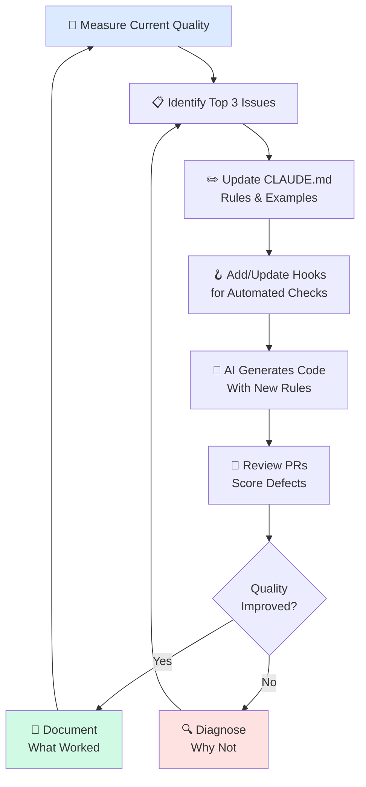

# 📊 Evaluating AI Output Quality

> **Time to read:** ~4 min | **Skill level:** Intermediate | **Platform:** iOS & Android

You added CLAUDE.md, wrote skills, set up hooks. But is it actually working? Here is how to measure.

> "What gets measured gets improved. What doesn't gets abandoned — even if it was working."

---

## 🎯 What to Measure

AI coding assistance is an investment. Like any investment, you need to track returns. These are the metrics that matter:

| Metric | What It Tells You | How to Collect |
|--------|-------------------|----------------|
| Bug rate (before/after) | Is AI introducing more bugs? | Track bugs per PR, per sprint |
| PR review cycles | Are AI PRs getting approved faster? | Count review rounds per PR |
| Time to feature completion | Are features shipping faster? | Measure ticket open-to-merge time |
| Test coverage delta | Is AI improving or degrading coverage? | CI coverage reports per PR |
| Code review findings | What types of issues does review catch? | Categorize PR review comments |
| Lines changed per hour | Is velocity actually increasing? | Git stats per developer |
| Revert rate | How often do AI-generated changes get rolled back? | Track reverts per week |

---

## 📏 The Baseline: Before You Start

You cannot measure improvement without a starting point. Before adopting AI tooling (or before changing your CLAUDE.md), capture a two-week baseline.

### What to Record

```
Baseline Period: [Start Date] to [End Date] (2 weeks)

Team: [Number of developers]
PRs merged: ___
Average PR review rounds: ___
Bugs found in review: ___
Bugs found in production: ___
Average time to merge (hours): ___
Test coverage: ___%
Reverts: ___

Qualitative:
- Most common review feedback: ___
- Biggest time sinks: ___
- Developer satisfaction (1-5): ___
```

Then repeat this measurement after 2 weeks of AI-assisted development. The comparison tells the real story.

---

## 📋 CLAUDE.md Effectiveness

Your CLAUDE.md is the single most important file for AI output quality. Here is how to measure whether it is working.

### Tracking Instruction Compliance

Review the last 10 AI-generated PRs and score each one:

```
CLAUDE.md Compliance Scorecard:

Instruction: "Use async/await, never Combine"
  Compliant: 8/10 | Violations: 2/10
  Action: Add explicit example to CLAUDE.md showing the pattern

Instruction: "All ViewModels must be @MainActor"
  Compliant: 10/10 | Violations: 0/10
  Action: None — this rule is working

Instruction: "Use Given/When/Then test naming"
  Compliant: 5/10 | Violations: 5/10
  Action: Add a test naming example, move rule higher in file

Instruction: "No force unwraps"
  Compliant: 9/10 | Violations: 1/10
  Action: Minor — add to pre-commit hook for automated catch
```

### Common CLAUDE.md Failures

| Symptom | Cause | Fix |
|---------|-------|-----|
| AI ignores a rule | Rule is buried at bottom of file | Move to top, add emphasis |
| AI follows rule inconsistently | Rule is ambiguous | Add a concrete code example |
| AI follows rule but misapplies it | Rule lacks context | Add "when to use" and "when NOT to use" |
| AI follows outdated rule | CLAUDE.md not updated | Schedule monthly CLAUDE.md reviews |
| AI invents rules not in CLAUDE.md | Over-generalizing from examples | Be explicit: "Only these patterns" |

### Iterating on CLAUDE.md

```
# Prompt to AI itself:
Review the last 5 PRs you generated for TaskPulse.
Compare them against CLAUDE.md rules.

For each rule:
1. Were you compliant? (yes/no)
2. If no, why? Was the rule unclear?
3. Suggest how to rewrite the rule so you'd follow it correctly.
```

This meta-prompt uses AI to improve its own instructions — a powerful feedback loop.

---

## 🏷️ Quality Scoring for AI PRs

Not all defects are equal. A missing null check is worse than a style violation. Use severity-weighted scoring to track meaningful quality.

### Defect Categories

| Category | Severity Weight | Example |
|----------|----------------|---------|
| Critical | 10 | Crash, data loss, security vulnerability |
| Logic error | 7 | Wrong business rule, incorrect calculation |
| Missing edge case | 5 | Nil not handled, empty array crash |
| API misuse | 4 | Deprecated API, wrong lifecycle method |
| Performance | 3 | Unnecessary allocation, missing cache |
| Style / convention | 1 | Wrong naming, missing doc comment |

### Calculating Defect Density

```
Defect Density = Sum(defect_severity) / Lines of Code Changed

Example PR (247 lines changed):
- 1 missing edge case (5)
- 2 style violations (1 + 1)
- 0 critical issues

Defect Density = (5 + 1 + 1) / 247 = 0.028

Target: < 0.05 (good)
Warning: 0.05–0.10 (review CLAUDE.md)
Alert: > 0.10 (stop and fix process)
```

### Tracking Over Time

```
Week 1: Density 0.12 (no CLAUDE.md)
Week 2: Density 0.08 (added CLAUDE.md)
Week 3: Density 0.05 (refined rules + examples)
Week 4: Density 0.03 (added hooks + skills)
Week 5: Density 0.02 (mature setup)
```

---

## 📈 Before/After Comparisons

The most convincing evidence is a direct comparison: same team, same codebase, with and without AI guardrails.

### What to Compare

| Metric | Without Guardrails | With Guardrails | Delta |
|--------|-------------------|-----------------|-------|
| PRs needing rework | 60% | 20% | -67% |
| Avg review comments | 8.3 | 2.1 | -75% |
| Test coverage of new code | 45% | 82% | +82% |
| Time to first approval | 4.2 hrs | 1.8 hrs | -57% |
| Production bugs (per sprint) | 3.1 | 0.8 | -74% |
| Developer confidence (1-5) | 2.8 | 4.2 | +50% |

Guardrails = CLAUDE.md + hooks + skills + structured prompts.

### Running the Comparison

```
Phase 1 (2 weeks): Use AI without CLAUDE.md or guardrails.
  Record all metrics above.

Phase 2 (2 weeks): Add CLAUDE.md, hooks, and skills.
  Record same metrics.

Phase 3: Compare. Share with team.
```

---

## 🔍 Regression Detection

AI output quality is not static. Watch for these signs that quality is dropping:

### When Quality Drops

| Signal | Likely Cause | Action |
|--------|-------------|--------|
| More review comments than last month | CLAUDE.md rules stale or context too large | Trim and update CLAUDE.md |
| AI ignoring recent conventions | New patterns not added to CLAUDE.md | Document new patterns immediately |
| Inconsistent code style across PRs | Multiple developers with different prompting styles | Standardize prompts in skills |
| More production bugs | Edge cases not caught by hooks or tests | Add pre-commit hooks for common issues |
| AI generating deprecated patterns | CLAUDE.md references old APIs | Update examples to current APIs |

### Automated Quality Checks

```json
// .claude/settings.json — Post-commit hook for quality tracking
{
  "hooks": {
    "PostCommit": [
      {
        "command": "python3 .claude/hooks/quality-tracker.py"
      }
    ]
  }
}
```

```python
# .claude/hooks/quality-tracker.py
# Logs quality signals after each AI commit

import subprocess
import json
from datetime import datetime

def collect_metrics():
    # Count TODO/FIXME added in this commit
    diff = subprocess.check_output(
        ["git", "diff", "HEAD~1", "--unified=0"], text=True
    )
    todos_added = diff.count("+.*TODO") + diff.count("+.*FIXME")

    # Count force unwraps (iOS)
    force_unwraps = diff.count("+.*!")  # Simplified — real check is smarter

    # Lines changed
    stat = subprocess.check_output(
        ["git", "diff", "HEAD~1", "--stat", "--stat-count=1"], text=True
    )

    metrics = {
        "timestamp": datetime.now().isoformat(),
        "todos_added": todos_added,
        "force_unwraps": force_unwraps,
        "diff_summary": stat.strip()
    }

    # Append to metrics log
    with open(".claude/quality-metrics.jsonl", "a") as f:
        f.write(json.dumps(metrics) + "\n")

collect_metrics()
```

---

## 🔄 The Continuous Improvement Loop



### Monthly Review Checklist

```
Monthly AI Quality Review:

□ Pull defect density trend for last 4 weeks
□ Review top 5 most common review comments
□ Check CLAUDE.md compliance rate per rule
□ Compare current metrics to baseline
□ Interview 2 team members: "What's AI doing well? Poorly?"
□ Update CLAUDE.md with new patterns from last month
□ Remove outdated rules from CLAUDE.md
□ Add new hooks for recurring issues
□ Document changes made and expected impact
```

---

## 🏗️ TaskPulse Example: 30-Day Quality Dashboard

Here is what a real quality tracking effort looks like over 30 days:

### Week 1: Baseline (No Guardrails)

```
PRs merged: 12
Defects found in review: 34 (avg 2.8 per PR)
  - Critical: 2 (crash on nil task)
  - Logic: 5 (wrong filter behavior)
  - Edge case: 9 (empty states, long strings)
  - Style: 18 (naming, formatting)
Defect density: 0.14
Test coverage of new code: 38%
Time to first approval: 5.1 hours
```

### Week 2: Added CLAUDE.md

```
PRs merged: 14
Defects found in review: 19 (avg 1.4 per PR)  ↓50%
  - Critical: 0
  - Logic: 2
  - Edge case: 6
  - Style: 11
Defect density: 0.07                            ↓50%
Test coverage of new code: 61%                   ↑60%
Time to first approval: 3.2 hours               ↓37%

Changes made: Added CLAUDE.md with architecture rules,
naming conventions, and 3 code examples.
```

### Week 3: Added Hooks + Skills

```
PRs merged: 16
Defects found in review: 8 (avg 0.5 per PR)   ↓58%
  - Critical: 0
  - Logic: 1
  - Edge case: 3
  - Style: 4
Defect density: 0.03                            ↓57%
Test coverage of new code: 79%                   ↑30%
Time to first approval: 1.9 hours               ↓41%

Changes made: Pre-commit hook for force unwraps and
missing test files. Skills for ViewModel and test generation.
```

### Week 4: Refined CLAUDE.md Based on Data

```
PRs merged: 18
Defects found in review: 5 (avg 0.3 per PR)   ↓38%
  - Critical: 0
  - Logic: 0
  - Edge case: 2
  - Style: 3
Defect density: 0.02                            ↓33%
Test coverage of new code: 84%                   ↑6%
Time to first approval: 1.4 hours               ↓26%

Changes made: Added edge case examples to CLAUDE.md.
Updated style rules with before/after examples.
Removed 2 rules AI was already following consistently.
```

### The Trend

| Metric | Week 1 | Week 4 | Improvement |
|--------|--------|--------|-------------|
| Defects per PR | 2.8 | 0.3 | -89% |
| Defect density | 0.14 | 0.02 | -86% |
| Test coverage | 38% | 84% | +121% |
| Time to approval | 5.1h | 1.4h | -73% |
| Critical bugs | 2 | 0 | -100% |

---

## 🧪 Try It Now

1. **Capture your baseline.** Review your last 10 PRs (AI-assisted or not). Count defects by category, measure time to approval, and note test coverage. This is your Week 0.

2. **Score your CLAUDE.md.** Pick 5 rules from your CLAUDE.md. Check the last 5 AI-generated PRs for compliance. Calculate a compliance percentage per rule. Fix the lowest-scoring rule.

3. **Calculate defect density.** For your most recent AI PR, categorize every review comment by severity. Calculate the weighted defect density. Is it above or below 0.05?

4. **Set up quality tracking.** Add a simple post-commit hook that logs lines changed, TODOs added, and force unwraps introduced. Run it for a week and review the data.

---

← Previous: [32-performance.md](32-performance.md) | [🗺️ Course Map](../00-course-map.md) | Next →: [Cheat Sheet](../appendix/A-cheat-sheet.md)
