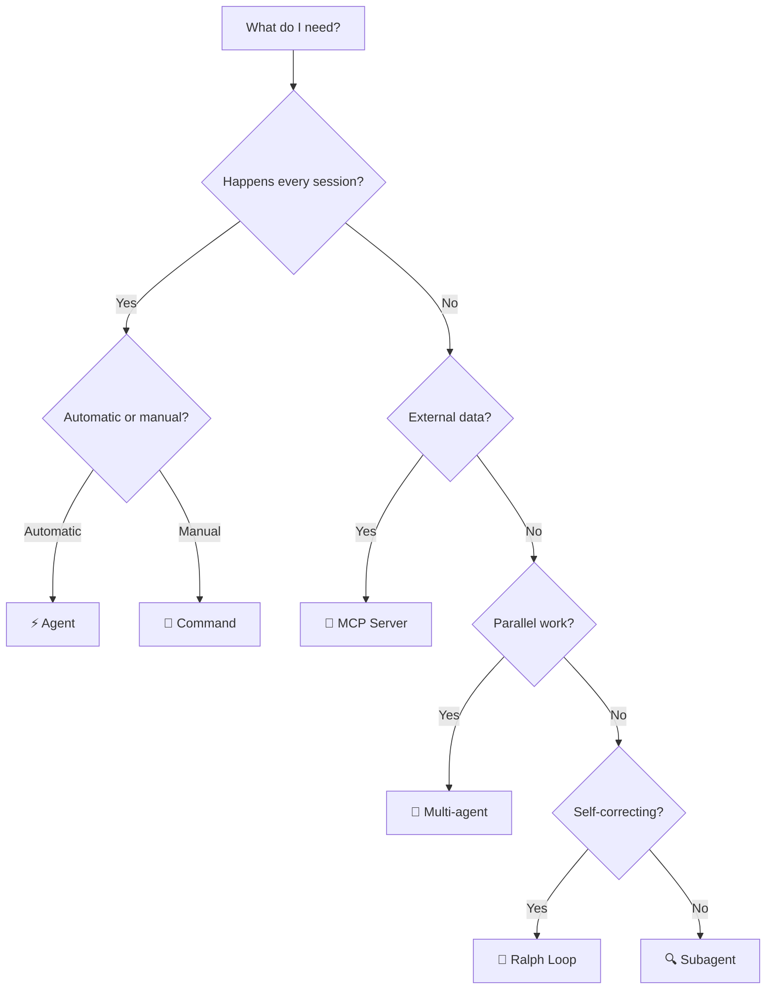

# 📋 Quick Reference Cheat Sheet

> **Print this. Pin it. Refer to it daily.**

---

## 🗂️ File Locations

| File | Path | Purpose |
|------|------|---------|
| **GEMINI.md** | `./GEMINI.md` | Project-wide AI memory (architecture, rules, patterns) |
| **AGENTS.md** | `./AGENTS.md` | Multi-agent role definitions and coordination |
| **Agents** | `.gemini/agents/*.md` | Auto-triggered reusable instruction sets |
| **Commands** | Custom commands (`.toml` files) | On-demand slash commands |
| **Settings** | `.gemini/settings.json` | Tool permissions, MCP servers, model config |
| **User Settings** | `~/.gemini/settings.json` | Global user-level preferences |
| **MCP Config** | `.gemini/settings.json` → `mcpServers` | MCP server connections |
| **Hooks** | `.gemini/settings.json` → `hooks` | Pre/post event triggers |
| **Extensions** | `.gemini/extensions/` | Custom extensions for additional capabilities |

---

## 🛠️ Tool Decision Matrix

*"Which tool do I use for this?"*

| Need | Tool | Why | Set Up Time |
|------|------|-----|-------------|
| 🧠 Consistent output every session | **GEMINI.md** | Persistent memory across sessions | 10 min |
| 🔁 Repeated pattern (auto-triggered) | **Agent** | Loads automatically when relevant | 15 min |
| 🎯 Manual workflow (on-demand) | **Command** | Triggered with `/slash` commands | 10 min |
| 🛡️ Error prevention (deterministic) | **Hook** | Runs scripts before/after actions | 20 min |
| 🔍 Quick focused research | **Subagent** | Scoped context, doesn't pollute main chat | 0 min |
| 👥 Parallel independent work | **Multi-agent** | Multiple agents work via shell tool delegation | 5 min |
| 🔌 External data / tools | **MCP Server** | Standardized protocol for integrations | 30 min |
| 🤖 Full autonomous implementation | **Ralph Loop** | Self-correcting build→test→fix cycle | 5 min |
| 🧩 Extended capabilities | **Extension** | Custom extensions in `.gemini/extensions/` | 15 min |

### Quick Decision Flowchart



---

## ⌨️ Key Shortcuts & Commands

| Shortcut / Command | What It Does |
|---------------------|-------------|
| `/plan` | Toggle **Plan Mode** (thinking without coding) |
| `/init` | Initialize GEMINI.md for current project |
| `/compact` | Compress conversation context to save tokens |
| `Escape` | Cancel current AI generation |
| `#` (in prompt) | Reference a file path |
| `@` (in prompt) | Reference a person/agent |

### CLI Flags

```bash
# Headless mode (no interactive UI)
gemini --headless

# Specify model
gemini --model gemini-2.5-pro

# Resume last conversation
gemini --continue

# Print output only (for piping)
gemini --print -p "Your prompt"
```

---

## 📋 CRAC Prompt Template

**C**ontext → **R**ole → **A**ction → **C**onstraints

```
[CONTEXT]
I'm working on TaskPulse, a collaborative task manager.
iOS: SwiftUI + MVVM. Android: Compose + MVVM.
Current file: Sources/Features/Tasks/TaskListViewModel.swift

[ROLE]
You are a senior iOS engineer reviewing this code.

[ACTION]
Add pagination to the task list: load 20 tasks at a time,
fetch next page when user scrolls to bottom.

[CONSTRAINTS]
- Use async/await (no Combine)
- Follow existing patterns in TaskListViewModel
- Don't modify TaskService interface
- Include unit tests
```

### Quick CRAC Examples

| Scenario | Context | Role | Action | Constraints |
|----------|---------|------|--------|-------------|
| New screen | "TaskPulse, MVVM" | "Senior iOS dev" | "Create task detail screen" | "Match existing patterns" |
| Debug | "Crash on line 42" | "Debugger" | "Find root cause" | "Don't change public API" |
| Refactor | "Module has 800 lines" | "Architect" | "Split into smaller files" | "No behavior changes" |
| Review | "PR #234" | "Code reviewer" | "Review for issues" | "Focus on performance" |

---

## 📊 Key Stats to Remember

| Stat | Value | Source |
|------|-------|--------|
| AI bug rate (no guardrails) | **1.7x more** than human-only | CodeRabbit 2025 |
| AI bug rate (with guardrails) | **25% fewer** than human-only | CodeRabbit 2025 |
| AI security vulnerabilities | **1.5-2x more** without rules | GitClear Analysis |
| Devs who won't merge AI code unreviewed | **71%** | Stack Overflow Survey |
| AI-generated code with defects | **41%** | Microsoft Research |
| Context window utilization sweet spot | **60-70%** | Google DeepMind Guidance |

---

## 🔄 The Ralph Loop (Quick Reference)

```
Implement [TASK]. After each change:
1. Build: [BUILD_COMMAND]
2. If build fails → read error → fix → rebuild
3. Test: [TEST_COMMAND]
4. If test fails → read failure → fix → retest
5. Repeat until green
6. Stop and ask if: [ESCALATION_CONDITIONS]
```

---

## 🏗️ Multi-agent Template

```
Launch [N] subagents:

Agent 1 — "[ROLE]": [TASK]. Files: [SCOPE]
Agent 2 — "[ROLE]": [TASK]. Files: [SCOPE]
Agent 3 — "[ROLE]": [TASK]. Files: [SCOPE]

Coordination: [SHARED_INTERFACE_OR_CONTRACT]
Each agent: build-verify independently before reporting back.
```

---

## 📱 Mobile Quick Reference

### iOS Build Commands
```bash
# Build
swift build
xcodebuild -scheme TaskPulse -destination 'platform=iOS Simulator,name=iPhone 16'

# Test
swift test
xcodebuild test -scheme TaskPulse -destination 'platform=iOS Simulator,name=iPhone 16'
```

### Android Build Commands
```bash
# Build
./gradlew assembleDebug

# Test
./gradlew testDebugUnitTest

# Lint
./gradlew lintDebug
```

---

## 🎯 The Golden Rules

1. **Context is everything** — GEMINI.md > clever prompting
2. **Plan before code** — `/plan` saves hours of rework
3. **Verify every step** — Ralph Loop: build, test, fix, repeat
4. **Understand before changing** — Explore → impact analysis → implement
5. **Agents > repeating yourself** — If you've said it 3x, make it an agent
6. **Flags > big-bang launches** — Ship safely with feature flags
7. **Docs travel with code** — Doc-as-code, not doc-in-wiki

---

← [🗺️ Course Map](../00-course-map.md) | Next →: [B — Prompt Library](B-prompt-library.md)
